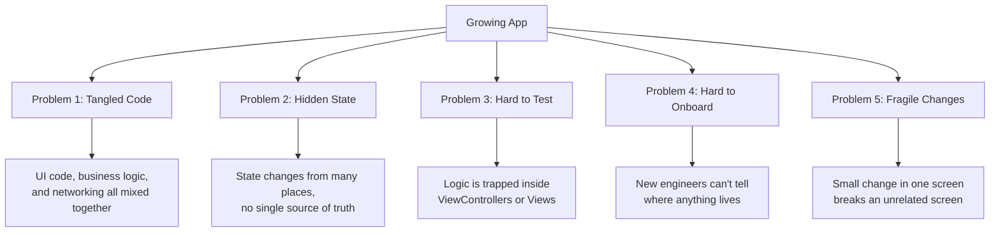
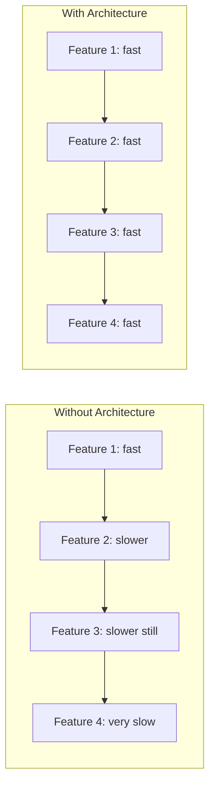
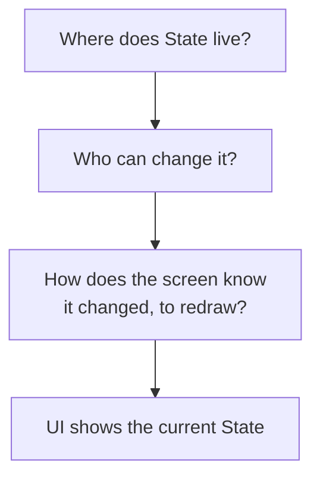

# Chapter 1 — What is Architecture?

> "Architecture is not about the code you write today. It is about how easy
> or hard it is to change that code tomorrow." — a common saying among
> senior engineers.

## 1.1 What is software architecture?

Think about building a house. Before anyone lays a single brick, someone
draws a plan: where the rooms go, where the pipes run, where the wires go
inside the walls. That plan is the **architecture** of the house. It is not
the house itself. It is the set of rules and structure that decide how all
the parts of the house fit together.

Software architecture is the same idea, but for code. It is the set of
rules that decide:

- Where each piece of code lives.
- How different pieces of code talk to each other.
- Who is allowed to change what.
- How data moves through the app.

An app without architecture is like a house built without a plan. Rooms get
added wherever there is space. Wires cross pipes. One day you want to add a
window, and to do that you have to tear down a wall that was never meant to
be load-bearing, but somehow is holding up the roof.

**Plain definition:** Software architecture is the way you organize your
code so that the app is easy to understand, easy to change, and easy to
test, even as it grows.

## 1.2 Why do we even need architecture?

A small app does not feel like it needs architecture. If you are building a
one-screen app that shows "Hello, World," you can write all the code in one
file and it will work fine. The problems show up later, when the app grows.

Here is what usually happens to a real app over time:

1. Week 1: One screen. One `ViewController` or one SwiftUI `View`. Simple.
2. Month 1: Five screens. Some screens share logic. You start copying code
   between files.
3. Month 6: Twenty screens. Three other engineers are now working on the
   same codebase. Nobody is fully sure which file controls what anymore.
4. Year 1: A hundred screens. A bug fix in one screen accidentally breaks a
   feature in a completely different screen, because they secretly shared
   a piece of mutable state.

Architecture exists to stop step 4 from happening. It gives every piece of
code a clear job, a clear home, and clear rules for how it can be touched.

### The core promise of architecture

Good architecture gives you four things:

1. **Organization** — you know where to find code, and where new code
   should go.
2. **Scalability** — the app can grow (more screens, more features, more
   engineers) without becoming harder to work in at the same rate.
3. **Testability** — you can check that your logic works correctly without
   running the full app on a simulator or device.
4. **Maintainability** — six months from now, you (or a teammate) can read
   the code and safely change it, without fear of breaking something
   unrelated.

We will look at each of these four in detail, because they are the reasons
every architecture pattern in this book exists, including TCA.

## 1.3 Why not put everything inside the View?

SwiftUI makes it very tempting to put everything inside the `View`. A
`View` in SwiftUI is just a `struct` that describes what should appear on
screen. You can add `@State` properties to it, write functions inside it,
call networking code from a button action, and it will compile and run.

Here is an example of what that looks like — a small "login screen" with
everything crammed into the View:

```swift
struct LoginView: View {
    @State private var email = ""
    @State private var password = ""
    @State private var isLoading = false
    @State private var errorMessage: String?
    @State private var isLoggedIn = false

    var body: some View {
        VStack {
            TextField("Email", text: $email)
            SecureField("Password", text: $password)

            if let errorMessage {
                Text(errorMessage).foregroundColor(.red)
            }

            Button("Log In") {
                // Validation logic lives here
                guard email.contains("@") else {
                    errorMessage = "Enter a valid email"
                    return
                }
                guard password.count >= 8 else {
                    errorMessage = "Password too short"
                    return
                }

                isLoading = true
                // Networking logic lives here too
                URLSession.shared.dataTask(with: makeLoginRequest()) { data, _, error in
                    DispatchQueue.main.async {
                        isLoading = false
                        if let error {
                            errorMessage = error.localizedDescription
                            return
                        }
                        // Parsing logic lives here too
                        guard let data,
                              let response = try? JSONDecoder().decode(LoginResponse.self, from: data)
                        else {
                            errorMessage = "Something went wrong"
                            return
                        }
                        // Saving logic lives here too
                        UserDefaults.standard.set(response.token, forKey: "auth_token")
                        isLoggedIn = true
                    }
                }.resume()
            }
        }
    }

    private func makeLoginRequest() -> URLRequest {
        var request = URLRequest(url: URL(string: "https://api.example.com/login")!)
        request.httpMethod = "POST"
        request.httpBody = try? JSONEncoder().encode(["email": email, "password": password])
        return request
    }
}
```

This code works. It will run on a device. But it has a list of serious
problems, and every one of these problems is a reason architecture exists.

### Problem 1 — You cannot test the logic without the screen

The validation rule "password must be at least 8 characters" is business
logic. It is a rule about how the app should behave, not about how pixels
should be drawn. But in the code above, that rule only exists inside a
button's closure, buried inside a `View`. SwiftUI views are structs that
get created and destroyed constantly by the framework — you cannot easily
grab one in a unit test and say "tap the button and check the error
message," at least not without heavy UI testing tools that are slow and
fragile.

### Problem 2 — The View knows too much

Look at everything `LoginView` is responsible for: drawing text fields,
validating email format, validating password length, building a URL
request, making a network call, decoding JSON, saving a token to disk, and
tracking loading state. That is at least six different jobs for one
`struct`. In good architecture, each of those jobs should belong to a
different, smaller piece of code, each with one clear responsibility. This
idea is called **separation of concerns** — every part of the system
should be concerned with (responsible for) one thing.

### Problem 3 — Logic cannot be reused

Imagine you need the exact same "log in" logic on a second screen — maybe
a "quick sign-in" widget. With the code above, you would have to copy and
paste the whole button closure into a new View. Now you have two copies of
the same logic. When you fix a bug in one, you must remember to fix it in
the other. This is how bugs come back after they are "already fixed."

### Problem 4 — Nobody can reason about the state

`isLoading`, `errorMessage`, and `isLoggedIn` are three separate `@State`
variables that all change independently. Nothing stops them from getting
into a state that makes no sense — for example, `isLoading == true` and
`isLoggedIn == true` at the same time, which should never happen, but
nothing in the code prevents it. As more state variables are added, the
number of possible combinations grows very fast, and some of those
combinations are invalid but the compiler cannot catch them.

### Problem 5 — Growth makes it worse, not better

This example has one screen. Now imagine a hundred screens written in this
same style, by five different engineers, over two years. Every screen
reinvents its own validation, its own networking, its own error handling,
in a slightly different way. There is no shared, tested, trusted place
where "login logic" lives. This is exactly the situation architecture is
designed to prevent.

## 1.4 Problems in large apps — a closer look

Let's zoom out from one screen to a whole app. As an app grows, five
specific problems tend to appear, regardless of what language or framework
you use. Every architecture pattern you will learn in Chapter 2 — MVC,
MVVM, VIPER, Redux, and eventually TCA — is an attempt to solve some or all
of these five problems.



### 1.4.1 Code organization

Without architecture, code organization tends to follow whatever felt
convenient at the time it was written. This means similar logic ends up
scattered across many files, and unrelated logic ends up crammed into one
file. Good architecture defines, in advance, what kind of code goes where.
For example, "all logic that changes app state must live in a reducer" or
"all networking code must live in a client" (both of these are TCA rules,
which you will learn later). When the rule is defined ahead of time, every
engineer on the team — including future you — knows exactly where to look.

### 1.4.2 Scalability

Scalability, in this context, does not usually mean "handling more
internet traffic" — it means **the codebase can grow in features and team
size without growing more slowly per feature**. A well-architected app
lets you add a tenth feature about as easily as you added the first one.
A poorly-architected app gets slower to work in with every feature added,
because each new feature has to fight against tangled logic left behind by
the last one.



### 1.4.3 Testability

**Testability** means: how easily can you write an automated test that
proves a piece of logic works correctly, without running the whole app?
In the `LoginView` example above, the only way to check "does the password
length validation work?" is to run the app, tap into the text field, type
a short password, tap the button, and look at the screen. That is a slow,
manual, error-prone way to check a simple rule.

Good architecture pulls logic out of the View and into plain, testable
pieces of code — often plain functions or plain objects with no dependency
on UIKit or SwiftUI at all. A plain function can be called directly in a
unit test, checked in milliseconds, and re-checked automatically every time
you build the app (this is called **regression testing** — making sure old
bugs do not come back).

### 1.4.4 Maintainability

**Maintainability** is about the future. It answers the question: six
months from now, can someone (possibly not you) safely change this code?
Maintainable code has a few traits in common:

- Each piece of code has one clear job (**single responsibility**).
- It is obvious where to make a given change.
- Making a change in one place does not create surprise side effects
  somewhere else.
- The code reads clearly enough that a new engineer can understand it
  without asking the original author.

An app can "work" today and still be unmaintainable. Maintainability is
not about whether the app runs — it is about how much pain is involved the
next time someone has to touch it.

## 1.5 A simple mental model

Here is a mental model that will help for the rest of this book. Almost
every architecture pattern is trying to answer the same three questions:

1. **Where does state live?** (State = the data that describes what the
   app currently looks like and knows — e.g., is the user logged in, what
   is in the shopping cart, what text is in the search bar.)
2. **What is allowed to change that state?**
3. **How does the screen find out that the state changed, so it can
   redraw itself?**



Every architecture you will study — MVC, MVVM, VIPER, Redux, and TCA —
answers these three questions differently. Keep this mental model in mind.
By the time you reach Chapter 5, you will see that TCA gives very precise,
very strict answers to all three questions, and that strictness is exactly
what makes it powerful for large apps.

## 1.6 Chapter Summary

- Software architecture is the plan that decides where code lives, how it
  talks to other code, and how data flows through an app.
- Small apps can survive without architecture. Growing apps cannot —
  architecture problems appear as an app adds screens, features, and
  engineers.
- Putting everything inside the View causes five concrete problems: logic
  cannot be tested in isolation, the View takes on too many
  responsibilities, logic cannot be reused, state can reach invalid
  combinations, and all of this gets worse as the app grows.
- Architecture exists to deliver four things: organization, scalability,
  testability, and maintainability.
- Every architecture pattern is really just a different answer to three
  questions: where does state live, what can change it, and how does the
  UI find out it changed?

## 1.7 Check Your Understanding

Try to answer these before moving to Chapter 2. (Full interview-style
answers for questions like these are in Chapter 20.)

1. In your own words, what is software architecture?
2. Why does a one-screen app often not need much architecture, while a
   hundred-screen app does?
3. List three separate jobs the `LoginView` example above was doing that
   should probably be separated out.
4. What does "testability" mean, and why is logic trapped inside a `View`
   hard to test?
5. What are the three questions every architecture pattern tries to
   answer?

---

**Next:** [Chapter 2 — Evolution of iOS Architecture](02-Evolution-of-iOS-Architecture.md)
