# Chapter 2 — Evolution of iOS Architecture

In Chapter 1 you learned *why* architecture matters. In this chapter you
will meet the actual patterns iOS engineers have used over the years, in
the order they became popular. Understanding this history matters for two
reasons. First, in interviews you will be asked to compare architectures,
and you cannot compare something you have not learned. Second, TCA borrows
ideas from several of these patterns — you will recognize pieces of MVC,
Redux, and Elm inside TCA once you have seen the originals.

## 2.1 Roadmap of this chapter

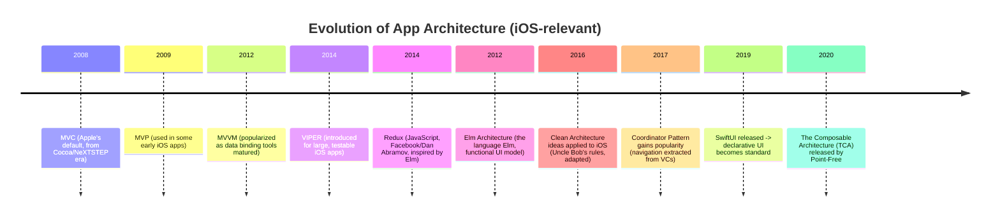

We will go through each pattern with the same structure: what it is, why
it appeared, how data flows through it, its pros and cons, and where it is
used in the real world.

---

## 2.2 MVC (Model-View-Controller)

### What it is

MVC splits an app into three pieces:

- **Model** — the data and the rules about that data (e.g., a `User`
  struct, or the rule "a password must be 8+ characters").
- **View** — what the user sees, and how they interact with it (buttons,
  labels, table views).
- **Controller** — the "middle man." It receives input from the View,
  updates the Model, and updates the View to reflect the new Model.

Apple's UIKit was built around this pattern from the start —
`UIViewController` is, quite literally, the "Controller" of MVC.

```mermaid
flowchart LR
    User((User)) -->|taps button| View
    View -->|forwards event| Controller
    Controller -->|reads/writes| Model
    Controller -->|updates| View
    Model -.->|notifies of change\n(optional, via delegate/notification)| Controller
```

### History

MVC did not start on iOS. It comes from Smalltalk in the 1970s, and Apple
carried a version of it forward through NeXTSTEP into Cocoa, and then into
Cocoa Touch (UIKit) in 2008 when the iPhone SDK launched. Apple's official
sample code, tutorials, and Interface Builder are all built assuming MVC.
This is why MVC became the *default* architecture for iOS apps — it is not
that engineers chose it, it is what Apple's tools push you toward from day
one.

### Why it became "Massive View Controller"

In Apple's textbook version of MVC, the Controller is supposed to be a
thin coordinator. In practice, on iOS, the `UIViewController` ends up
holding:

- Outlets to UI elements (View-related).
- Table view data source and delegate methods (View-related).
- Networking calls (Model-related, but often written directly in the
  Controller).
- Validation logic (Model-related, but often written directly in the
  Controller).
- Navigation logic (deciding which screen to push next).

Because `UIViewController` is the one class Apple's frameworks give you a
required hook into, it becomes the dumping ground for everything that does
not have an obvious other home. Engineers nicknamed this problem **Massive
View Controller** — a `UIViewController` that has grown to thousands of
lines, mixing five or six unrelated responsibilities. This is the direct,
real-world version of the `LoginView` problem from Chapter 1, just in
UIKit form instead of SwiftUI form.

### Advantages

- Built into UIKit — zero setup, no libraries needed.
- Easy to learn — most iOS tutorials and Apple's own documentation assume
  it.
- Fine for small apps or prototypes with only a few screens.

### Disadvantages

- Controllers grow without limit ("Massive View Controller").
- Business logic and UI logic are tangled together, so neither can be
  tested in isolation without also standing up UIKit.
- No enforced separation of concerns — nothing stops you from putting
  networking code directly next to `viewDidLoad()`.
- Hard to reuse logic across screens — logic is trapped inside a specific
  Controller subclass.

### Real-world usage

MVC (or something that looks like MVC on the surface but is really
"whatever grew out of a ViewController") is still extremely common,
especially in smaller apps, startups moving fast, and legacy codebases
that started years ago. Very few production apps stay "textbook MVC" as
they grow — most drift toward MVVM or a custom pattern once the pain of
Massive View Controller becomes obvious.

---

## 2.3 MVP (Model-View-Presenter)

### What it is

MVP is a direct response to MVC's biggest weakness: the View and the logic
are tangled together. MVP tries to fully separate them by introducing a
**Presenter** — a plain object (not a `UIViewController`) that contains
all the logic, and talks to the View only through a narrow protocol.

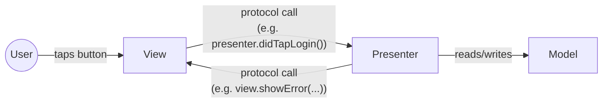

The key difference from MVC: in MVP, the View is usually a thin
`UIViewController` that implements a `ViewProtocol`, and the Presenter
holds a reference to that protocol, not to the concrete `UIViewController`
class. This means you can write a **fake View** in a unit test and check
that the Presenter calls the right methods on it, without ever creating a
real `UIViewController`.

### History

MVP dates back to the 1990s (Taligent, then popularized further by
Microsoft's patterns & practices team in the 2000s). On iOS, it saw modest
adoption around 2012–2015 as an alternative to Massive View Controller,
mostly among teams that wanted better testability but were not ready for
the extra complexity of VIPER.

### Advantages

- Business logic lives in the Presenter, a plain class you can unit test
  without UIKit.
- Clear one-directional contract between View and Presenter via
  protocols.
- Easier to reason about than MVC once the split is made correctly.

### Disadvantages

- Requires writing a protocol for every View, which is extra boilerplate
  (boilerplate = repetitive code you must write by hand for the pattern to
  work, not because it solves a unique problem).
- The Presenter can still grow large if a screen has a lot of logic — MVP
  moves the "massiveness" problem, it does not eliminate it.
- Never got first-class support from Apple's tools, so it always felt
  like swimming against the current on iOS.

### Real-world usage

MVP is less common on iOS today than MVVM or VIPER, but it still shows up,
especially in codebases with engineers who came from Android (MVP was very
popular in Android development for years).

---

## 2.4 MVVM (Model-View-ViewModel)

### What it is

MVVM introduces a **ViewModel** — a plain object that holds the state and
logic for a screen, and exposes it in a form the View can *observe*.
Instead of the ViewModel calling methods on the View directly (like MVP's
Presenter does), the View watches the ViewModel's published properties and
updates itself automatically when they change. This "watching" is called
**data binding**.

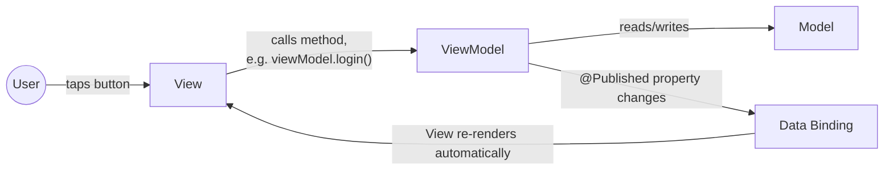

### History

MVVM was introduced by Microsoft engineers (John Gossman, 2005) for WPF
(Windows Presentation Foundation), a UI framework with strong built-in data
binding. It only became practical on iOS once Apple shipped a real data
binding system: first **Key-Value Observing (KVO)**, then, much more
naturally, **Combine** (2019) and `@Published`/`@ObservedObject`, and then
even more naturally with **SwiftUI**, which was basically designed with
MVVM-style state observation in mind.

This is an important pattern to notice: **an architecture becomes popular
on a platform once the platform's tools make that architecture natural to
write.** MVC was natural on UIKit because Interface Builder wires Views
directly to Controllers. MVVM became natural once Combine and SwiftUI gave
engineers automatic, declarative observation. Keep this pattern in mind —
it is exactly why TCA became possible: SwiftUI's Observation system made
a strict, unidirectional store-based architecture practical to write
without excessive boilerplate.

### A concrete example

```swift
// Model
struct LoginCredentials {
    var email: String
    var password: String
}

// ViewModel — plain class, no UIKit/SwiftUI import needed for its logic
@MainActor
final class LoginViewModel: ObservableObject {
    @Published var email = ""
    @Published var password = ""
    @Published var errorMessage: String?
    @Published var isLoading = false

    private let authService: AuthServicing

    init(authService: AuthServicing) {
        self.authService = authService
    }

    func login() async {
        guard email.contains("@") else {
            errorMessage = "Enter a valid email"
            return
        }
        isLoading = true
        defer { isLoading = false }
        do {
            try await authService.login(email: email, password: password)
        } catch {
            errorMessage = error.localizedDescription
        }
    }
}

// View — thin, only describes layout and binds to the ViewModel
struct LoginView: View {
    @StateObject var viewModel: LoginViewModel

    var body: some View {
        VStack {
            TextField("Email", text: $viewModel.email)
            SecureField("Password", text: $viewModel.password)
            if let errorMessage = viewModel.errorMessage {
                Text(errorMessage).foregroundColor(.red)
            }
            Button("Log In") {
                Task { await viewModel.login() }
            }
        }
    }
}
```

Notice how much cleaner this already is compared to Chapter 1's
`LoginView`. The `LoginViewModel` can be unit tested directly — create it
with a fake `AuthServicing`, call `login()`, and assert on
`errorMessage` — with no UIKit or SwiftUI involved at all.

### Advantages

- Plain, testable ViewModel classes — a big readability and testability
  win over MVC.
- Natural fit with SwiftUI and Combine's declarative, reactive style.
- Widely understood — most modern iOS teams already use some version of
  this.
- Moderate learning curve — most iOS engineers can pick it up quickly.

### Disadvantages

- No official rules about what "counts" as business logic versus
  view-formatting logic, so ViewModels can still grow large ("Massive
  ViewModel" is a real, commonly-reported problem).
- No built-in answer for navigation — every team invents its own way to
  handle it (this gap is what the Coordinator pattern, Section 2.8, tries
  to solve).
- No built-in answer for how ViewModels talk to each other (parent-child
  communication is ad hoc).
- Testing async and multi-step flows can still get messy without extra
  discipline.
- State is spread across many `@Published` properties, similar to the
  `@State` problem in Chapter 1 — nothing stops the properties from
  reaching invalid combinations.

### Real-world usage

MVVM is, as of 2026, the most widely used architecture on iOS, especially
in SwiftUI apps. Most companies that do not use TCA use some flavor of
MVVM, often combined with a Coordinator for navigation ("MVVM-C").

---

## 2.5 VIPER

### What it is

VIPER splits a screen into five distinct pieces, each with a single job:

- **View** — displays what the Presenter tells it to display, and forwards
  user actions to the Presenter. Contains zero logic.
- **Interactor** — contains the business logic. Talks to services/data
  sources. Knows nothing about UI.
- **Presenter** — the middle man. Takes results from the Interactor,
  formats them for display, and tells the View what to show. Also tells
  the Router when navigation should happen.
- **Entity** — plain data models (similar to "Model" in MVC).
- **Router** (sometimes called Wireframe) — handles navigation; decides
  which screen appears next and how to build it.

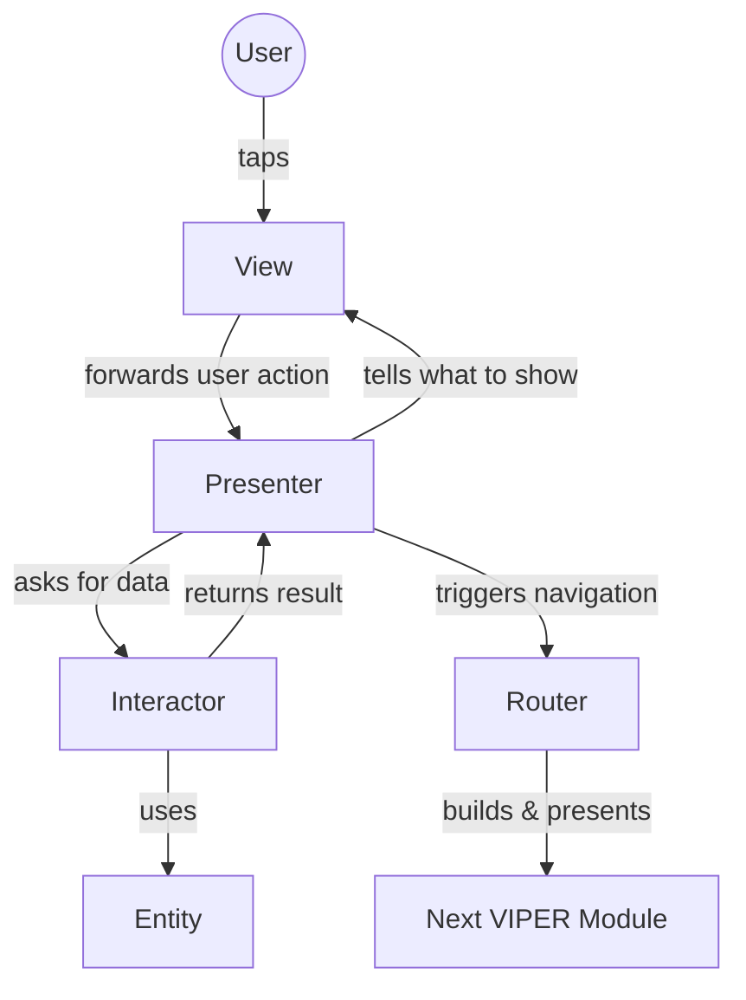

### History

VIPER was introduced by Mutual Mobile in 2014 as an application of
**Clean Architecture** (Section 2.7) and the **Single Responsibility
Principle** to iOS. It was designed specifically to solve Massive View
Controller in large, long-lived, heavily-tested apps — think banking apps,
enterprise apps, and apps with big QA teams that need very high test
coverage.

### Advantages

- Extremely clear separation of concerns — each of the five pieces has
  exactly one job, and it is hard to break that discipline by accident.
- Very testable — the Interactor and Presenter are plain objects, easily
  unit tested with fakes.
- Scales well to very large teams, because a new engineer can be told "you
  own the Interactor for this module" and know exactly what that means.

### Disadvantages

- Very high boilerplate — a single screen may need five or more new files
  and several protocols, even for something simple like a settings toggle.
- Steep learning curve — new engineers often find VIPER confusing at
  first because there are so many moving pieces.
- Can feel like overkill for small apps or simple screens.
- Passing data between the five layers of one module, and between
  different VIPER modules, requires a lot of manual protocol-writing.

### Real-world usage

VIPER saw real adoption in large enterprise iOS apps in the mid-to-late
2010s (banking, insurance, and other apps with big engineering teams and a
strong QA culture). Its popularity has declined somewhat since as SwiftUI
and MVVM/TCA-style architectures offered similar testability with less
boilerplate, but it is still found in older, large UIKit codebases.

---

## 2.6 Redux (and why it matters even though it is JavaScript)

Redux is not an iOS pattern — it is a JavaScript state management library,
released in 2015 by Dan Abramov, used heavily with the React framework.
You need to understand Redux because **TCA is directly inspired by it**
(the official TCA documentation says so explicitly). Once you understand
Redux, TCA's design will make far more sense.

### What it is

Redux enforces one very strict rule: **all of the app's state lives in one
place (a single "store"), and the only way to change that state is to
dispatch a plain description of what happened (an "action") to a pure
function (a "reducer") that computes the new state.**

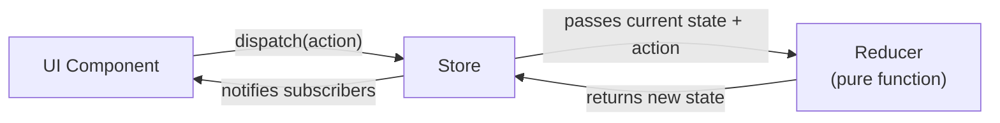

Key vocabulary, because you will see these exact words again in TCA:

- **State** — one object/tree that holds everything the app currently
  knows.
- **Action** — a plain description of "something happened" (e.g.,
  `{ type: "LOGIN_SUCCESS", token: "abc123" }`).
- **Reducer** — a pure function: `(state, action) -> newState`. "Pure"
  means: given the same inputs, it always produces the same output, and it
  never causes side effects (no networking, no random numbers, no reading
  the clock) inside the reducer itself.
- **Store** — the object that holds the current state, receives dispatched
  actions, runs them through the reducer, and notifies the UI when state
  changes.

### Why this strictness is valuable

Because state can only change in one traceable way (dispatch an action →
reducer computes new state), you get powerful abilities almost for free:

- **Predictability** — given a sequence of actions, you can always compute
  the exact resulting state. This removes a huge class of "how did we get
  into this weird state?" bugs.
- **Time-travel debugging** — because every state change is just "apply
  this action to that reducer," you can record every action, and replay
  them to reproduce any bug exactly, or even step backward and forward
  through app history in a debugger.
- **Easy testing** — since a reducer is a pure function, you test it by
  calling it directly with an input state and action, and checking the
  output state. No mocking a UI required.

### Disadvantages

- Boilerplate: defining action types, action creators, and reducers for
  every piece of state is a lot of ceremony in plain JavaScript/Redux.
- The strict single-store, pure-function-only model can feel rigid for
  quick, simple features.
- Side effects (networking, timers) do not fit cleanly into a pure
  reducer, so Redux needs extra tools (like "middleware," e.g. Redux
  Thunk or Redux Saga) bolted on to handle them.

### Real-world usage

Redux became one of the most popular state management tools in the React
ecosystem through the mid-to-late 2010s, and its core ideas (single
source of truth, unidirectional data flow, pure reducers) went on to
influence state management libraries across nearly every UI framework,
including SwiftUI's TCA.

---

## 2.7 The Elm Architecture

### What it is

Elm is a functional programming language for building web UIs, and it
actually came *before* Redux and directly inspired it. The **Elm
Architecture (TEA)** defines an app as three things:

- **Model** — the state.
- **Update** — a pure function: `(Message, Model) -> Model`. This is
  exactly what Redux later called a "reducer," and what TCA calls a
  "reducer."
- **View** — a pure function: `Model -> HTML`. Given the current state, it
  produces what should be shown. There is no manual DOM manipulation.

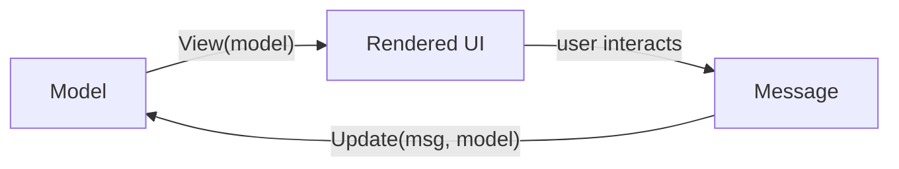

This is the same triangle you saw in Redux, just with different names
(Message = Action, Update = Reducer). Elm actually predates Redux — Dan
Abramov has said publicly that Redux's design was directly inspired by
Elm. TCA, in turn, borrows terminology and structure from both: it uses
Redux's word "Action," but its overall shape — a pure function that
transforms state given a message, paired with a declarative view function
— is Elm's idea.

### Why it matters for TCA

TCA's official documentation explicitly credits Elm as an inspiration.
The chain of influence looks like this:

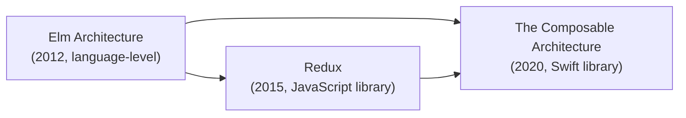

Understanding this chain is genuinely useful in interviews: if you are
asked "what inspired TCA," the correct, complete answer is "the Elm
Architecture and Redux," not just "Redux."

---

## 2.8 Clean Architecture

### What it is

Clean Architecture is not iOS-specific or even UI-specific — it is a
general set of rules proposed by Robert C. Martin ("Uncle Bob") in a 2012
blog post and later a book. The central rule is the **Dependency Rule**:
source code dependencies must only point *inward*, toward business rules,
never outward toward UI or infrastructure details.

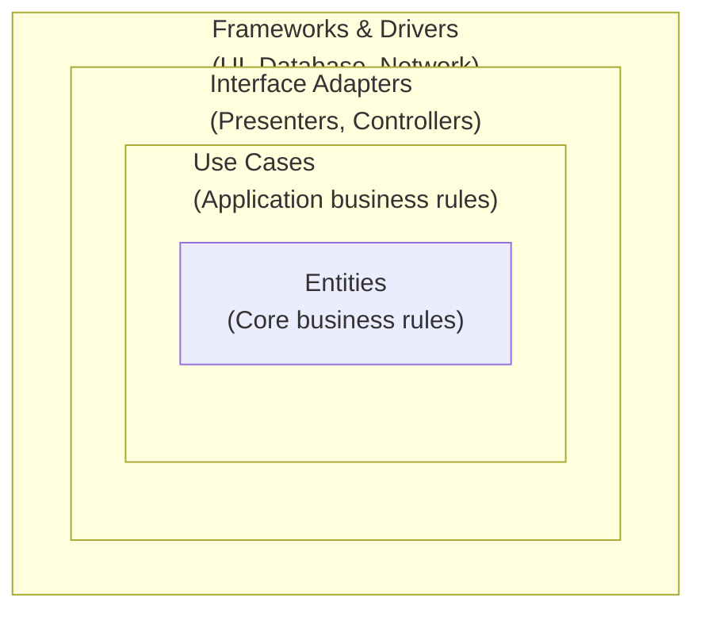

The idea: your core business rules (Entities, Use Cases) should not know
or care whether the app uses UIKit, SwiftUI, Core Data, or a REST API.
Those "outer" details can be swapped out without touching the core logic.
This is enforced by defining protocols in the inner layers and
implementing them in the outer layers ("dependency inversion").

### Why it matters for iOS

Clean Architecture itself is not a full UI architecture — VIPER (Section
2.5) is essentially Clean Architecture's rules applied specifically to an
iOS screen (Interactor = Use Case layer, Entity = Entity layer, and so
on). Many modern MVVM iOS apps also borrow Clean Architecture's layering
idea even without using VIPER — for example, defining a `Repository`
protocol in a core module, and only letting outer, networking-specific
code implement it.

### Advantages

- Forces a very clean boundary between business logic and framework
  details, which makes swapping data sources (e.g., mock API → real API)
  trivial.
- Extremely testable, since business rules never depend on UIKit/SwiftUI.
- Scales well across large, long-lived codebases and multiple platforms.

### Disadvantages

- A lot of upfront ceremony: protocols, layers, and mapping between layers
  add real development time.
- Overkill for small apps or apps that will not live long.
- Easy to apply half-heartedly, which gives you all the boilerplate with
  none of the actual benefit.

---

## 2.9 The Coordinator Pattern

### What it is

The Coordinator pattern, popularized by Soroush Khanlou around 2015,
solves a problem that MVC, MVP, and MVVM all leave unsolved: **who decides
navigation?** Without a Coordinator, navigation logic (deciding "after
login succeeds, push the home screen") tends to leak into Controllers or
ViewModels, which then need to know about screens that are not really
their concern.

A **Coordinator** is an object whose only job is to own navigation: it
creates screens, decides which one appears next, and passes data between
them, keeping that logic out of the View/ViewModel entirely.

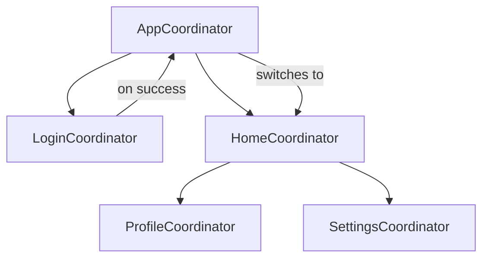

### Advantages

- Screens (Views/ViewModels) do not need to know what comes next — they
  just report "login succeeded" and let the Coordinator decide.
- Navigation flows become easy to visualize and change in one place.
- Screens become more reusable, since they are not hard-coded to always
  be followed by a specific next screen.

### Disadvantages

- Adds another layer of objects and protocols to maintain.
- Passing data and dismiss/back actions through Coordinators can get
  verbose without careful design.
- Not an Apple-provided pattern, so every team implements it slightly
  differently, which can confuse engineers moving between codebases.

### Why this matters for TCA

TCA has its own, built-in, more structured answer to "who owns
navigation" using `NavigationStack`, `StackState`, and
`PresentationState` (you will learn these in Chapter 9). This is one of
TCA's real advantages over MVVM: navigation is handled by the same
reducer/state/action system as everything else, instead of needing a
separate, hand-rolled Coordinator layer.

---

## 2.10 Feature-based Architecture

### What it is

This is less a specific pattern and more an **organizing principle**: instead of
grouping files by *type* (all Views in one folder, all ViewModels in
another, all Models in a third), you group files by *feature* (everything
related to "Login" lives in one folder: `LoginView.swift`,
`LoginViewModel.swift` or `LoginReducer.swift`, `LoginModels.swift`,
`LoginTests.swift`).

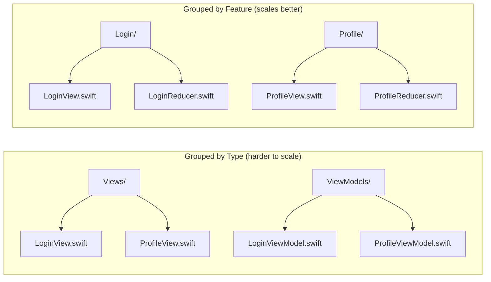

### Why it matters

As an app grows to dozens or hundreds of screens, grouping by type means
every folder becomes a long, unrelated list of files, and finding
everything related to one feature means jumping between many folders.
Grouping by feature keeps related code together, makes it obvious what a
feature owns, and makes it much easier to delete or move a whole feature
(which is common in real products — features get cut, split, or
relaunched under a different team).

TCA's design leans heavily into feature-based organization: each feature
is typically its own `@Reducer` type with its own `State`, `Action`, and
`body`, living in its own file or module. Chapter 15 covers real
production folder structures built around this idea in depth.

---

## 2.11 Why companies moved away from MVC

Pulling the threads of this chapter together, here is a concise answer to
a very common interview question: *why did the industry move away from
MVC?*

1. **Massive View Controller.** UIKit funnels almost everything into
   `UIViewController`, and nothing enforces limits, so Controllers grow
   without bound.
2. **Poor testability.** Logic embedded in a `UIViewController` is hard to
   unit test — you often need to stand up UIKit, which is slow and
   brittle.
3. **No separation of concerns.** Networking, validation, formatting, and
   navigation all end up living in the same object.
4. **Team scaling problems.** When five engineers work in the same
   Massive View Controller, merge conflicts and accidental regressions
   become constant.
5. **New tools made better patterns practical.** KVO, then Combine, then
   SwiftUI's Observation system made MVVM (and eventually TCA) far easier
   to write than they were in MVC's era. Architecture choices often follow
   what the platform's tools make convenient (see Section 2.4).

## 2.12 Why Redux (and Elm) influenced TCA

This chapter set up the exact ideas TCA needed:

- From **Elm**: the idea of a pure `update` function driving all state
  changes, and a `View` that is a pure function of `State`.
- From **Redux**: the vocabulary — "Action," "Reducer," "Store" — and the
  discipline of a single, predictable, traceable way to change state.
- From **VIPER/Clean Architecture**: the value of strict separation of
  concerns and high testability in large, enterprise-scale apps.
- From **MVVM**: the value of reactive, declarative UI that updates itself
  automatically when state changes — which SwiftUI already gives you.
- From the **Coordinator pattern**: the idea that navigation deserves its
  own first-class, structured treatment, not ad hoc code in a ViewModel.

TCA is, in a real sense, an attempt to take the predictability and
testability of Redux/Elm, and combine it with the declarative,
observation-driven rendering of SwiftUI, while adding first-class
solutions for the things Redux does not solve well out of the box: side
effects, dependency injection, and navigation. Chapter 3 picks up exactly
here and tells the story of how Point-Free built that combination.

## 2.13 Comparison table

| Pattern | State lives in | Who can change state | Testability | Boilerplate | Navigation story | Learning curve |
|---|---|---|---|---|---|---|
| MVC | Controller & Model, informally | Anyone with a reference to the Controller | Low | Low | Ad hoc, often in Controller | Low |
| MVP | Model, exposed via Presenter | Presenter only | Medium-High | Medium | Ad hoc, often in Presenter | Medium |
| MVVM | ViewModel (`@Published` props) | ViewModel methods | High | Medium | Not built-in (often Coordinator) | Low-Medium |
| VIPER | Entities, surfaced by Interactor | Interactor only | Very High | High | Router (built into the pattern) | High |
| Redux | Single global store | Reducers only, via dispatched actions | Very High | Medium-High | Not built-in (middleware/libs) | Medium |
| Elm Architecture | Model | `update` function only, via messages | Very High | Low (language-native) | Not built-in | Medium |
| Clean Architecture | Entities/Use Cases | Use Cases only | Very High | High | Not defined (layer-agnostic) | High |
| Coordinator | N/A (navigation only) | N/A | High (for navigation logic) | Medium | This *is* the navigation solution | Medium |
| TCA | Single feature-scoped State tree | Reducers only, via dispatched actions | Very High | Medium (macros reduce this) | Built-in (`StackState`, `PresentationState`) | Medium-High |

## 2.14 Data flow, side by side

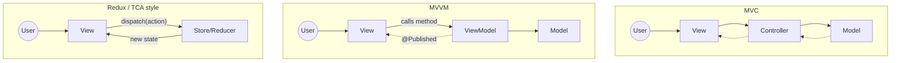

## 2.15 Chapter Summary

- MVC is Apple's default; it is simple but collapses into Massive View
  Controller as apps grow.
- MVP separates logic into a testable Presenter, at the cost of protocol
  boilerplate.
- MVVM is today's most common iOS pattern, thanks to SwiftUI/Combine's
  built-in data binding, but leaves navigation and "Massive ViewModel"
  unsolved.
- VIPER gives extremely strict separation of concerns at a high
  boilerplate cost, and is common in large, heavily-tested enterprise
  apps.
- Redux and the Elm Architecture are the direct ancestors of TCA's core
  ideas: single state, pure reducer functions, dispatched actions, strict
  unidirectional data flow.
- Clean Architecture's Dependency Rule underlies VIPER and influences how
  many MVVM apps structure their data layers.
- The Coordinator pattern solves navigation, a gap left open by MVC/MVP/
  MVVM — and TCA solves the same problem natively.
- Feature-based file organization scales better than grouping files by
  type, and TCA is designed with this in mind.
- Architecture choices tend to follow what a platform's tools make easy —
  this is exactly why TCA became viable once SwiftUI shipped.

## 2.16 Check Your Understanding

1. What specifically causes "Massive View Controller" in MVC?
2. How does MVP make logic more testable than MVC?
3. Why did MVVM only become popular on iOS after Combine/SwiftUI shipped?
4. Name the five layers of VIPER and the one responsibility each one has.
5. In Redux, what are the exact rules for how state is allowed to change?
6. What two things did TCA borrow from the Elm Architecture and Redux,
   respectively?
7. What problem does the Coordinator pattern solve that MVC, MVP, and
   MVVM leave open?
8. Why does feature-based folder organization scale better than
   type-based organization?

---

**Previous:** [Chapter 1 — What is Architecture?](01-What-is-Architecture.md)
**Next:** [Chapter 3 — Why TCA Was Created](03-Why-TCA-Was-Created.md)
