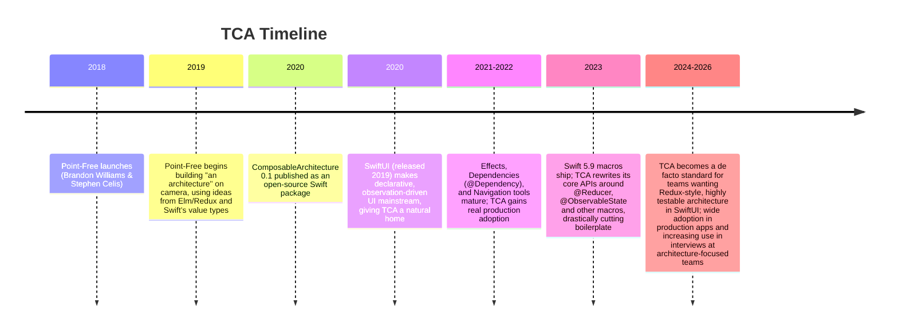

# Chapter 3 — Why TCA Was Created

## 3.1 Who is Point-Free?

**Point-Free** is a video series and software studio run by two engineers,
**Brandon Williams** and **Stephen Celis**. Both worked at Kickstarter,
where they were known for pushing functional programming ideas into a
production iOS codebase (Kickstarter's iOS app was, for years, one of the
most-cited examples of functional Swift in the wild — its source is open
on GitHub). In 2018 they left to start Point-Free: a subscription video
series that teaches functional programming and Swift through deep,
episode-by-episode exploration of real problems.

Point-Free's teaching style is to *build things from first principles, on
screen, over many episodes*, rather than hand you a finished library. The
Composable Architecture is the most famous result of that process: it was
not designed in a single meeting and then written — it was built, argued
over, and refined across dozens of recorded episodes starting in 2019,
with the source published as an open-source Swift package.

## 3.2 A short history / timeline

The exact version numbers are less important than the trend: TCA started
as an experiment in "what if Swift had an Elm/Redux-style architecture,"
and matured, release by release, into a serious, production-grade library
used by real companies, with the 2023 macro rewrite being the single
biggest turning point — it removed most of the manual boilerplate that
made early TCA feel heavy.

## 3.3 The problems TCA set out to solve

Chapter 2 showed you that every architecture pattern is really an answer
to the same three questions: where does state live, what can change it,
and how does the UI find out. TCA's specific answers were shaped by five
concrete problems the Point-Free team observed in real Swift codebases,
including their own work at Kickstarter.

### Problem 1 — State management gets messy as apps grow

In MVVM, state lives in scattered `@Published` properties across many
ViewModels. Nothing connects them into one coherent picture, and nothing
stops two properties from disagreeing with each other (Chapter 1's
`isLoading == true && isLoggedIn == true` example). TCA's answer: **all of
a feature's state lives in one `struct`,** so at any moment you can look
at exactly one value and know everything the feature currently knows.

### Problem 2 — Business logic is hard to test in isolation

In MVC and loosely-structured MVVM, logic often lives inside closures
triggered by button taps, which are hard to call directly in a test. TCA's
answer: **all logic lives in a reducer — a function you can call directly,
with no UI involved,** the same way Redux's reducer or Elm's `update`
function can be called directly.

### Problem 3 — Side effects (networking, timers, etc.) are handled inconsistently

Every engineer on a team tends to write networking code slightly
differently — some use completion handlers, some use Combine, some use
async/await, some cancel requests properly, some do not. TCA's answer: **a
single `Effect` type represents all side effects**, with consistent rules
for cancellation, dependency injection, and testing.

### Problem 4 — Testing async, multi-step flows is painful

Testing "tap login, wait for the network call, check the error state" in
MVVM usually means either slow UI tests, or manually awaiting async work
in a unit test and hoping timing works out. TCA's answer: the
**`TestStore`**, a tool purpose-built to send actions, await effects
deterministically, and assert on every single state change, one step at a
time (Chapter 13 is dedicated to this).

### Problem 5 — Composing small features into big features is ad hoc

In MVVM, if you want a "Settings" screen made of five smaller
sub-features (Profile, Notifications, Privacy, Billing, Account), there is
no standard way to combine five ViewModels into one. Each team invents its
own convention. TCA's answer: reducers can be **composed** — small
reducers can be plugged into larger ones using operators like `Scope`,
with well-defined rules for how state, actions, and effects flow between
parent and child (Chapter 10 covers this fully). This composability is
where the architecture's name comes from: **The Composable Architecture.**

## 3.4 Why SwiftUI works so well with TCA

TCA was originally released in 2020, before SwiftUI's tools for
observation were as mature as they are today, and even then, TCA's design
already leaned on the same idea SwiftUI is built around: **the View is a
pure function of State.** Give SwiftUI a `State` value, and it draws the
screen. Change the `State`, and SwiftUI redraws automatically. This is
precisely the "View is a function of Model" idea from the Elm Architecture
(Section 2.7).

Three specific SwiftUI/Swift developments made TCA dramatically better
over time:

1. **Combine (2019)** gave TCA's original `Store` a supported way to
   publish state changes that SwiftUI could observe.
2. **Swift 5.9 macros (2023)** let TCA introduce `@Reducer` and
   `@ObservableState`, which auto-generate large amounts of code
   (conformances, boilerplate initializers, observation hooks) that
   earlier TCA versions required you to write by hand.
3. **The Observation framework (`@Observable`, iOS 17+)** gave SwiftUI a
   much more precise, much faster way to track exactly which piece of
   state a given View reads, and only redraw that View when *that*
   specific piece changes — a huge performance and ergonomics win over
   Combine-based observation. TCA's `@ObservableState` macro is built on
   top of this.

Because SwiftUI already assumes "the View renders based on some State,
and reacts when it changes," TCA does not have to fight the platform —
it fits directly into the shape SwiftUI expects, the same way MVVM does,
but with far stricter, more testable rules for how that State is allowed
to change.

## 3.5 Why didn't Apple create something like this?

This is a common and fair interview question. A few honest reasons:

1. **Apple tends to ship low-level building blocks, not opinionated
   architectures.** SwiftUI, Combine, and Observation are all tools you
   could use to *build* something like TCA — and Point-Free did exactly
   that. Apple generally avoids picking a single "correct" architecture
   for all apps, since apps range from a single-screen utility to a
   banking app with a hundred engineers.
2. **Different apps genuinely need different amounts of structure.** A
   simple weather widget does not need Redux-style strictness. Apple's
   frameworks are deliberately architecture-agnostic so they work well
   whether you use MVC, MVVM, VIPER, or TCA.
3. **Third parties are often faster at exploring opinionated ideas.**
   Point-Free could iterate rapidly, in public, based on direct developer
   feedback, in a way that is harder for a platform vendor shipping to
   hundreds of millions of devices with strict backward-compatibility
   requirements.
4. **Apple did eventually ship the *pieces* TCA needed** — Combine, then
   Observation, then Swift macros — which is arguably Apple's version of
   "supporting this style of architecture": give developers strong
   primitives, and let the community build the opinionated layer on top.

## 3.6 What TCA actually is, in one sentence

> TCA is a Swift library for building applications in a consistent and
> understandable way, with composition, testing, and ergonomics in mind,
> using a single, traceable, unidirectional flow of state, actions, and
> effects — heavily inspired by the Elm Architecture and Redux, and built
> to work naturally with SwiftUI.

Keep that sentence in mind. Every following chapter is really just
unpacking one part of it.

## 3.7 Chapter Summary

- TCA was created by Point-Free (Brandon Williams and Stephen Celis),
  starting in 2019, and released as an open-source Swift package in 2020.
- It set out to solve five concrete problems: scattered state, untestable
  logic, inconsistent side-effect handling, painful async testing, and ad
  hoc composition of small features into large ones.
- It is directly inspired by the Elm Architecture and Redux (Chapter 2).
- Swift 5.9 macros (2023) were a major turning point, cutting a large
  amount of the boilerplate that made earlier TCA versions feel heavy.
- SwiftUI's "View is a function of State" design, plus Combine and later
  the Observation framework, made TCA a natural fit for SwiftUI apps.
- Apple did not build TCA itself because Apple tends to ship
  architecture-agnostic building blocks and leaves opinionated
  architecture to the community — Point-Free built TCA on top of exactly
  those Apple-provided building blocks.

## 3.8 Check Your Understanding

1. Who created TCA, and what was their teaching approach?
2. Name three of the five specific problems TCA was designed to solve.
3. What changed for TCA in 2023, and why did it matter?
4. Why does TCA fit naturally with SwiftUI specifically (not just "any
   framework")?
5. Give an honest, technical reason why Apple has not shipped an
   official architecture like TCA itself.

---

**Previous:** [Chapter 2 — Evolution of iOS Architecture](02-Evolution-of-iOS-Architecture.md)
**Next:** [Chapter 4 — High-Level Overview](04-High-Level-Overview.md)
