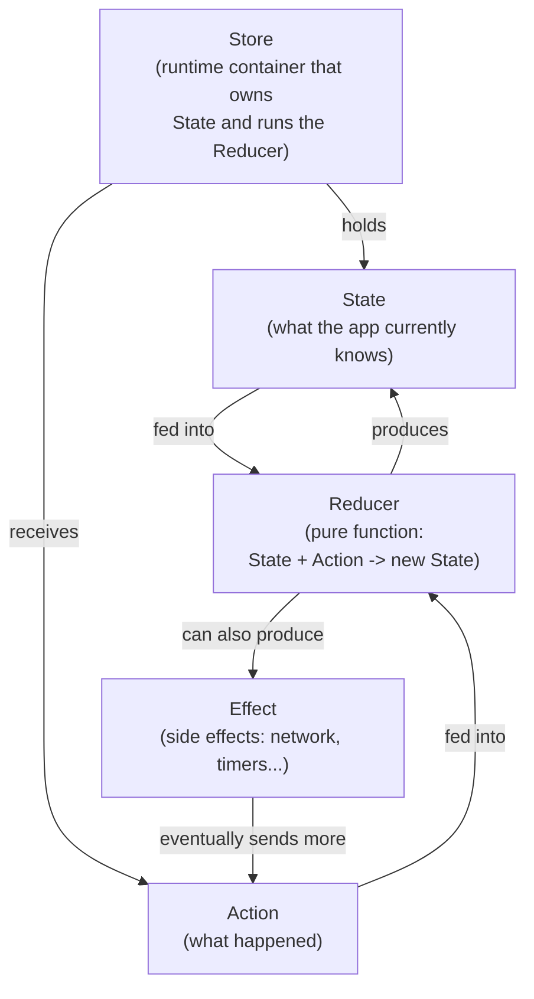
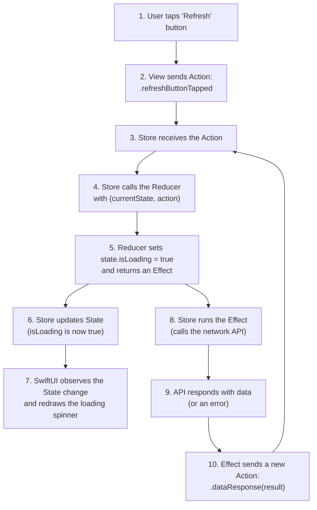
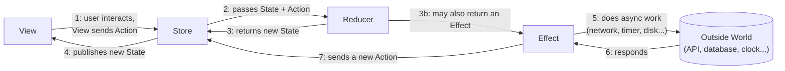
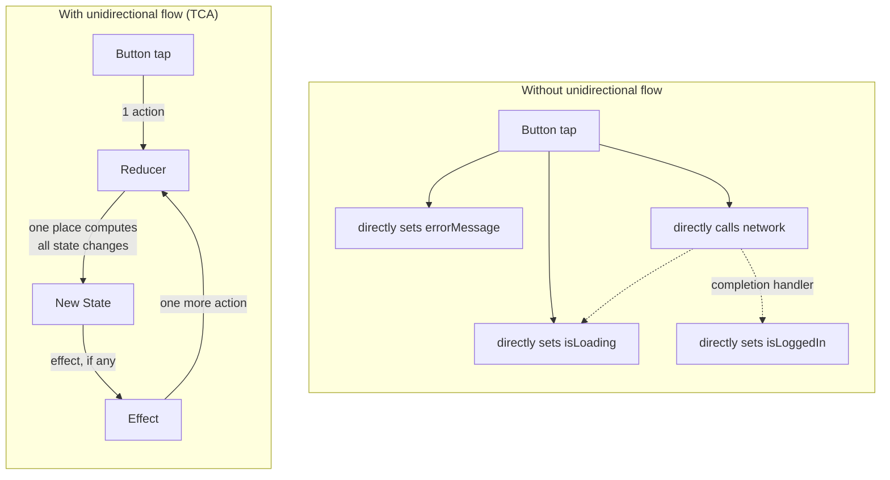
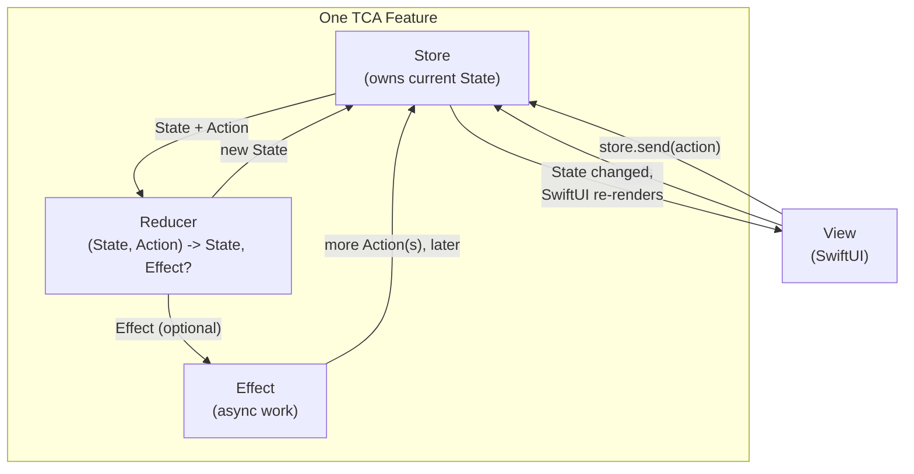

# Chapter 4 — High-Level Overview

Before you see a single line of TCA code, you need a mental picture of the
whole system. This chapter builds that picture with diagrams only. Every
box and arrow here will become a real Swift type in Chapter 5 — read this
chapter slowly, and Chapter 5 will feel like "oh, I already understand
this, now I just need the syntax."

## 4.1 The five building blocks

TCA is built from five kinds of pieces. Here they are, in plain English,
before any code:

1. **State** — a plain value (a `struct`) holding everything a feature
   currently knows: what's on screen, what the user has typed, whether
   something is loading, what data came back from the network.
2. **Action** — a plain value (an `enum`) describing something that
   happened: the user tapped a button, a network call finished, a timer
   fired.
3. **Reducer** — a function that takes the current State and an Action,
   and produces the new State (and, optionally, an Effect to run).
4. **Effect** — a description of work that happens outside the reducer:
   calling an API, starting a timer, reading a file. Effects eventually
   produce more Actions.
5. **Store** — the object that ties all of the above together at runtime:
   it holds the current State, receives Actions, runs the Reducer, and
   runs any Effects.

## 4.2 The full loop, step by step

Now let's trace one complete round trip through the system, using a
concrete scenario: **the user taps a "Refresh" button, which fetches data
from an API.**

Notice something important: step 10 loops back to step 3. **Every effect
eventually turns back into an action.** There is no separate "side effect
world" that quietly changes the app — everything, including the network
response, must flow back through the same reducer, the same way a user
tap does. This is one of the most important ideas in TCA, and it is worth
re-reading until it feels obvious.

## 4.3 Zooming out: the whole loop as one diagram

Read this diagram left to right, then notice the loop at the bottom: the
Effect talks to the outside world, gets a response, and turns that
response into another Action that flows right back into the Store — the
same entry point a user's tap uses.

## 4.4 Why this shape is called "unidirectional"

**Unidirectional data flow** means data moves in one direction around a
loop, never in a shortcut. Compare this to the messy `LoginView` example
from Chapter 1, where a button's closure directly read and wrote
`@State` variables in five different places, with no consistent order.

In the messy version, state can be changed from many different places, in
any order, and it's hard to predict what combination of state you will
end up with. In the unidirectional version, there is exactly **one** door
into changing state: dispatch an Action, let the Reducer decide. Every
state change can be traced back to a specific Action, in a specific
order. This traceability is the entire reason TCA (and Redux, and Elm) is
easy to debug, test, and reason about, even in large apps.

## 4.5 The full picture, including the View

Let's add the View explicitly, since it is the piece that actually
triggers Actions and displays State.

Notice the View never talks to the Reducer or the Effect directly. It only
ever does two things: **read State to know what to draw**, and **send
Action to say what happened**. Everything else is the Store's job, working
with the Reducer behind the scenes. This is a very important boundary,
and it is one of the reasons TCA views tend to stay small and simple, no
matter how complex the feature's logic is — all the complexity lives in
the Reducer, not the View.

## 4.6 A worked example, in words, before code

Let's walk through a real, tiny scenario end to end in plain English, so
Chapter 5 and 7's code will feel familiar.

**Feature: a counter with a "+1" button and an "Fetch Fact" button that
calls an API to get a fun fact about the current number.**

1. State: `{ count: 0, fact: nil, isLoadingFact: false }`
2. User taps "+1".
3. View sends action `.incrementButtonTapped`.
4. Reducer receives `(state, .incrementButtonTapped)`, sets
   `state.count += 1`, returns no effect.
5. Store's state is now `{ count: 1, fact: nil, isLoadingFact: false }`.
6. SwiftUI redraws, showing "1".
7. User taps "Fetch Fact".
8. View sends action `.fetchFactButtonTapped`.
9. Reducer receives `(state, .fetchFactButtonTapped)`, sets
   `state.isLoadingFact = true`, and returns an Effect that calls a
   "number facts" API with `state.count`.
10. Store's state is now `{ count: 1, fact: nil, isLoadingFact: true }`.
11. SwiftUI redraws, showing a loading spinner.
12. The Effect finishes: the API returns the string "1 is the loneliest
    number."
13. The Effect sends action `.factResponse("1 is the loneliest number.")`.
14. Reducer receives `(state, .factResponse(...))`, sets
    `state.fact = "1 is the loneliest number."` and
    `state.isLoadingFact = false`.
15. Store's state is now
    `{ count: 1, fact: "1 is the loneliest number.", isLoadingFact: false }`.
16. SwiftUI redraws, showing the fact and hiding the spinner.

Every single step above is either "an Action was sent" or "the Reducer
computed a new State from the previous State and that Action." There is
no step where state silently changes outside of this loop. That is the
whole idea of TCA — and once you have this loop firmly in your head, the
rest of this book is just filling in details and giving you the exact
Swift syntax for each piece.

## 4.7 Chapter Summary

- TCA has five core pieces: State, Action, Reducer, Effect, and Store.
- The full loop: View sends an Action → Store passes it to the Reducer
  along with the current State → Reducer returns new State (and maybe an
  Effect) → Store updates its State → View re-renders → any Effect
  eventually sends a new Action, restarting the loop.
- This is called unidirectional data flow: state can only change through
  one path (dispatch Action → Reducer computes new State), which makes
  every state change traceable.
- The View only ever does two things: read State, and send Action. It
  never talks to the Reducer or Effects directly.
- Every Effect eventually turns back into an Action — there is no
  separate, untracked way for the outside world to change your state.

## 4.8 Check Your Understanding

1. Name the five core pieces of TCA and, in one sentence each, what they
   do.
2. In the Refresh-button example (Section 4.2), which step is where the
   network call actually happens, and which piece triggers it?
3. What does "unidirectional data flow" mean, and why does it make
   debugging easier?
4. What are the only two things a TCA View is allowed to do with the
   Store?
5. Why must an Effect eventually send an Action, rather than changing
   State directly?

---

**Previous:** [Chapter 3 — Why TCA Was Created](03-Why-TCA-Was-Created.md)
**Next:** [Chapter 5 — Core Components](05-Core-Components.md)
