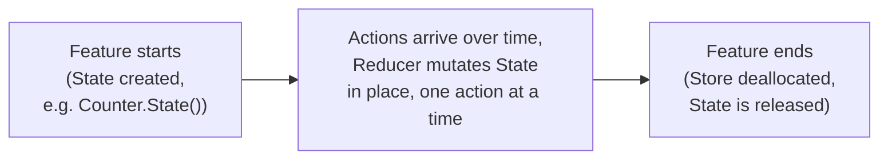
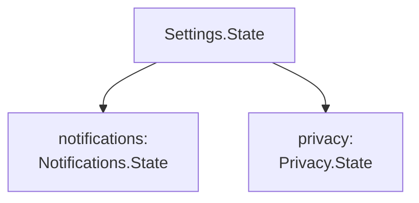
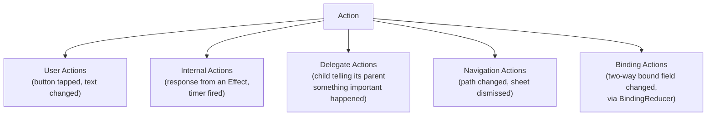
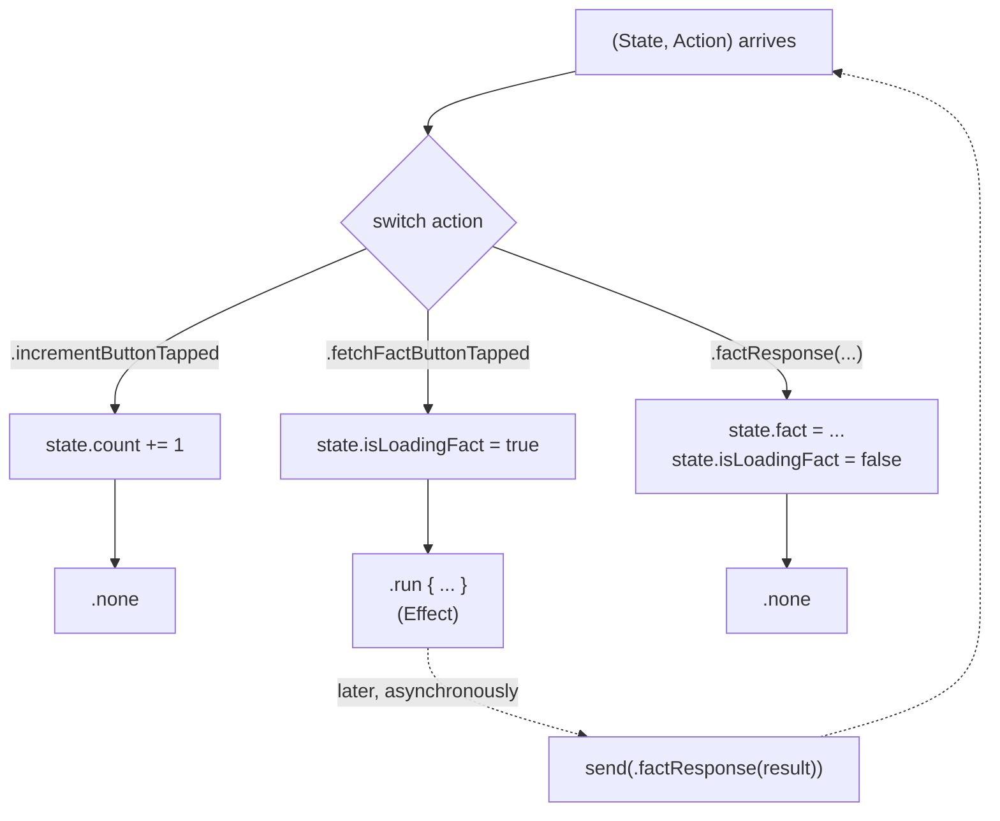
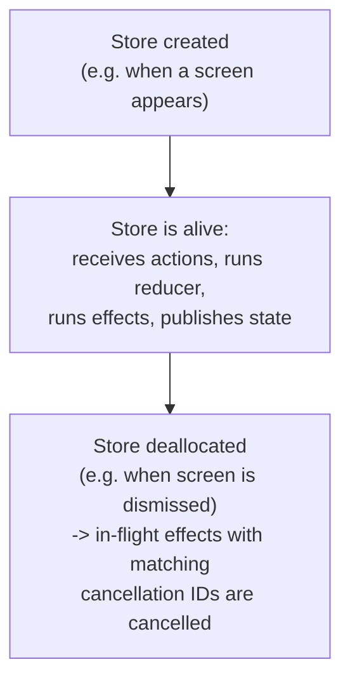
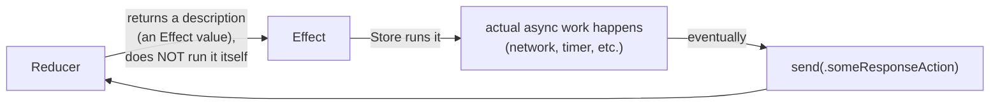
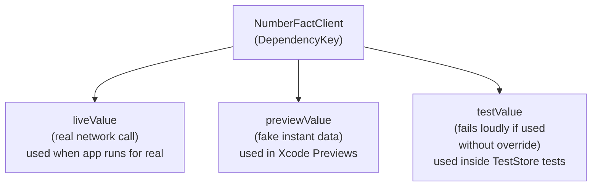

# Chapter 5 — Core Components

Chapter 4 gave you the shape of TCA using only diagrams. Now we give each
piece its real Swift syntax, using modern TCA (the macro-based API, Swift
6, iOS 17+). Every section follows the same order: what it is, why it
exists, how it works, examples, then common mistakes.

We will use one running example feature through this whole chapter: a
**Counter feature** that can increment, decrement, and fetch a "fun
fact" about the current number from an API. By the end of the chapter you
will have seen every piece of this feature explained in isolation. Chapter
7 puts it all together as a runnable app.

## 5.1 State

### What is State?

State is a plain Swift `struct` that holds every piece of data a feature
needs to know about itself, at this exact moment, in order to be drawn on
screen and to make decisions. Nothing more, nothing less.

```swift
import ComposableArchitecture

@Reducer
struct Counter {
    @ObservableState
    struct State: Equatable {
        var count = 0
        var fact: String?
        var isLoadingFact = false
    }
    // ... Action and body come later in this chapter
}
```

Let's explain every keyword here, since this book promised to explain
every keyword:

- `@Reducer` — a Swift **macro** (introduced in Swift 5.9) that, at
  compile time, generates a lot of boilerplate conformances and code for
  you (you will see exactly what in Section 5.3 and Chapter 14). For now,
  think of it as: "this type is a TCA feature."
- `struct Counter` — the feature itself is usually named after what it
  represents. This outer struct is a namespace that will hold `State`,
  `Action`, and the reducer logic together, in one place.
- `@ObservableState` — another macro. It makes this `State` struct work
  with SwiftUI's modern Observation system, so that when a property
  changes, only the exact Views reading that property redraw. Chapter 6
  explains the mechanics in depth.
- `struct State: Equatable` — `State` is the conventional name TCA uses
  for a feature's state type. `Equatable` means two `State` values can be
  compared with `==`. This matters enormously for testing (Chapter 13)
  and for SwiftUI's diffing.
- `var count = 0` — a normal, mutable property, with a default value.
- `var fact: String?` — an **optional** `String`. `nil` means "we do not
  have a fact yet."
- `var isLoadingFact = false` — a `Bool` flag tracking whether a network
  request is in flight, so the UI can show a spinner.

### Why State exists (as its own explicit type)

Compare this to MVVM's several separate `@Published var count = 0`,
`@Published var fact: String?`, `@Published var isLoadingFact = false`
properties scattered across a ViewModel (Chapter 2, Section 2.4). In TCA,
all of this lives in **one value**. This single value can be:

- Printed and inspected as a whole, in one debugger view.
- Compared as a whole with `==`, which is exactly what `TestStore` does
  in every test assertion (Chapter 13).
- Encoded/decoded as a whole, useful for state restoration or debugging
  tools.
- Passed around, copied, and stored, because it is a `struct` (a value
  type), which means copies are independent — mutating one copy never
  silently mutates another copy somewhere else in memory.

### Single source of truth

**Single source of truth** means: there is exactly one place that holds
the real, authoritative answer to "what is the current count?" — the
`State`. The View never keeps its own separate copy of `count` that might
drift out of sync. It only ever reads `state.count` directly. This
directly solves Chapter 1's Problem 4 (state reaching invalid, disagreeing
combinations) — because there is only one value, it cannot disagree with
itself.

### State lifecycle

A feature's `State` is created once, when the feature starts (for
example, when the app launches, or when a screen is pushed), and it lives
for exactly as long as that feature is "alive" — as long as the `Store`
that owns it exists. When the reducer processes an action, it does not
create new `State` from scratch — it **mutates the existing State value in
place** (Swift value-type mutation, `state.count += 1`), and the `Store`
publishes that mutated value.



### Nested State

Real apps are made of features inside features. A `Settings` feature
might contain a `Notifications` feature and a `Privacy` feature, each with
their own `State`. TCA handles this by **nesting State structs** — a
parent's `State` simply holds a child's `State` as a property (or, for
optional/list features, using tools you will meet in Chapters 9-10:
`@Presents`, `IdentifiedArrayOf`, `StackState`).

```swift
@Reducer
struct Settings {
    @ObservableState
    struct State: Equatable {
        var notifications = Notifications.State()
        var privacy = Privacy.State()
    }
    // ...
}
```



This is exactly why the architecture is called *Composable* — small,
independent `State` types compose into bigger ones, the same way small
reducers will compose into bigger reducers (Section 5.3, and fully in
Chapter 10).

### Common mistakes with State

- **Putting derived/computed values in State as stored properties.** If
  `isValid` can be computed from `email` and `password`, make it a
  computed property (`var isValid: Bool { email.contains("@") && ... }`),
  not a stored property you must remember to keep in sync manually.
- **Forgetting `Equatable`.** Without it, `TestStore` assertions and
  SwiftUI's efficient diffing do not work as well.
- **Storing UIKit/SwiftUI-specific types in State**, like `UIImage` or
  `Color` used for transient animation. Keep State to plain, testable
  data; keep pure UI/rendering detail in the View when it doesn't need to
  be tested or driven by logic.

### Best practices for State

- Keep State minimal: only what the feature actually needs to render and
  decide things.
- Prefer nested `State` structs per feature over one giant flat struct.
- Give every property a sensible default so `State()` is always valid.

---

## 5.2 Action

### What are Actions?

An Action is a plain Swift `enum` describing **everything that can happen**
to a feature: user interactions, responses from effects, and messages
from child features.

```swift
extension Counter {
    enum Action {
        case incrementButtonTapped
        case decrementButtonTapped
        case fetchFactButtonTapped
        case factResponse(Result<String, Error>)
    }
}
```

### Why enums?

A Swift `enum` is exactly the right tool here because it can represent
"exactly one of these possibilities happened," and each case can carry
its own associated data. This maps perfectly onto real events: "the fact
response came back" always comes with either a `String` (success) or an
`Error` (failure) attached — you cannot forget to handle one of those two
outcomes, because `switch` over an enum must be exhaustive (the compiler
forces you to handle every case, or explicitly say `default`).

### Categories of actions

In real TCA features, actions tend to fall into a few recognizable
categories. Recognizing these categories helps you name and organize
actions consistently across a whole codebase.



- **User actions** — directly caused by the user, usually named
  `somethingButtonTapped` or `somethingChanged`. Example:
  `incrementButtonTapped`.
- **Internal actions** — caused by something the app itself triggers,
  most commonly an Effect finishing. Convention: name them
  `somethingResponse`. Example: `factResponse(Result<String, Error>)`.
- **Delegate actions** — a child feature reporting something upward to
  its parent, without knowing or caring what the parent does about it.
  Convention: a nested `case delegate(Delegate)` enum. Fully explained in
  Chapter 10.
- **Navigation actions** — describe navigation events, like a
  `NavigationStack`'s path changing, or a sheet being dismissed. Fully
  explained in Chapter 9.
- **Binding actions** — a special case generated by `BindingReducer` for
  fields that use SwiftUI's two-way `$binding` syntax directly against
  State. Fully explained in Chapter 14.

### Why `Result<String, Error>`?

`factResponse(Result<String, Error>)` is a common, important pattern.
`Result` forces the reducer to handle both the success and failure case
explicitly — you cannot "forget" to handle a network error, because the
compiler requires you to switch over both `.success` and `.failure`. (In
modern TCA, effects are usually written with plain `async throws`
functions and a `do`/`catch` inside a `run` effect, which achieves the
same guarantee more directly — you'll see both styles in Chapter 11.)

### Common mistakes with Actions

- **One giant, vague action** like `case update(State)` that just
  replaces the whole state. This throws away all the traceability TCA is
  built for — you can no longer tell *what happened*, only that
  *something* changed.
- **Reusing the same action name for unrelated events**, which makes
  `switch` statements confusing and hard to search for.
- **Putting non-`Sendable` types in actions that cross concurrency
  boundaries** (e.g. into an `Effect`) — Swift 6's strict concurrency
  checking will flag this; keep action payloads simple, `Sendable` value
  types.

---

## 5.3 Reducer

### Why Reducers exist

The Reducer is where all of a feature's logic lives. It answers exactly
one question, over and over: *given what the app currently knows (State)
and what just happened (Action), what should the app know now (new
State), and is there any outside work that needs to happen (Effect)?*

### Pure functions

A **pure function** is a function whose output depends only on its
inputs, and which does not cause side effects (no networking, no random
numbers, no touching global mutable variables) by itself. TCA's reducer
`body` is conceptually a pure function:
`(inout State, Action) -> Effect<Action>`. Any side effect (networking,
timers, etc.) is not performed inside the reducer directly — it is
*described* as an `Effect` value, which the `Store` runs afterward
(Section 5.6, and fully in Chapter 11). This separation is exactly what
makes reducers so easy to test: calling a reducer with a given State and
Action always produces the same new State, with no hidden surprises.

### The code

```swift
@Reducer
struct Counter {
    @ObservableState
    struct State: Equatable {
        var count = 0
        var fact: String?
        var isLoadingFact = false
    }

    enum Action {
        case incrementButtonTapped
        case decrementButtonTapped
        case fetchFactButtonTapped
        case factResponse(Result<String, Error>)
    }

    @Dependency(\.numberFactClient) var numberFactClient

    var body: some ReducerOf<Self> {
        Reduce { state, action in
            switch action {
            case .incrementButtonTapped:
                state.count += 1
                return .none

            case .decrementButtonTapped:
                state.count -= 1
                return .none

            case .fetchFactButtonTapped:
                state.isLoadingFact = true
                state.fact = nil
                let count = state.count
                return .run { send in
                    let result = await Result { try await numberFactClient.fetch(count) }
                    await send(.factResponse(result))
                }

            case let .factResponse(.success(fact)):
                state.isLoadingFact = false
                state.fact = fact
                return .none

            case .factResponse(.failure):
                state.isLoadingFact = false
                state.fact = "Couldn't load a fact. Try again."
                return .none
            }
        }
    }
}
```

### Explaining every line

- `@Dependency(\.numberFactClient) var numberFactClient` — declares that
  this reducer needs a "number fact client" service, without saying how
  that service is implemented. This is dependency injection, done through
  a property wrapper. Full explanation in Section 5.7 and Chapter 12.
- `var body: some ReducerOf<Self>` — every `@Reducer` type must provide a
  `body`. `ReducerOf<Self>` is a type alias for
  `Reducer<Self.State, Self.Action>`. `some` is an opaque return type: the
  exact underlying type is complex (it's built from combinators), but
  callers only need to know "this conforms to `Reducer`."
  This is a **computed property**, evaluated to build up the reducer's
  logic.
- `Reduce { state, action in ... }` — the most basic reducer building
  block: a closure that receives the current state (`inout`, meaning you
  mutate it directly) and the action that occurred, and returns an
  `Effect<Action>`.
- `switch action { ... }` — because `Action` is an enum, `switch` is the
  natural, exhaustive way to handle every case.
- `case .incrementButtonTapped: state.count += 1; return .none` —
  mutate `count` directly (because `state` is `inout`), and return
  `.none`, meaning "no side effect needs to run for this action."
- `case .fetchFactButtonTapped:` — sets `isLoadingFact = true` and clears
  any old fact, then captures `state.count` into a local constant
  `count` (this matters: by the time the effect actually runs, `state`
  might have changed again, so we snapshot the value we need right now),
  and returns a `.run` effect.
- `.run { send in ... }` — describes asynchronous work. Inside, `send` is
  a function you call to dispatch new actions back into the system once
  the async work completes. Chapter 11 covers `.run` fully.
- `await Result { try await numberFactClient.fetch(count) }` — calls the
  injected dependency, wraps success/failure into a `Result` value.
- `await send(.factResponse(result))` — sends the result back into the
  reducer as a new action, continuing the loop from Chapter 4.
- `case let .factResponse(.success(fact)):` — pattern-matches a nested
  enum case: `Action.factResponse` wrapping `Result.success` wrapping a
  `String`, binding that string to a local constant `fact`.
- Both `.factResponse` cases finish by setting `isLoadingFact = false`,
  ensuring the spinner always disappears, whether the request succeeded
  or failed.

### Reducer flow diagram



### Common mistakes with Reducers

- **Calling `URLSession` or other async APIs directly inside `Reduce`,
  outside of an `Effect`.** This breaks testability and the pure-function
  guarantee — always wrap async/side-effecting work in `.run` or another
  `Effect`.
- **Forgetting to return something from every case.** Every case must
  return an `Effect<Action>` (even if it's `.none`).
- **Doing too much work per action.** If one action's handler is 200
  lines long, consider whether it should be split into multiple, more
  specific actions.

---

## 5.4 Store

### What is the Store?

The `Store` is the runtime engine. It is a reference type (a class) that:

1. Holds the current `State`.
2. Receives `Action`s (via `store.send(action)`).
3. Runs the `Reducer` to compute new `State` (and any `Effect`s).
4. Runs those `Effect`s, and feeds any actions they produce back into
   itself.
5. Notifies SwiftUI when `State` changes, so Views re-render.

```swift
@main
struct CounterApp: App {
    var body: some Scene {
        WindowGroup {
            CounterView(
                store: Store(initialState: Counter.State()) {
                    Counter()
                }
            )
        }
    }
}
```

- `Store(initialState: Counter.State())` — creates the Store with a
  starting `State` value.
- `{ Counter() }` — a trailing closure providing the reducer itself (an
  instance of the `Counter` type you defined in Section 5.3).

### Why Store exists as a separate object from State

`State` is a value type — cheap to copy, but that also means it has no
identity and no lifecycle of its own; a `struct` cannot "run effects" or
"notify observers" by itself. `Store` is a reference type (a class)
specifically because it needs identity and a lifecycle: something has to
exist for the whole time a feature is alive, own the current `State`,
manage running `Effect`s (which may need to be cancelled later), and act
as the one true entry point (`send`) for changing that `State`.

### Store lifecycle



### Scoped Store

A **scoped Store** is a Store that exposes only a *slice* of a bigger
feature's State and Action to a child View, using `.scope(state:action:)`.
This lets a parent feature own the full State, while handing a child View
only the part it actually needs — the child cannot accidentally read or
mutate state outside its slice.

```swift
// Inside a parent view that shows a child feature's view:
ChildView(
    store: store.scope(state: \.child, action: \.child)
)
```

- `store.scope(...)` — creates a new `Store` value that is backed by the
  *same* underlying state and effect-running machinery as the parent, but
  presents a narrower, child-shaped view onto it.
- `state: \.child` — a key path saying "the child's State lives at
  `parentState.child`."
- `action: \.child` — a key path saying "child actions should be wrapped
  into the parent's `Action.child(...)` case before being sent up."

Scoping is central to how parent/child features stay decoupled while
still sharing one real, underlying Store. Chapter 10 covers this in full
depth, with diagrams of the state tree.

### Shared Store, and memory management

Multiple Views can hold the *same* scoped Store (for example, a parent
View and a child View both showing pieces of the same feature). Because
`Store` is a class, holding it in multiple places does not copy state —
they are all looking at the same underlying data. SwiftUI (via
`@ObservableState`/Observation) ensures each View only re-renders when the
*specific* properties it reads actually change, even though many Views
might share access to the same overall Store. When a Store (and every
View referencing it) is no longer needed — for example, a sheet is
dismissed — Swift's normal reference counting deallocates it, and any
effects tied to it are cancelled (Chapter 11 covers cancellation IDs).

### Common mistakes with Store

- **Creating a new `Store` every time a View's `body` is computed.**
  `Store` should be created once (e.g., stored in a parent's state as a
  child feature, or held by `@State` at the root) and then reused/scoped,
  not constructed fresh on every render.
- **Reaching into a Store's state and mutating it directly from outside a
  reducer.** All state changes must go through `send(action)` — there is
  intentionally no public API to mutate `Store` state directly, other
  than through `@Bindable`/binding actions, which still flow through the
  reducer.

---

## 5.5 View

### Store observation, state rendering, sending actions

A TCA View has exactly three jobs, matching the boundary established in
Chapter 4: read State to know what to draw, send Actions when something
happens, and nothing else.

```swift
struct CounterView: View {
    let store: StoreOf<Counter>

    var body: some View {
        VStack(spacing: 16) {
            Text("\(store.count)")
                .font(.largeTitle)

            HStack {
                Button("-") { store.send(.decrementButtonTapped) }
                Button("+") { store.send(.incrementButtonTapped) }
            }

            if store.isLoadingFact {
                ProgressView()
            } else if let fact = store.fact {
                Text(fact)
            }

            Button("Fetch Fact") {
                store.send(.fetchFactButtonTapped)
            }
        }
    }
}
```

### Explaining every line

- `let store: StoreOf<Counter>` — `StoreOf<Counter>` is shorthand for
  `Store<Counter.State, Counter.Action>`. The View holds a reference to
  the Store; it does not own or create it.
- `Text("\(store.count)")` — thanks to `@ObservableState` on `Counter.State`
  and dynamic member lookup on `Store`, you can read `store.count`
  directly, as if the Store *were* the State. Under the hood, this
  registers this specific View with Swift's Observation system for the
  `count` property specifically — if `fact` changes but `count` does not,
  this `Text` will not re-render. (Chapter 6 explains this mechanism in
  full.)
- `store.send(.decrementButtonTapped)` — sends an Action. This is the
  *only* way this button is allowed to affect the app; it never mutates
  any state directly.
- `if store.isLoadingFact { ProgressView() } else if let fact = store.fact { Text(fact) }`
  — pure, declarative rendering logic based only on the current State,
  same as any SwiftUI View.

### Common mistakes with Views

- **Putting logic in the View**, such as validating input before sending
  an action. If a rule matters (e.g., "the fetch button should be
  disabled while loading"), express it as state the reducer computes
  (`state.isLoadingFact`), not as a check written inside the View.
- **Holding local `@State` for things that are actually part of feature
  logic.** It's fine to use `@State` for pure, ephemeral UI-only concerns
  (like whether a `TextField` is focused), but feature data belongs in
  the TCA `State`.

---

## 5.6 Effect

### What Effects are

An `Effect` is a value that *describes* work to be performed outside the
reducer — most commonly asynchronous work like a network call, but also
timers, reading the clock, reading a file, listening for notifications, or
getting the user's location.

### Why Reducers cannot call APIs directly

A reducer must stay a pure function so that (a) it is trivially testable —
call it with State and Action, check the resulting State — and (b) all
state changes remain traceable to a specific Action. If a reducer directly
called `URLSession.shared.data(from:)`, two problems appear immediately:

1. **You can no longer test the reducer in isolation** without actually
   hitting the network (slow, flaky, and sometimes impossible in CI).
2. **The response would arrive on its own schedule, outside the
   Action-driven loop**, breaking the "every state change traces back to
   an Action" guarantee from Chapter 4.

So instead, the reducer returns an `Effect` — just a *description* of the
work — and the `Store` is the thing that actually executes it, later,
outside of the reducer call.



### Kinds of side effects Effects commonly wrap

- **Networking** — calling an HTTP API and decoding a response.
- **Timers** — firing an action repeatedly or after a delay.
- **Database/disk** — reading or writing local persistence.
- **Location** — subscribing to location updates.
- **Notifications** — observing system or app notifications.
- **Async sequences** — anything that produces a stream of values over
  time (e.g. `NotificationCenter.notifications(named:)`).

Chapter 11 is dedicated entirely to Effects — `.run`, `.send`,
cancellation, debouncing, throttling, and parallel work. For now, the
important idea is just: **Effects are how the outside world is allowed to
touch your app, and they always come back in through an Action.**

---

## 5.7 Dependency

### Dependency Injection, in plain English

**Dependency Injection (DI)** means: instead of a piece of code creating
the services it needs by itself (e.g., calling `URLSession.shared`
directly inside a reducer), the service is supplied ("injected") from
outside, usually through a well-defined interface. This makes it possible
to substitute a fake or test version of the service without changing the
reducer's code at all.

### `DependencyValues` and `@Dependency`

TCA ships a full dependency injection system, `DependencyValues`,
directly inspired by SwiftUI's own `EnvironmentValues`. You declare a
dependency's interface, provide default implementations for different
contexts (live, preview, test), and read it with the `@Dependency`
property wrapper.

```swift
// 1. Define the interface
struct NumberFactClient {
    var fetch: (Int) async throws -> String
}

// 2. Register it as a dependency
extension NumberFactClient: DependencyKey {
    static let liveValue = NumberFactClient(
        fetch: { number in
            let (data, _) = try await URLSession.shared.data(
                from: URL(string: "http://numbersapi.com/\(number)")!
            )
            return String(decoding: data, as: UTF8.self)
        }
    )

    static let previewValue = NumberFactClient(
        fetch: { number in "\(number) is a great number (preview data)." }
    )

    static let testValue = NumberFactClient(
        fetch: { _ in
            reportIssue("NumberFactClient.fetch is unimplemented")
            return ""
        }
    )
}

extension DependencyValues {
    var numberFactClient: NumberFactClient {
        get { self[NumberFactClient.self] }
        set { self[NumberFactClient.self] = newValue }
    }
}

// 3. Use it in a reducer
@Dependency(\.numberFactClient) var numberFactClient
```

### Explaining every piece

- `struct NumberFactClient { var fetch: (Int) async throws -> String }` —
  the interface is just a struct holding closures. This is a common TCA
  convention ("closure-based dependency clients") because it lets you
  swap implementations by constructing a different struct value — no
  subclassing or protocol-conformance machinery needed.
- `DependencyKey` — a protocol that associates a type with default values
  for different contexts.
- `liveValue` — the real implementation, used when the app actually runs.
- `previewValue` — used automatically in SwiftUI previews, so previews do
  not make real network calls.
- `testValue` — used automatically inside `TestStore`-based tests; the
  default here deliberately fails loudly (`reportIssue`) if a test
  forgets to override it, so tests never accidentally hit the real
  network.
- `extension DependencyValues { var numberFactClient: ... }` — registers a
  friendly `\.numberFactClient` key path, the same pattern SwiftUI uses
  for `\.colorScheme` and other environment values.
- `@Dependency(\.numberFactClient) var numberFactClient` — inside a
  reducer, this reads whichever value is currently active for this
  context (live in the running app, preview in Xcode previews, test — or
  an overridden fake — inside a test).

### Live, Preview, and Test values, side by side



### Environment (old TCA) vs modern dependencies

Early versions of TCA (before around 2022) used a single, hand-written
`Environment` struct per feature, containing every dependency that
feature's reducer needed, manually passed down through every layer of
composition. This worked, but it had two real problems: every feature had
to define its own `Environment` type, and passing new dependencies
through many layers of nested features required editing every
intermediate layer. The modern `@Dependency`/`DependencyValues` system
(inspired by, and interoperable with, Point-Free's separate
`swift-dependencies` library) solves both problems: dependencies are
declared globally, once, and any reducer anywhere can read exactly the
one it needs with `@Dependency(\.key)`, without threading it through
unrelated intermediate features. If you see `Environment` in older TCA
code or tutorials, mentally translate it to "the old way of doing what
`@Dependency` now does."

### Common mistakes with Dependencies

- **Calling `URLSession.shared` or `Date()` or `UUID()` directly inside a
  reducer**, instead of through an injected dependency. This makes tests
  non-deterministic (different UUIDs or dates every run) and couples the
  reducer to a specific implementation. TCA even ships built-in
  controllable dependencies for the clock, date, and UUID generation for
  exactly this reason (Chapter 12).
- **Forgetting to provide a `testValue`**, leading to confusing failures
  or, worse, tests that accidentally call the live implementation.
- **Making dependency interfaces too large.** A `NumberFactClient` with
  fifteen unrelated methods is harder to fake in tests than a small,
  focused interface.

## 5.8 Chapter Summary

| Component | What it is | Its one job |
|---|---|---|
| State | A `struct` (marked `@ObservableState`) | Hold everything the feature currently knows |
| Action | An `enum` | Describe everything that can happen |
| Reducer | A `@Reducer` type with a `body` | Compute new State (and Effects) from State + Action |
| Effect | A value returned by the reducer | Describe outside-world work; always resolves back into an Action |
| Store | A class | Own the runtime State, run the Reducer, run Effects, publish changes |
| View | A SwiftUI `View` | Read State to render; send Action on user interaction |
| Dependency | A `DependencyKey` + `@Dependency` | Inject swappable services (live/preview/test) into reducers |

## 5.9 Check Your Understanding

1. Why is `State` a `struct` and `Store` a `class`? What would break if
   this were reversed?
2. Write, in your own words, what makes a reducer "pure," and why that
   matters for testing.
3. What are the three "contexts" a `DependencyKey` typically provides
   values for, and when is each one used?
4. What two things is a TCA View allowed to do with a Store, and what is
   it never allowed to do?
5. Why must an Effect send an Action instead of just mutating State
   directly when it finishes?
6. What problem does `.scope(state:action:)` solve for a parent/child
   feature relationship?

---

**Previous:** [Chapter 4 — High-Level Overview](04-High-Level-Overview.md)
**Next:** [Chapter 6 — Internal Working](06-Internal-Working.md)
