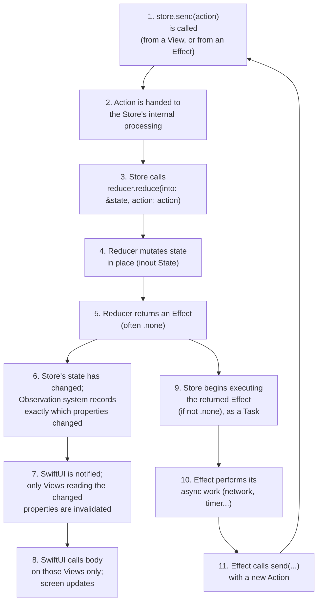
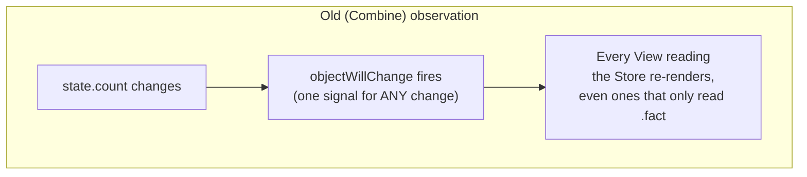
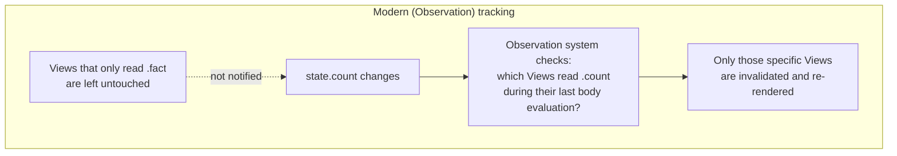
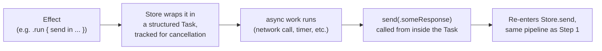
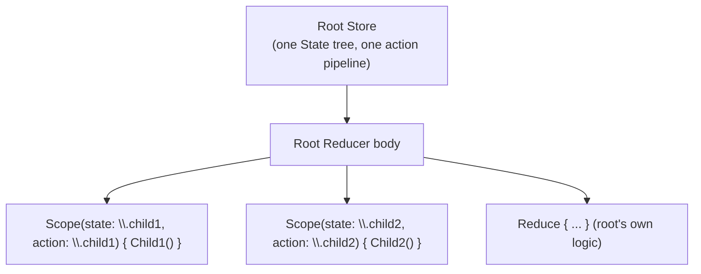
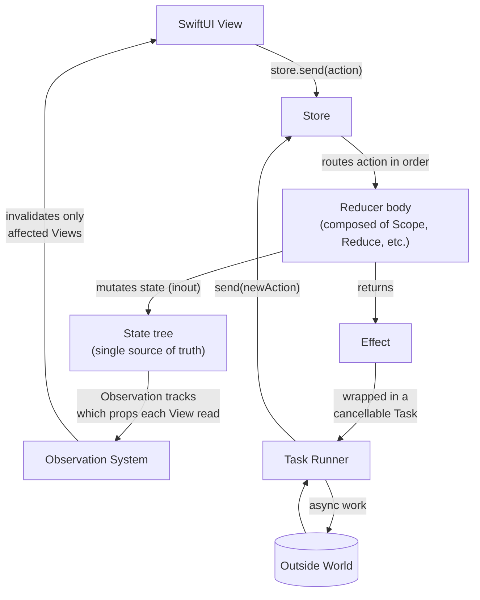

# Chapter 6 — Internal Working

You now know what each piece of TCA does from the outside. This chapter
opens the hood and explains what actually happens, step by step, inside
the library, when your app runs. Understanding this is what separates
"I can copy TCA examples" from "I can debug TCA at 2am when something
weird happens" — and it is exactly the kind of thing senior/architect-level
interview questions probe for.

## 6.1 The full internal pipeline

Let's walk through each numbered step in detail.

## 6.2 Step 1-2: `send` and action processing

When you call `store.send(.incrementButtonTapped)`, the Store does not
run the reducer instantly and carelessly — it needs to guarantee that
actions are processed **one at a time, in order**, even if multiple
actions arrive in quick succession (for example, a fast double-tap, or an
effect completing at the same moment a user taps something else). TCA
achieves this by funneling every action, from every source (Views,
Effects, child features), through the same single Store instance, and
processing them synchronously on the main actor in the order they were
received. This ordering guarantee is one of the most important internal
properties of TCA — it is exactly what makes state changes fully
traceable and reproducible (Chapter 4's "unidirectional flow" promise
depends on this).

## 6.3 Step 3-5: Running the reducer

The Store calls into the reducer's `reduce(into:action:)` method (which
the `@Reducer` macro and the `Reduce` type generate/wire up for you from
the `body` you write). This method receives `state` as `inout` — meaning
the reducer is given direct, mutable access to the *actual* state stored
inside the Store, not a copy. It mutates it directly (`state.count += 1`),
and returns an `Effect<Action>` describing any side work to perform. This
call is synchronous and fast — it must be, since it runs on the main
actor and blocks nothing else while it executes.

### Why `inout` and not "return a new State"?

Redux and Elm's reducers are typically written as *returning* a brand new
state value: `(state, action) -> newState`. TCA instead uses `inout`
mutation for a very practical reason: Swift `struct`s with many properties
are expensive to reconstruct from scratch on every single action if you
have to copy-and-modify a full new value each time, especially with deeply
nested state trees. `inout` lets Swift mutate the existing value's
properties directly and efficiently, using Swift's **copy-on-write**
value semantics under the hood, which keeps this both fast and still
fully value-type-safe (no other piece of code holds a hidden reference to
that state that could see a "half-mutated" version).

## 6.4 Step 6-8: Observation and rendering

This is the part that changed the most between older TCA (Combine-based)
and modern TCA (`@ObservableState`-based), and it is worth understanding
both, because you will encounter both in real codebases and in
interviews.

### The old way: Combine's `ObservableObject`

Before the Observation framework, `Store` conformed to
`ObservableObject`, and it published a single `objectWillChange` signal
whenever *any* property of state changed, no matter which one. Every
SwiftUI View reading *anything* from that Store would recompute its
`body` on *every* state change, even if the specific value it read did
not change. For state with many properties, or Views deep in a feature
tree, this could cause real, measurable, unnecessary re-rendering.

### The modern way: `@ObservableState` and the Observation framework

`@ObservableState` uses Swift's Observation framework (iOS 17+), the same
underlying mechanism as `@Observable` classes. Under the hood, each
*stored property* gets wrapped so that when a View's `body` reads
`store.count`, the Observation system records "this specific View reads
this specific property." Later, when `state.count` (specifically) changes,
only Views that registered as reading `count` are invalidated. A View that
only reads `store.fact` is left alone.

This is a substantial performance improvement, especially for large
feature trees, and it is why modern TCA guidance strongly favors
`@ObservableState` over the legacy `ObservableObject`-based `Store`
usage. Chapter 18 (Performance) goes deeper into measuring and optimizing
this.

## 6.5 Step 9-11: Running Effects

If the reducer returned anything other than `.none`, the Store starts
executing that `Effect`. Concretely, this usually means the Store wraps
the effect's async work in a Swift structured-concurrency `Task`, and
that `Task` is tracked by the Store so it can be cancelled later (for
example, if the feature is torn down, or if you explicitly cancel it by
its `id`, see Chapter 11). When the effect calls `send(newAction)` from
inside its async work, that call re-enters the exact same pipeline from
Step 1 — it is handed to the Store, processed in order, run through the
reducer, and so on.

## 6.6 Composition: how nested reducers fit into this pipeline

When features are composed (Chapter 10), the top-level Store still has
exactly one reducer — but that reducer's `body` is built out of smaller
reducers combined with tools like `Scope`. When an action arrives, TCA's
composition machinery routes it to the right nested reducer(s) based on
the action's case and the `Scope`/`ifLet`/`forEach` rules you have set up,
using key paths and case paths under the hood (Chapter 14 explains case
paths). The important internal fact: **there is still only one Store,
one State tree, and one ordered action pipeline** — composition changes
how the reducer's logic is *organized in source code*, not how many
Stores or pipelines exist at runtime.

## 6.7 Full internal diagram, all together

## 6.8 Chapter Summary

- Every action, no matter its source (View, Effect, child feature), flows
  through one Store, processed synchronously and in order on the main
  actor — this ordering is what makes TCA fully traceable.
  and processed synchronously and in order.
- The reducer mutates `state` via `inout`, directly and efficiently,
  rather than returning a brand-new state value each time, relying on
  Swift's value semantics and copy-on-write for safety and performance.
- Modern TCA uses the Observation framework (`@ObservableState`) to track
  exactly which properties each View reads, and only re-renders Views
  whose specific data changed — a real improvement over the older
  Combine-based `ObservableObject` approach, which re-rendered on any
  change.
- Effects are wrapped in trackable, cancellable `Task`s. When they finish,
  calling `send` re-enters the same pipeline actions from the UI use.
- Composition (nested reducers via `Scope`, etc.) changes how logic is
  organized in your source code, but there is still exactly one Store,
  one State tree, and one ordered action pipeline at runtime.

## 6.9 Check Your Understanding

1. Why does TCA process actions one at a time, in order, instead of
   letting them run concurrently?
2. Why does the reducer mutate `state` with `inout` instead of returning
   a brand-new `State` value?
3. Explain the practical difference between Combine's `ObservableObject`
   observation and the modern `@ObservableState`/Observation approach, in
   terms of what triggers a re-render.
4. When an Effect finishes and calls `send`, what pipeline does that
   re-enter, and why does that matter for traceability?
5. True or false: composing several reducers together with `Scope`
   creates multiple separate Stores at runtime. Explain your answer.

---

**Previous:** [Chapter 5 — Core Components](05-Core-Components.md)
**Next:** [Chapter 7 — Building the First App](07-Building-the-First-App.md)
