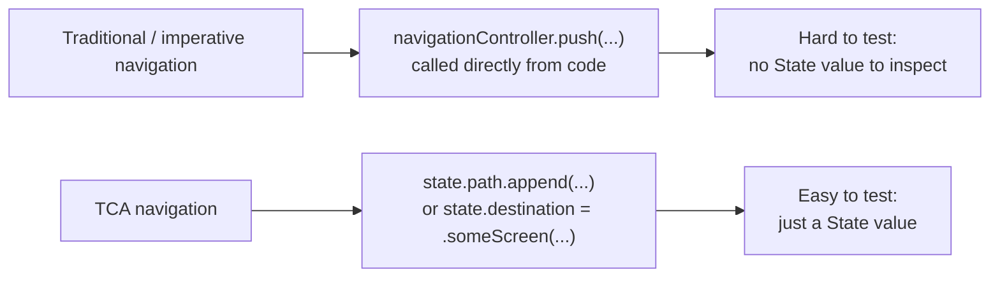
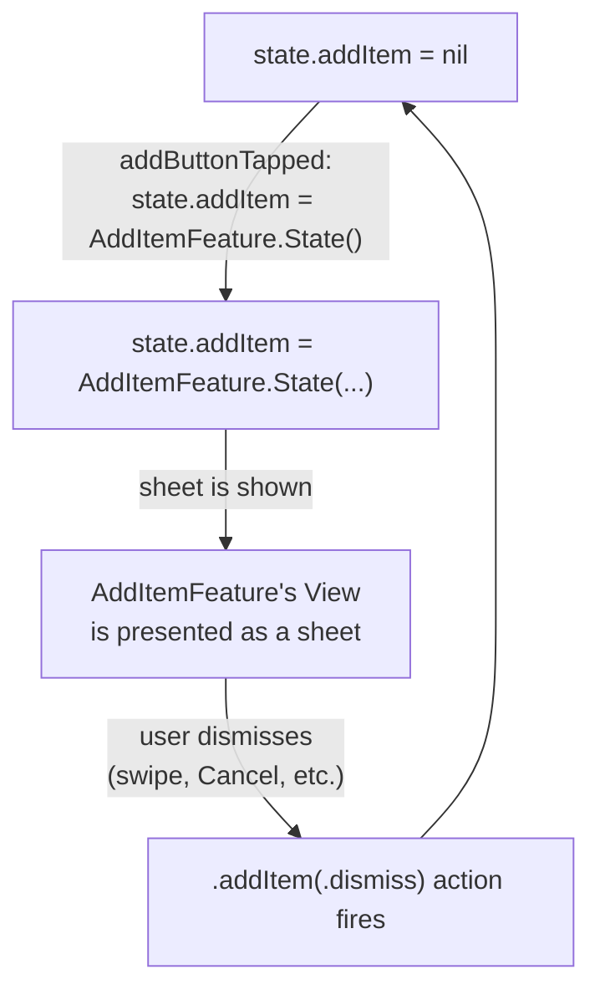
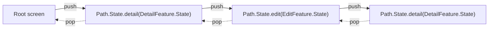
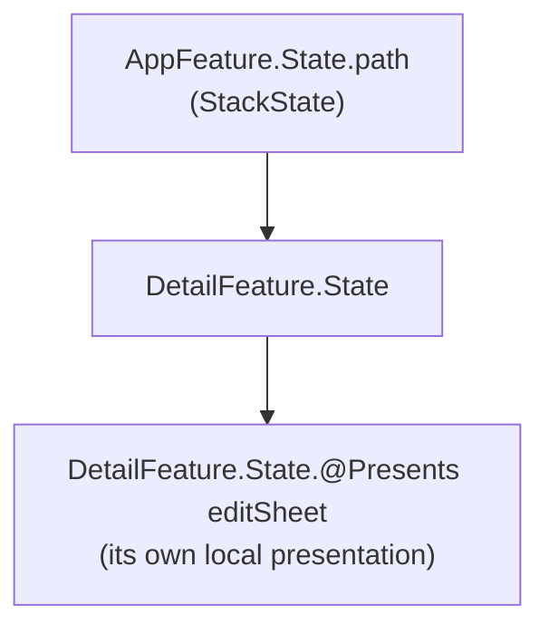
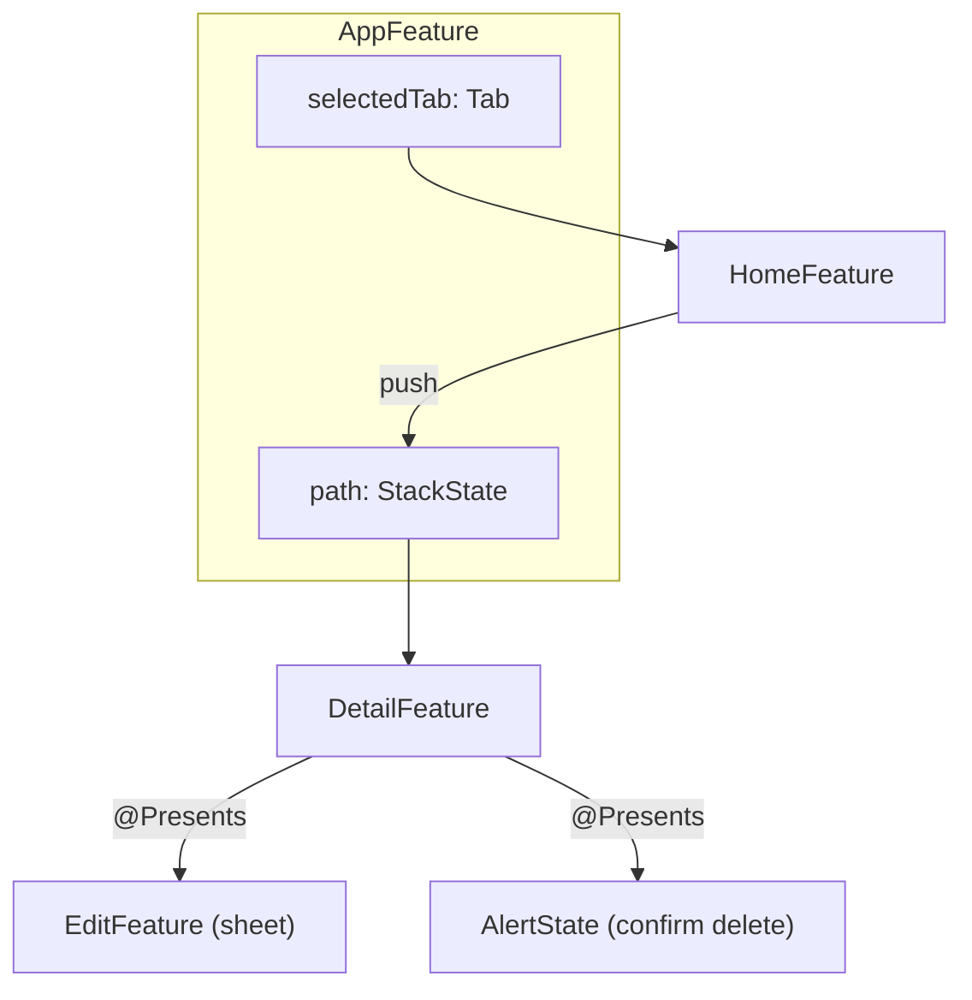

# Chapter 9 — Navigation

Chapter 2 introduced the Coordinator pattern as MVC/MVP/MVVM's answer to
"who owns navigation." TCA takes a different approach: navigation is
modeled as **state**, exactly like everything else, and driven through the
same Action → Reducer loop you already know. This chapter covers every
navigation tool TCA provides.

## 9.1 Why navigation is modeled as state

If "which screen is showing" lives only inside SwiftUI's own view
hierarchy (e.g. an imperative `navigationController.pushViewController(...)`
call), you cannot easily test it, restore it, or deep link into it,
because it is not a value you can inspect — it's an imperative side
effect on a view hierarchy. TCA's answer: represent "what is currently
presented" as a piece of `State`. Presenting a screen is then just
"setting a State property to non-nil" (or appending to a stack), which
means it is testable with `TestStore` (Chapter 13) exactly like any other
state change, and driven by the same Action-based rules as everything
else in the app.



## 9.2 `PresentationState` and `PresentationAction` — presenting one optional screen

Use this for a single screen presented (or not) at a time: a sheet, a
full screen cover, an alert, or a confirmation dialog.

```swift
@Reducer
struct InventoryFeature {
    @ObservableState
    struct State: Equatable {
        var items: IdentifiedArrayOf<Item> = []
        @Presents var addItem: AddItemFeature.State?
    }

    enum Action {
        case addButtonTapped
        case addItem(PresentationAction<AddItemFeature.Action>)
    }

    var body: some ReducerOf<Self> {
        Reduce { state, action in
            switch action {
            case .addButtonTapped:
                state.addItem = AddItemFeature.State()
                return .none

            case .addItem(.presented(.saveButtonTapped)):
                // handled fully in the .ifLet below or here, see Chapter 10
                return .none

            case .addItem(.dismiss):
                return .none

            case .addItem:
                return .none
            }
        }
        .ifLet(\.$addItem, action: \.addItem) {
            AddItemFeature()
        }
    }
}
```

**Explaining every new piece:**

- `@Presents var addItem: AddItemFeature.State?` — `@Presents` is a macro
  marking this optional property as something that drives presentation.
  `nil` means "nothing is presented"; a non-nil value means "present this
  screen, with this state."
- `case addItem(PresentationAction<AddItemFeature.Action>)` —
  `PresentationAction<Action>` wraps a child's actions in two possible
  forms: `.presented(childAction)` (an action from inside the presented
  screen) and `.dismiss` (the presented screen was dismissed, whether by
  a swipe, a Cancel button, or programmatically).
- `.ifLet(\.$addItem, action: \.addItem) { AddItemFeature() }` — this
  reducer combinator says: "whenever `state.addItem` is non-nil, also run
  `AddItemFeature`'s reducer on it, routing matching actions to it."
  Note the `$` in `\.$addItem` — this refers to the special projected key
  path that `@Presents` generates, which understands presentation
  semantics (like automatically clearing `addItem` back to `nil` on
  `.dismiss`).



### Wiring it to a SwiftUI sheet

```swift
struct InventoryView: View {
    @Bindable var store: StoreOf<InventoryFeature>

    var body: some View {
        List(store.items) { item in
            Text(item.name)
        }
        .toolbar {
            Button("Add") { store.send(.addButtonTapped) }
        }
        .sheet(item: $store.scope(state: \.addItem, action: \.addItem)) { addItemStore in
            AddItemView(store: addItemStore)
        }
    }
}
```

- `.sheet(item: $store.scope(state: \.addItem, action: \.addItem))` —
  SwiftUI's `sheet(item:)` modifier presents a sheet whenever the given
  optional becomes non-nil, and dismisses it when it becomes `nil` again.
  `$store.scope(...)` produces exactly that kind of optional binding, tied
  to a scoped child `Store`. Swap `.sheet` for `.fullScreenCover` to get a
  full screen cover instead — the reducer code does not change at all,
  only the View's presentation style. Use `.alert($store.scope(state: \.alert, action: \.alert))`
  or `.confirmationDialog(...)` the same way for alerts/dialogs, typically
  with `AlertState`/`ConfirmationDialogState` instead of a full child
  feature.

## 9.3 `StackState` and `StackAction` — a push-based navigation stack

Use this for `NavigationStack`-driven flows: pushing and popping any
number of screens, of possibly different feature types.

```swift
@Reducer
struct AppFeature {
    @ObservableState
    struct State: Equatable {
        var path = StackState<Path.State>()
    }

    enum Action {
        case path(StackAction<Path.State, Path.Action>)
        case homeButtonTapped
    }

    @Reducer
    enum Path {
        case detail(DetailFeature)
        case edit(EditFeature)
    }

    var body: some ReducerOf<Self> {
        Reduce { state, action in
            switch action {
            case .homeButtonTapped:
                state.path.removeAll()
                return .none

            case .path:
                return .none
            }
        }
        .forEach(\.path, action: \.path)
    }
}
```

**Explaining every new piece:**

- `var path = StackState<Path.State>()` — `StackState` is an
  array-like, `Identifiable`-aware collection specifically designed to
  back a `NavigationStack`. Each element represents one screen currently
  pushed onto the stack.
- `@Reducer enum Path { case detail(DetailFeature); case edit(EditFeature) }`
  — a special TCA pattern: a `@Reducer`-annotated **enum** where each
  case wraps a *different* feature type. This lets one stack hold
  different kinds of screens (a detail screen, then an edit screen, then
  another detail screen, etc.), and the macro generates a combined
  `Path.State`/`Path.Action` enum plus routing logic automatically.
- `case path(StackAction<Path.State, Path.Action>)` — `StackAction`
  represents everything that can happen to the stack: a screen's action
  firing, a screen being pushed, or a screen being popped.
- `.forEach(\.path, action: \.path) { }` — wait, note: with an `enum`
  `Path` marked `@Reducer`, `forEach` doesn't need a trailing closure
  supplying the reducer, since `Path`'s own generated reducer (switching
  over its cases) already knows how to run `DetailFeature` or
  `EditFeature` depending on which case is active. This routes any action
  for any element of the stack to the correct nested feature.



### Wiring it to `NavigationStack`

```swift
struct AppView: View {
    @Bindable var store: StoreOf<AppFeature>

    var body: some View {
        NavigationStack(
            path: $store.scope(state: \.path, action: \.path)
        ) {
            HomeView(store: store) // the root screen
        } destination: { store in
            switch store.case {
            case let .detail(store):
                DetailView(store: store)
            case let .edit(store):
                EditView(store: store)
            }
        }
    }
}
```

- `NavigationStack(path: $store.scope(state: \.path, action: \.path))` —
  binds SwiftUI's native `NavigationStack` directly to `state.path`.
  Pushing/popping in the UI (including swipe-back gestures) automatically
  updates `state.path`, and updating `state.path` from a reducer (e.g.
  `state.path.removeAll()`) automatically updates the UI.
- `destination: { store in switch store.case { ... } }` — `store.case`
  gives you a `switch`-able view onto which `Path` case is currently
  active for this element, each with its own correctly-scoped child
  `Store`, so you can render the right View.

### Pushing a new screen from a reducer

```swift
case .itemRowTapped(let id):
    state.path.append(.detail(DetailFeature.State(itemID: id)))
    return .none
```

Because `path` is just `State`, pushing a screen from *anywhere* in your
logic (a button, a deep link, an effect response) is the same one-line
operation: append to the array.

## 9.4 Sheets vs Full Screen Covers vs Tabs

| Tool | SwiftUI modifier | TCA state shape | Typical use |
|---|---|---|---|
| Sheet | `.sheet(item:)` | `@Presents var x: Feature.State?` | Modal forms, quick tasks, "add new" flows |
| Full screen cover | `.fullScreenCover(item:)` | `@Presents var x: Feature.State?` | Onboarding, paywalls, camera/full-focus flows |
| Alert | `.alert($store.scope(...))` | `@Presents var alert: AlertState<Action>?` | Simple confirm/cancel prompts |
| NavigationStack push | `NavigationStack(path:)` | `StackState<Path.State>` | Drill-down flows (list → detail → edit) |
| TabView | `TabView(selection:)` | An enum or int describing the selected tab, each tab owning its own feature State | Top-level app sections |

### Tabs example

```swift
@Reducer
struct AppTabsFeature {
    @ObservableState
    struct State: Equatable {
        var selectedTab: Tab = .home
        var home = HomeFeature.State()
        var search = SearchFeature.State()
        var profile = ProfileFeature.State()
    }
    enum Tab { case home, search, profile }
    enum Action {
        case tabSelected(Tab)
        case home(HomeFeature.Action)
        case search(SearchFeature.Action)
        case profile(ProfileFeature.Action)
    }
    var body: some ReducerOf<Self> {
        Scope(state: \.home, action: \.home) { HomeFeature() }
        Scope(state: \.search, action: \.search) { SearchFeature() }
        Scope(state: \.profile, action: \.profile) { ProfileFeature() }
        Reduce { state, action in
            switch action {
            case let .tabSelected(tab):
                state.selectedTab = tab
                return .none
            default:
                return .none
            }
        }
    }
}
```

Each tab is a fully independent feature with its own State — switching
tabs is just changing which one is "selected" for display; all tabs'
State stays alive in memory the whole time (useful, since it means
switching back to a tab does not lose its scroll position or in-progress
work).

## 9.5 Nested navigation

Nothing stops a pushed screen from itself containing another
`NavigationStack`, another `@Presents` sheet, or its own `StackState`.
Each feature manages its own local navigation state; a parent feature
does not need to know the details of how a child manages navigation
inside itself — it only needs to know the child's `State`/`Action` types,
same as any other composed feature (Chapter 10).



## 9.6 Deep linking

Because navigation is just `State`, deep linking becomes: **parse the
incoming URL, then construct the `State` tree that represents "already
navigated to the right place," and hand it to the Store at launch (or via
an action).**

```swift
func appState(for url: URL) -> AppFeature.State {
    var state = AppFeature.State()
    // e.g. myapp://items/42/edit
    guard url.pathComponents.count >= 3,
          url.pathComponents[1] == "items",
          let itemID = Int(url.pathComponents[2])
    else { return state }

    state.path.append(.detail(DetailFeature.State(itemID: itemID)))
    if url.pathComponents.count >= 4, url.pathComponents[3] == "edit" {
        state.path.append(.edit(EditFeature.State(itemID: itemID)))
    }
    return state
}
```

Then, typically, you would dispatch an action like
`.deepLink(url)` and let the reducer build up `state.path` the same way,
so the same logic is testable with `TestStore` — you can write a test
that sends `.deepLink(someURL)` and asserts the exact resulting
`state.path`, with no UIKit/SwiftUI involved at all.

## 9.7 Feature navigation — putting it all together



This diagram is a realistic picture of a mid-size app's navigation: tabs
at the top level, a push-based stack within a tab, and a sheet plus an
alert hanging off of one of the pushed screens — all of it expressed as
plain, testable, inspectable `State`.

## 9.8 Common mistakes with navigation

- **Mutating `@Presents` state to a new instance instead of `nil`ing it
  out to dismiss.** To dismiss, set the property to `nil` (or handle
  `.dismiss` correctly) — do not try to manage dismissal by hand outside
  this system.
- **Forgetting `.ifLet`/`.forEach`.** Without wiring
  `.ifLet(\.$child, action: \.child) { ChildFeature() }` or
  `.forEach(\.path, action: \.path)`, child actions are never actually
  routed to the child's reducer — the screen may appear, but its logic
  will not run.
- **Building a huge, single `Path` enum with unrelated features mixed
  together carelessly.** Keep `Path` scoped to what's actually part of
  one logical flow; very distinct flows (e.g. onboarding vs. main app)
  are often better modeled as entirely separate root states, switched at
  a higher level.
- **Trying to imperatively call `dismiss()` from deep inside a child and
  expecting it to "just work" without going through `PresentationAction`
  / popping `StackState`.** Prefer sending an action that the parent
  reducer interprets as "clear this state," keeping the change traceable.

## 9.9 Chapter Summary

- TCA models navigation as State, not as imperative view-hierarchy calls,
  which makes it testable and traceable like everything else.
- `@Presents` + `PresentationState`/`PresentationAction` + `.ifLet` handle
  one-at-a-time presented screens: sheets, full screen covers, alerts.
- `StackState` + `StackAction` + `.forEach` handle push-based
  `NavigationStack` flows, including multiple different feature types via
  a `@Reducer enum Path`.
- Tabs are typically modeled as "which feature's State is currently
  selected for display," with every tab's State kept alive simultaneously.
- Nested navigation is just features containing features, each owning its
  own local navigation state.
- Deep linking becomes "parse a URL into a State value," fully testable
  without any UI.

## 9.10 Check Your Understanding

1. Why does representing navigation as `State` make it more testable than
   an imperative `push(...)` call?
2. What is the difference between `PresentationAction.presented(_:)` and
   `PresentationAction.dismiss`?
3. What does `.ifLet(\.$child, action: \.child) { ChildFeature() }`
   actually do, and what breaks if you forget it?
4. Why might you use a `@Reducer enum Path` instead of a single feature
   type for a `NavigationStack`'s `StackState`?
5. Describe, step by step, how you would implement deep linking to a
   specific pushed screen using the tools in this chapter.

---

**Previous:** [Chapter 8 — More Examples](08-More-Examples.md)
**Next:** [Chapter 10 — Parent & Child Features](10-Parent-and-Child-Features.md)
