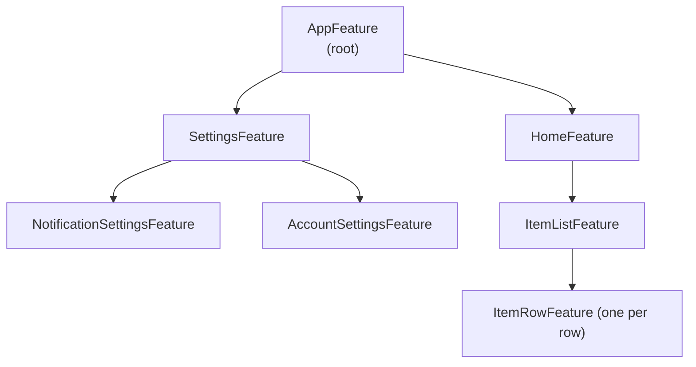
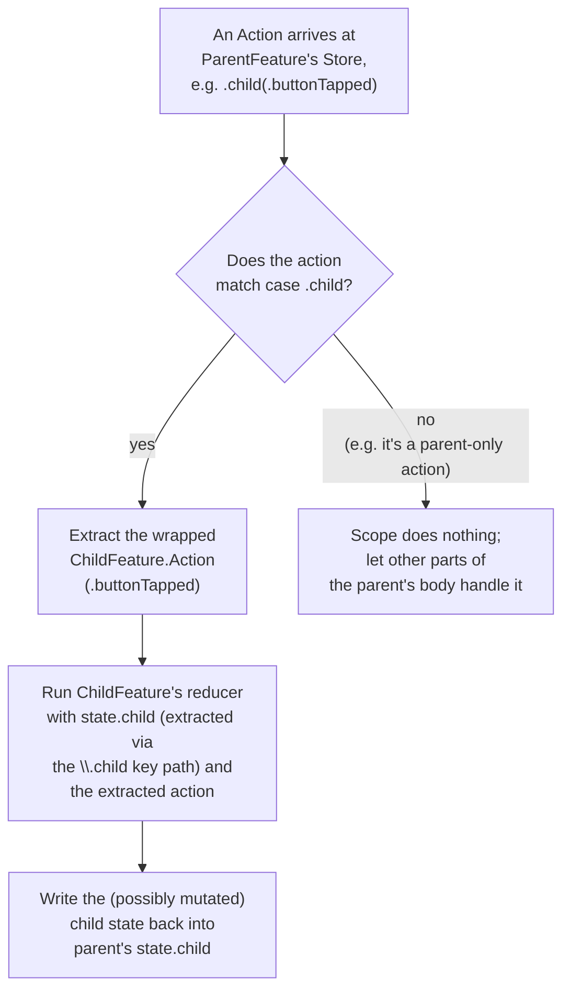
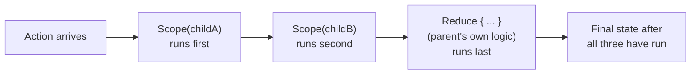
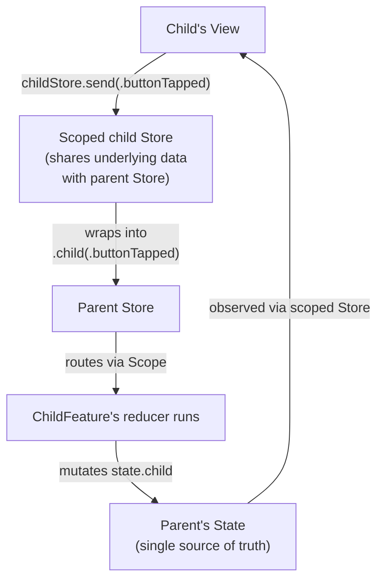
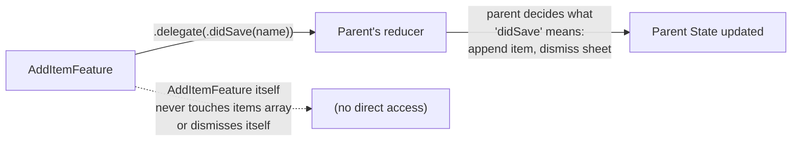
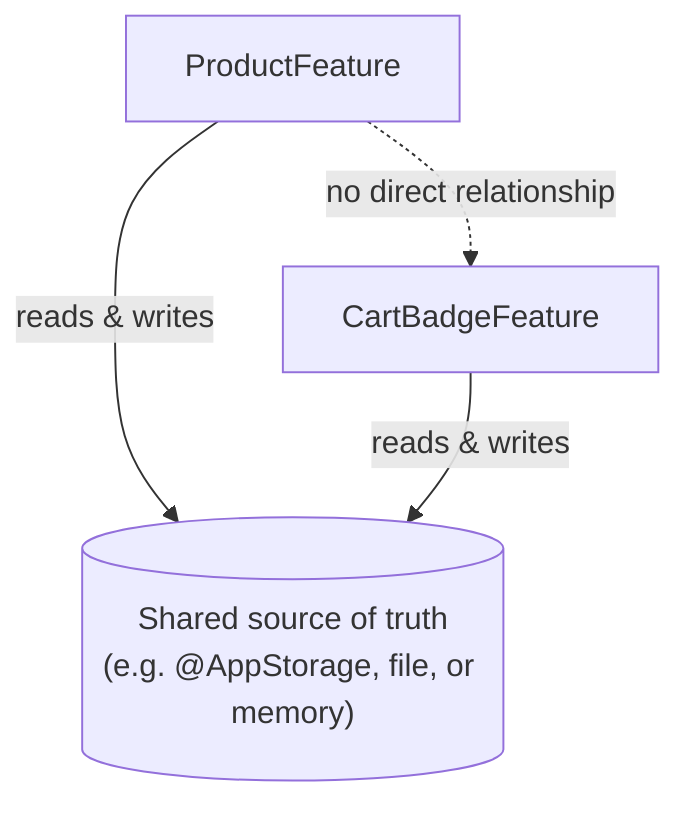
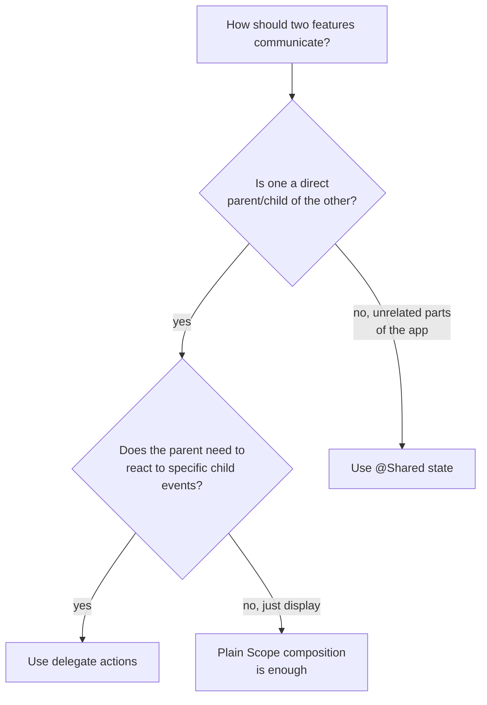

# Chapter 10 — Parent & Child Features

Chapter 9 used composition tools (`Scope`, `.ifLet`, `.forEach`) to build
navigation. This chapter steps back and explains composition itself, in
general — the mechanics of how any parent feature contains any child
feature, how actions route between them, how they can share state, and
the disciplined way for a child to talk back up to a parent.

## 10.1 Why composition is the "C" in TCA

Recall Chapter 3: TCA solves the problem of combining small features into
large ones in a principled way. This is the single idea that makes large
TCA codebases manageable — a hundred-screen app is not one giant reducer,
it is many small, independently-written, independently-tested reducers,
wired together.



Every box in this tree is a completely ordinary `@Reducer` type — nothing
about `ItemRowFeature` needs to know it will eventually live inside
`AppFeature`. This is what "composable" really means: features are
written in isolation and assembled later.

## 10.2 `Scope` — the basic composition tool

`Scope` connects a slice of a parent's `State` and a case of a parent's
`Action` to a whole child reducer.

```swift
@Reducer
struct ParentFeature {
    @ObservableState
    struct State: Equatable {
        var child = ChildFeature.State()
    }
    enum Action {
        case child(ChildFeature.Action)
    }
    var body: some ReducerOf<Self> {
        Scope(state: \.child, action: \.child) {
            ChildFeature()
        }
    }
}
```

- `Scope(state: \.child, action: \.child)` — the first `\.child` is a key
  path into `ParentFeature.State` (a `struct` property). The second
  `\.child` is a **case path** into `ParentFeature.Action` (an `enum`
  case) — Swift enums don't have key paths to cases the way structs have
  key paths to properties, so TCA (through its macros) generates these
  case paths for you automatically when you write `@Reducer`. If this is
  the first time you have seen a "key path into an enum case," don't
  worry — Chapter 14 explains case paths from first principles.
- `{ ChildFeature() }` — the trailing closure builds the actual child
  reducer instance to run.

## 10.3 What `Scope` actually does, step by step



The important thing to internalize: **`Scope` only runs the child reducer
when the action actually matches that child's case.** An action like
`.someUnrelatedParentAction` passes right through, untouched, to whatever
else is in the parent's `body` (often a plain `Reduce { ... }` for the
parent's own logic).

## 10.4 Combining multiple children with a parent's own logic

A `body` is not limited to one `Scope` — it is a list of reducers that
all get a chance to run, in order, for every action, via **result
builder** syntax (the same kind of syntax SwiftUI uses for `body`).

```swift
@Reducer
struct ParentFeature {
    @ObservableState
    struct State: Equatable {
        var childA = ChildAFeature.State()
        var childB = ChildBFeature.State()
        var isBusy = false
    }
    enum Action {
        case childA(ChildAFeature.Action)
        case childB(ChildBFeature.Action)
        case refreshAllButtonTapped
    }
    var body: some ReducerOf<Self> {
        Scope(state: \.childA, action: \.childA) { ChildAFeature() }
        Scope(state: \.childB, action: \.childB) { ChildBFeature() }
        Reduce { state, action in
            switch action {
            case .refreshAllButtonTapped:
                state.isBusy = true
                return .none
            case .childA, .childB:
                return .none
            }
        }
    }
}
```



Every reducer listed in `body` runs, in order, for *every* action — but
each one only actually does something when the action matches what it
cares about (`Scope` checks its case; `Reduce`'s `switch` checks its
cases). This ordering can matter: put `Scope`s before the parent's own
`Reduce` when the parent's logic needs to react to an *already-updated*
child state for that same action (a common, useful pattern — see Section
10.6).

## 10.5 Action routing — the full picture



Notice: **the child's View never talks to a separate, independent Store.**
`store.scope(state: \.child, action: \.child)` (Chapter 5, Section 5.4)
creates a *view* onto the same parent Store's data. When the child sends
an action, it is automatically wrapped into the parent's `.child(...)`
case before reaching the parent's `body`, where `Scope` unwraps it again
and routes it to the child's own reducer. This round trip is invisible to
you as the feature author — you just write `Scope`, and TCA generates the
wrapping/unwrapping via the case path.

## 10.6 Parent reacting to child actions ("parent listening in")

A very common real pattern: the parent wants to *react* to something a
child did, without the child needing to know the parent exists.

```swift
var body: some ReducerOf<Self> {
    Scope(state: \.addItem, action: \.addItem) {
        AddItemFeature()
    }
    Reduce { state, action in
        switch action {
        case .addItem(.saveButtonTapped):
            // Parent reacts to a child's action directly.
            // (This works, but see "delegate actions" below for
            // a cleaner, more decoupled version of this idea.)
            state.isDirty = true
            return .none
        default:
            return .none
        }
    }
}
```

This works, but it has a downside: the parent now has to know the exact
action name (`saveButtonTapped`) and internal shape of the child. If the
child feature is reused elsewhere, or its internals change, the parent's
`switch` breaks quietly. Section 10.7 introduces the cleaner alternative.

## 10.7 Delegate actions — the clean way for a child to talk to its parent

A **delegate action** is a dedicated, nested action case a child exposes
*specifically* to communicate upward, decoupled from its own internal
implementation details.

```swift
@Reducer
struct AddItemFeature {
    @ObservableState
    struct State: Equatable {
        var name = ""
    }

    enum Action {
        case saveButtonTapped
        case cancelButtonTapped
        case delegate(Delegate)

        @CasePathable
        enum Delegate: Equatable {
            case didSave(name: String)
            case didCancel
        }
    }

    var body: some ReducerOf<Self> {
        Reduce { state, action in
            switch action {
            case .saveButtonTapped:
                return .send(.delegate(.didSave(name: state.name)))
            case .cancelButtonTapped:
                return .send(.delegate(.didCancel))
            case .delegate:
                return .none
            }
        }
    }
}
```

The parent listens only for the `delegate` case, which is a small,
stable, intentional "public API" for this feature — the equivalent of a
protocol a child promises to honor, regardless of how its internals
change later.

```swift
Reduce { state, action in
    switch action {
    case .addItem(.presented(.delegate(.didSave(let name)))):
        state.items.append(Item(name: name))
        state.addItem = nil
        return .none

    case .addItem(.presented(.delegate(.didCancel))), .addItem(.dismiss):
        state.addItem = nil
        return .none

    default:
        return .none
    }
}
.ifLet(\.$addItem, action: \.addItem) {
    AddItemFeature()
}
```



**Why this is better:** `AddItemFeature` never needs to know it will be
used inside a sheet, never touches an `items` array it doesn't own, and
never dismisses itself — it just reports facts about what happened
(`didSave`, `didCancel`). This makes `AddItemFeature` genuinely reusable —
you could present it as a sheet in one place and push it in another, and
its own code would not change at all.

## 10.8 Shared State

Sometimes two *unrelated* parts of an app need to see the same piece of
data (a logged-in user's profile, a feature flag, a shopping cart badge
count) without one being a direct parent of the other. Threading that
value manually through every intermediate parent is painful and brittle.
TCA's `@Shared` property wrapper is designed for exactly this.

```swift
@Reducer
struct CartBadgeFeature {
    @ObservableState
    struct State: Equatable {
        @Shared(.appStorage("cartCount")) var cartCount = 0
    }
}

@Reducer
struct ProductFeature {
    @ObservableState
    struct State: Equatable {
        @Shared(.appStorage("cartCount")) var cartCount = 0
    }
    enum Action { case addToCartButtonTapped }
    var body: some ReducerOf<Self> {
        Reduce { state, action in
            switch action {
            case .addToCartButtonTapped:
                state.cartCount += 1
                return .none
            }
        }
    }
}
```

Both features declare `@Shared(.appStorage("cartCount"))`, pointing at
the same persistence key. Changing it in `ProductFeature` is immediately
visible in `CartBadgeFeature`, with no parent/child relationship required
between them at all. `@Shared` also supports in-memory sharing
(`.inMemory("key")`) for state that should be shared across features
during the app's lifetime but does not need to persist to disk, and
file-based persistence for larger data. Chapter 14 covers `@Shared` in
full depth, including how it interacts with testing.



### When to use Shared State vs. parent/child composition

| Situation | Prefer |
|---|---|
| Data naturally belongs to a specific screen and its sub-screens | Parent/child composition (`Scope`, delegate actions) |
| Data needs to be visible to two unrelated, distant parts of the app | `@Shared` |
| Data needs to persist across app launches | `@Shared(.appStorage(...))` or `@Shared(.fileStorage(...))` |
| Data is purely local, ephemeral UI state for one screen | Plain, non-shared `State` property |

Default to plain composition first — reach for `@Shared` only when
threading state through parents becomes genuinely impractical, since
shared state is a bit harder to reason about (more than one feature can
write to it) than state owned by exactly one reducer.

## 10.9 Communication patterns, summarized



## 10.10 Common mistakes

- **Reaching into a child's action cases directly from a distant,
  unrelated parent**, instead of using delegate actions or `@Shared`.
  This tightly couples features that should not know about each other.
- **Forgetting that `Scope`/`.ifLet`/`.forEach` order in `body` can
  matter** when the parent needs to see the child's *already-updated*
  state for the same action (put the child's `Scope` before the parent's
  `Reduce` in that case, as in Section 10.4).
- **Overusing `@Shared`** for state that really belongs to one feature.
  If only one feature ever reads or writes a value, it does not need to
  be shared — keep it local.
- **A child feature dismissing or mutating things outside its own
  `State`.** A well-designed child only ever touches its own `State` and
  reports facts upward via delegate actions; it should never assume
  anything about how it is being presented or used.

## 10.11 Chapter Summary

- `Scope(state:action:)` wires a slice of a parent's State and a case of
  a parent's Action to a whole child reducer, using key paths (for State)
  and case paths (for Action).
- A parent's `body` can list multiple `Scope`s plus its own `Reduce`;
  they all run, in order, for every action.
- Delegate actions (`case delegate(Delegate)`) are the clean, decoupled
  way for a child to report events upward without knowing anything about
  its parent.
- `@Shared` lets unrelated features observe and mutate the same piece of
  state without a parent/child relationship, optionally persisted to disk.
- Prefer plain composition for naturally-nested data; reach for
  `@Shared` only when two distant parts of the app genuinely need the
  same live data.

## 10.12 Check Your Understanding

1. What two kinds of "paths" does `Scope(state:action:)` need, and why
   does an `Action` enum need a different kind than a `State` struct?
2. Why does `Scope` only run a child's reducer for actions that match
   that child's case?
3. What problem do delegate actions solve that "the parent just
   pattern-matches the child's internal action" does not?
4. Give an example of data that should be `@Shared`, and one that should
   not be, and explain the difference.
5. In Section 10.4, why might the order of `Scope` and `Reduce` in a
   parent's `body` matter?

---

**Previous:** [Chapter 9 — Navigation](09-Navigation.md)
**Next:** [Chapter 11 — Effects](11-Effects.md)
