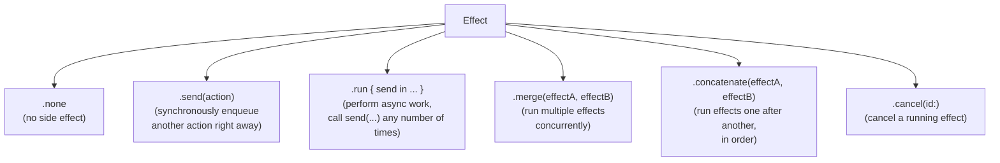
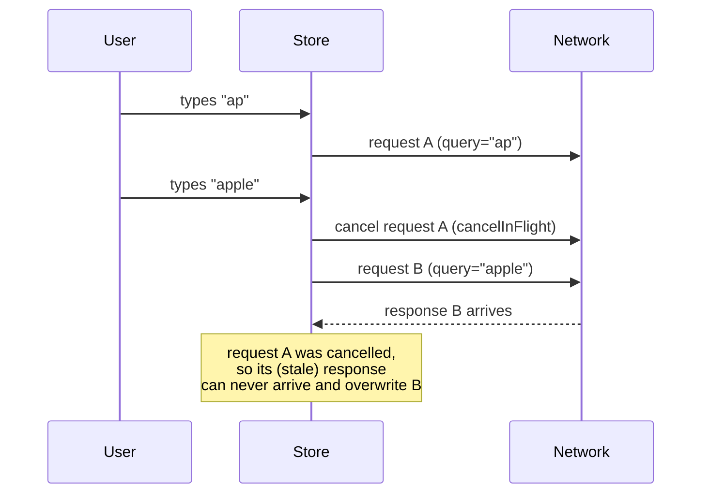
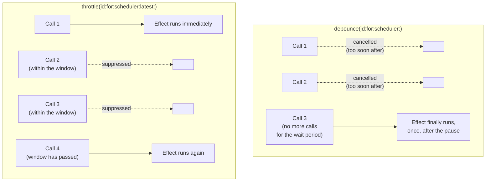

# Chapter 11 — Effects

Chapters 5 and 8 introduced Effects informally, through examples. This
chapter is the complete, systematic reference: every kind of `Effect`
TCA provides, when to use each, and exactly how cancellation,
debouncing, and throttling work under the hood.

## 11.1 The `Effect` type, in full

An `Effect<Action>` is a value describing work that should happen outside
the reducer, which eventually may produce zero or more `Action`s to feed
back into the Store. The reducer always returns exactly one `Effect` per
action handled (often `.none`, meaning "no side effect").



## 11.2 `.none`

The simplest case: this action requires no side effect at all — just a
synchronous state mutation.

```swift
case .incrementButtonTapped:
    state.count += 1
    return .none
```

## 11.3 `.send` — dispatching another action immediately

`.send(action)` synchronously enqueues another action to be processed
right after the current one, without any async work in between. This is
useful when one action logically implies another.

```swift
case .saveButtonTapped:
    return .send(.delegate(.didSave(name: state.name)))
```

Use `.send` sparingly, and only for genuinely synchronous follow-ups —
for anything that needs to *wait* (a network call, a timer), use `.run`
instead.

## 11.4 `.run` — the workhorse for async effects

`.run { send in ... }` is how almost all real side effects are expressed.
Inside the closure, you can `await` any async work, and call `send(...)`
(itself `async`) any number of times — zero, once, or many, over an
arbitrary period of time.

```swift
case .fetchButtonTapped:
    state.isLoading = true
    return .run { send in
        do {
            let result = try await apiClient.fetch()
            await send(.fetchResponse(.success(result)))
        } catch {
            await send(.fetchResponse(.failure(EquatableError(error))))
        }
    }
```

**Explaining every piece:**

- `.run { send in ... }` — `send` is a function with signature roughly
  `(Action) async -> Void`. Calling `await send(...)` re-enters the
  reducer pipeline (Chapter 6, Section 6.5).
- `do { ... } catch { ... }` — standard Swift error handling; because
  `apiClient.fetch()` is `async throws`, you must either `try` it inside
  a `do`/`catch`, or propagate the `throws` further. Most TCA effects
  catch locally so they can turn failures into a `.failure(...)` action
  rather than crashing or silently dropping the error.
- The closure runs inside a structured-concurrency `Task` managed by the
  `Store` (Chapter 6, Section 6.5), which is what makes it cancellable by
  ID.

### A shorthand using `Result` and `TaskResult`/`Result` mapping

For the common "call an async throwing function, wrap the outcome" shape,
you will often see this compressed form (as used throughout Chapter 8):

```swift
return .run { send in
    await send(.fetchResponse(
        Result { try await apiClient.fetch() }.mapError(EquatableError.init)
    ))
}
```

`Result { try await ... }` is a convenience initializer that runs the
throwing expression and captures either the success value or the thrown
error into a `Result`, in one line.

## 11.5 Sending multiple actions over time from one effect

A `.run` effect is not limited to sending one action. This is how you
model streams of events — for example, observing an `AsyncSequence`.

```swift
case .startObservingLocationButtonTapped:
    return .run { send in
        for await location in locationClient.locationUpdates() {
            await send(.locationUpdated(location))
        }
    }
    .cancellable(id: CancelID.locationUpdates)
```

`for await location in locationClient.locationUpdates()` iterates an
`AsyncSequence` — each new value pauses the loop until the next one
arrives, and `send` is called every time, for as long as the sequence
keeps producing values (until the effect is cancelled, e.g. when the user
navigates away — Section 11.8).

## 11.6 Parallel work inside one effect

When a single action needs to kick off multiple independent async
operations at once, use structured concurrency directly inside `.run`,
exactly as you would in any Swift async code.

```swift
case .loadDashboardButtonTapped:
    state.isLoading = true
    return .run { send in
        async let profile = profileClient.fetch()
        async let notifications = notificationsClient.fetchUnread()
        do {
            let (profileResult, notificationsResult) = try await (profile, notifications)
            await send(.dashboardResponse(.success((profileResult, notificationsResult))))
        } catch {
            await send(.dashboardResponse(.failure(EquatableError(error))))
        }
    }
```

- `async let profile = ...` and `async let notifications = ...` — both
  calls start running concurrently, immediately, without waiting for each
  other.
- `try await (profile, notifications)` — suspends until *both* finish,
  and gives you both results together. If either throws, the whole
  expression throws (structured concurrency automatically cancels the
  other one for you).

For a dynamic number of parallel tasks (e.g., fetching details for a list
of IDs whose length you don't know ahead of time), use a `TaskGroup`
instead of a fixed set of `async let`s — Chapter 16 covers `TaskGroup` in
depth as part of Swift Concurrency generally.

## 11.7 Running multiple *separate* effects — `.merge` and `.concatenate`

Sometimes a single action logically triggers more than one independent
effect (not one effect doing two things internally, but genuinely two
separate `Effect` values).

```swift
case .screenAppeared:
    return .merge(
        .run { send in
            for await _ in self.clock.timer(interval: .seconds(1)) {
                await send(.tick)
            }
        }
        .cancellable(id: CancelID.timer),

        .run { send in
            await send(.analyticsResponse(await analytics.logScreenView()))
        }
    )
```

- `.merge(effectA, effectB, ...)` — starts all given effects
  concurrently; each runs independently and can send its own actions on
  its own schedule.
- `.concatenate(effectA, effectB, ...)` — runs effects **in order**,
  waiting for one to fully finish (including all the actions it will ever
  send) before starting the next. Useful when a strict sequence matters
  (e.g. "save locally, *then* sync to server, only after local save
  succeeds").

## 11.8 Cancellation — the full mechanics

Every long-running or interruptible effect should be given a
**cancellation ID**, a `Hashable` value uniquely identifying "this kind of
work," so it can later be cancelled explicitly.

```swift
private enum CancelID { case search, timer, locationUpdates }

// Start (or restart) it:
return .run { send in ... }
    .cancellable(id: CancelID.search, cancelInFlight: true)

// Cancel it explicitly:
return .cancel(id: CancelID.search)

// Cancel several at once:
return .cancel(ids: [CancelID.search, CancelID.timer])
```

- `.cancellable(id:cancelInFlight:)` — attaches an ID to the effect.
  `cancelInFlight: true` means "if an effect with this same ID is already
  running, cancel it first" (Chapter 8, Section 8.6's image downloader
  example). `cancelInFlight: false` (the default) means multiple effects
  with the same ID can run concurrently, and `.cancel(id:)` cancels all
  of them.
- `.cancel(id:)` — returns an `Effect` whose entire job is to cancel any
  running effect(s) registered under that ID. It does not touch state
  directly; it is returned from a `case` just like any other effect.

### Why cancellation IDs matter for correctness, not just performance

Without cancelling a now-obsolete effect, you can get real bugs, not just
wasted work — for example, a slow search request for "ap" finishing
*after* a fast search request for "apple" already replaced the results,
silently overwriting the correct results with stale ones ("out-of-order
response" bugs). Cancellation IDs prevent this class of bug entirely by
ensuring only the latest relevant effect can ever complete.



### Effect lifecycle and Store deallocation

When the `Store` that owns a running effect's `Task` is deallocated (for
example, a sheet is dismissed, tearing down its child feature's Store),
TCA automatically cancels any effects still tied to that Store. This is
an important safety net: you do not have to manually cancel every effect
on teardown — but you should still use explicit cancellation IDs for
effects that should stop *before* teardown (like a stale search request),
since automatic cleanup only happens at the very end of a feature's life.

## 11.9 Debounce and Throttle

Both are built on top of the same cancellation machinery, and both solve
"don't run this effect too often," but for different situations.



- **Debounce** — "wait for a pause in activity, then run once." Best for
  search-as-you-type (Chapter 8, Section 8.7): you don't want a request
  per keystroke, you want one request shortly after the user stops
  typing.
- **Throttle** — "run at most once per time window, regardless of how
  many calls come in." Best for things like "log an analytics event for
  scroll position," where you want regular updates but not one per pixel
  of scroll.

```swift
return .run { send in
    let results = try await searchClient.search(query)
    await send(.searchResponse(results))
}
.debounce(id: CancelID.search, for: .milliseconds(300), scheduler: DispatchQueue.main)
```

```swift
return .run { send in
    await send(.scrollPositionLogged(position))
}
.throttle(id: CancelID.scrollLogging, for: .seconds(1), scheduler: DispatchQueue.main, latest: true)
```

`latest: true` on `.throttle` means: if calls were suppressed during the
window, run the effect one more time at the end of the window using the
*latest* suppressed call's data (rather than just the first one that
started the window).

## 11.10 Effects and Swift's structured concurrency

Every `.run` effect is, under the hood, backed by a genuine Swift `Task`,
which means the full structured concurrency toolkit — `async`/`await`,
`async let`, `TaskGroup`, `AsyncSequence`, cancellation checks
(`Task.isCancelled`, `try Task.checkCancellation()`) — works exactly as
it does anywhere else in Swift. Chapter 16 is dedicated to this
relationship in depth, including `Sendable` requirements introduced by
Swift 6's strict concurrency checking, and how `@Dependency`-injected
clients are typically written to satisfy them.

## 11.11 Common mistakes with Effects

- **Doing real side-effecting work directly inside `Reduce`'s closure**,
  outside of `.run`. Breaks testability and traceability (Chapter 5,
  Section 5.6).
- **Forgetting to cancel long-running/repeating effects** (timers,
  location updates) when they're no longer needed, causing wasted work or
  actions being sent to a feature the user has already left.
- **Not giving cancellable effects a stable, unique ID.** Using something
  like a raw `UUID()` generated fresh each time defeats cancellation
  entirely, since no two effects would ever share an ID.
- **Using `.merge` when you actually need strict ordering** (or vice
  versa) — mixing these up causes subtle race conditions, especially
  around effects that both write to related pieces of state.
- **Forgetting `await` before `send(...)`.** `send` is `async`; skipping
  `await` is a compile error, but it is easy to structure code so you
  accidentally call the wrong `send` (e.g. a local variable) — double
  check you are calling the closure parameter.

## 11.12 Chapter Summary

- `.none`, `.send`, `.run`, `.merge`, `.concatenate`, and `.cancel` are
  the core `Effect` operators; `.run` is used for essentially all real
  async work.
- A `.run` effect can `send` zero, one, or many actions over time, and
  can use full structured concurrency (`async let`, `TaskGroup`,
  `AsyncSequence`) internally.
- Cancellation IDs (`.cancellable(id:cancelInFlight:)`, `.cancel(id:)`)
  prevent both wasted work and real correctness bugs, like out-of-order
  responses overwriting newer data.
- `debounce` waits for a pause before running once; `throttle` limits how
  often an effect can run within a time window.
- Effects are cancelled automatically when their owning Store is
  deallocated, but explicit cancellation IDs are still needed for
  cancelling effects *before* that point.

## 11.13 Check Your Understanding

1. What is the practical difference between `.send(action)` and
   `.run { send in await send(action) }`?
2. Why can an out-of-order network response cause a real bug, not just
   wasted bandwidth, if effects are not cancelled properly?
3. When would you choose `.concatenate` over `.merge`?
4. Explain, in your own words, the difference between debounce and
   throttle, and give a real example use case for each that is *not* the
   one used in this chapter.
5. What happens to a feature's in-flight effects when its Store is
   deallocated?

---

**Previous:** [Chapter 10 — Parent & Child Features](10-Parent-and-Child-Features.md)
**Next:** [Chapter 12 — Dependencies](12-Dependencies.md)
