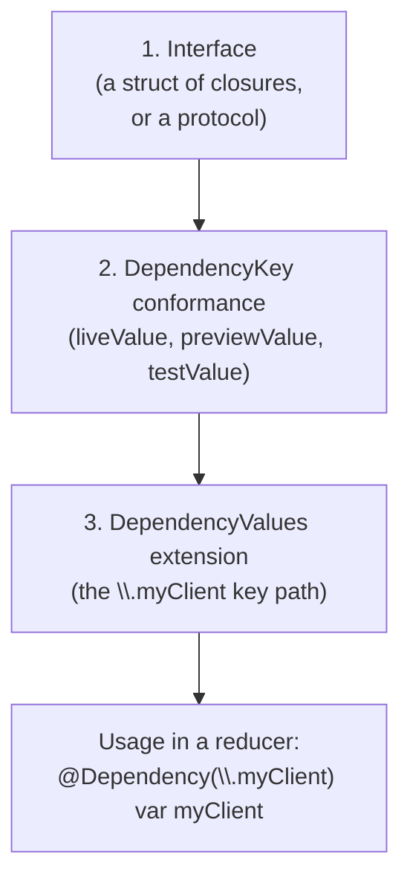
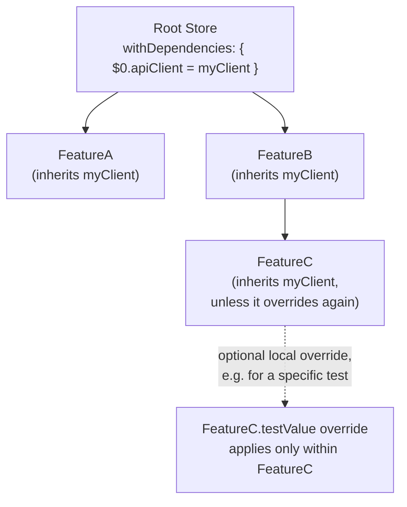

# Chapter 12 — Dependencies

Chapter 5, Section 5.7 introduced dependencies through one example. This
chapter is the complete reference: how the system works internally, the
built-in dependencies TCA/Swift ship for you, and every place you can
override a dependency.

## 12.1 Recap: the three pieces

Every dependency has three parts, and you should be able to draw this
from memory by the end of this chapter:



## 12.2 `DependencyValues` — a global, swappable registry

`DependencyValues` is a single, ambient collection of every dependency
your app knows about, conceptually similar to SwiftUI's `EnvironmentValues`.
At any given moment, there is one "current" `DependencyValues`, and every
`@Dependency` property wrapper reads from it. What makes this powerful is
that the *current* `DependencyValues` can be different depending on
context:

| Context | Which values are active by default |
|---|---|
| Running app (`@main`) | `liveValue` for every dependency |
| SwiftUI `#Preview` | `previewValue` (falls back to `liveValue` if not provided) |
| `TestStore`-based unit test | `testValue` (falls back to a value that fails loudly if unset) |

This is why the *exact same reducer code* behaves differently — safely —
in each context, without a single `if isRunningTests` check anywhere in
your feature code.

## 12.3 Defining a dependency, fully explained

```swift
import Dependencies

struct AuthClient {
    var login: (_ email: String, _ password: String) async throws -> AuthToken
    var logout: () async throws -> Void
    var currentUser: () -> User?
}

extension AuthClient: DependencyKey {
    static let liveValue = AuthClient(
        login: { email, password in
            // real network call
            try await APISession.shared.login(email: email, password: password)
        },
        logout: {
            try await APISession.shared.logout()
        },
        currentUser: {
            APISession.shared.cachedUser
        }
    )

    static let previewValue = AuthClient(
        login: { _, _ in AuthToken(raw: "preview-token") },
        logout: {},
        currentUser: { User(id: 1, name: "Preview User") }
    )

    static let testValue = AuthClient(
        login: unimplemented("AuthClient.login"),
        logout: unimplemented("AuthClient.logout"),
        currentUser: unimplemented("AuthClient.currentUser", placeholder: nil)
    )
}

extension DependencyValues {
    var authClient: AuthClient {
        get { self[AuthClient.self] }
        set { self[AuthClient.self] = newValue }
    }
}
```

- `unimplemented("AuthClient.login")` — produces a closure that, if
  called, immediately fails the current test with a clear message naming
  exactly which dependency method was called without being stubbed. This
  is deliberate: a test that unexpectedly touches an unstubbed dependency
  should fail loudly and immediately, not silently do nothing or crash
  mysteriously later.
- `placeholder: nil` — for `unimplemented` closures with a return value,
  you can supply a placeholder value to return *if* the surrounding test
  configuration allows non-fatal failures; by default it still fails the
  test, but this avoids a secondary crash from force-unwrapping a "no
  return value" case.

## 12.4 Using `@Dependency` in a reducer

```swift
@Reducer
struct LoginFeature {
    @Dependency(\.authClient) var authClient
    @Dependency(\.continuousClock) var clock
    @Dependency(\.uuid) var uuid
    @Dependency(\.date.now) var now
    // ...
}
```

`@Dependency(\.key)` is a property wrapper: at the point it's *read*
(not necessarily when the reducer type is created), it looks up the
current `DependencyValues` for the calling context and returns the
right value — live, preview, or test, following the table in Section
12.2.

## 12.5 Built-in dependencies

TCA (via the underlying `swift-dependencies` library) ships several
dependencies out of the box specifically because they are common sources
of untestable, non-deterministic code if called directly.

| Built-in dependency | Replaces direct call to | Why it matters for testing |
|---|---|---|
| `@Dependency(\.date)` | `Date()` | Tests can freeze/control "now" |
| `@Dependency(\.uuid)` | `UUID()` | Tests get predictable, sequential UUIDs |
| `@Dependency(\.continuousClock)` | `Task.sleep`, `Timer` | `TestStore` can advance time instantly instead of waiting in real time |
| `@Dependency(\.mainQueue)` / `\.mainRunLoop` | `DispatchQueue.main` | Tests can control scheduling deterministically |
| `@Dependency(\.uuid)` | `UUID()` | (see above) |

```swift
case .createButtonTapped:
    state.items.append(
        Item(id: uuid(), createdAt: now, name: state.newItemName)
    )
    return .none
```

If this reducer called `UUID()` and `Date()` directly, a test asserting
the exact resulting `Item` would need to somehow predict a random UUID
and the exact current time — effectively impossible. Because these are
injected dependencies, a test can override them to return fixed,
predictable values (Chapter 13 shows exactly this).

## 12.6 Overriding dependencies — three ways

### 1. In a preview

```swift
#Preview {
    LoginView(
        store: Store(initialState: LoginFeature.State()) {
            LoginFeature()
        } withDependencies: {
            $0.authClient.currentUser = { User(id: 1, name: "Preview User") }
        }
    )
}
```

`withDependencies: { $0.authClient... = ... }` overrides just the pieces
you care about for this specific preview, layered on top of whatever
`previewValue` already provides.

### 2. In a test

```swift
let store = TestStore(initialState: LoginFeature.State()) {
    LoginFeature()
} withDependencies: {
    $0.authClient.login = { _, _ in AuthToken(raw: "test-token") }
    $0.date.now = Date(timeIntervalSince1970: 0)
}
```

Chapter 13 covers `TestStore` fully; the key point here is that dependency
overriding uses the exact same `withDependencies` mechanism in tests as
in previews.

### 3. Deep inside a running app, for a sub-tree of features

```swift
Store(initialState: AppFeature.State()) {
    AppFeature()
} withDependencies: {
    $0.featureFlags = .liveFlags(from: remoteConfig)
}
```

Any dependency override applied when constructing a `Store` automatically
applies to that feature *and every child feature composed into it*
(Chapter 10), unless a child explicitly overrides it again further down.
This is how you can, for example, inject a single shared `APIClient`
instance once at the app's root and have every nested feature
automatically use it.

## 12.7 Scoping and propagation of dependency overrides



Overrides flow **downward** through composed features, the same
direction `State` nests. A child can always override further (narrowing
what it sees), but it cannot change what its parent or siblings see.

## 12.8 Replacing services entirely (e.g., swapping real backend for a fake one)

Because the *interface* (the `struct` of closures) is completely separate
from any specific implementation, replacing "real backend" with "an
entirely different fake backend" (useful for demos, offline mode, or
local development against fixture data) is just providing a different
value for `liveValue`, or overriding it at the `Store` construction site
for special builds:

```swift
#if DEMO_MODE
extension AuthClient {
    static let demoValue = AuthClient(
        login: { _, _ in AuthToken(raw: "demo-token") },
        logout: {},
        currentUser: { User(id: 999, name: "Demo Account") }
    )
}
#endif

// at app launch, in a DEMO_MODE build:
Store(initialState: AppFeature.State()) {
    AppFeature()
} withDependencies: {
    #if DEMO_MODE
    $0.authClient = .demoValue
    #endif
}
```

No reducer code changes at all — this is dependency injection delivering
exactly what it promises (Chapter 5, Section 5.7).

## 12.9 Testing services — a short preview (full depth in Chapter 13)

```swift
@MainActor
func testLoginSuccess() async {
    let store = TestStore(initialState: LoginFeature.State(email: "a@b.com", password: "password123")) {
        LoginFeature()
    } withDependencies: {
        $0.authClient.login = { _, _ in AuthToken(raw: "fake-token") }
    }

    await store.send(.loginButtonTapped) {
        $0.isLoading = true
    }
    await store.receive(\.loginResponse.success) {
        $0.isLoading = false
    }
}
```

Every dependency your reducer touches during this test **must** either be
overridden here, or have a safe default (`testValue`) — otherwise the
test fails loudly the moment an unstubbed dependency is called, which is
exactly the safety net described in Section 12.3.

## 12.10 Common mistakes with Dependencies

- **Calling `Date()`, `UUID()`, `URLSession.shared`, or
  `DispatchQueue.main.asyncAfter` directly**, instead of the injected,
  controllable equivalents. Symptom: flaky tests, or tests that must
  `sleep` in real time.
- **Making `liveValue` do too much inline**, instead of delegating to a
  well-tested lower-level client. Keep `liveValue` a thin adapter over
  real system APIs.
- **Forgetting `testValue`, relying only on the fallback failure
  behavior.** It is fine to rely on `unimplemented` defaults for methods
  you expect to always override explicitly per test, but for widely-used,
  simple dependencies (like a clock), providing a genuinely usable
  `testValue` (e.g. an immediate/no-op clock) reduces per-test
  boilerplate.
- **Sharing mutable reference state across `liveValue` calls
  accidentally** (e.g. a `class`-based cache with no thread safety),
  which can cause subtle bugs under Swift 6's strict concurrency
  checking — prefer `actor`-isolated or `Sendable`-safe implementations.

## 12.11 Chapter Summary

- `DependencyValues` is a global, swappable registry; `@Dependency(\.key)`
  reads from whichever version (live/preview/test) is active for the
  current context.
- TCA ships built-in, controllable versions of common non-deterministic
  APIs: `date`, `uuid`, `continuousClock`, `mainQueue`, and more.
- Dependencies can be overridden at `Store` construction (`withDependencies`),
  which cascades to all composed child features unless overridden again
  further down.
- Swapping entire implementations (e.g. demo mode, fake backend) requires
  zero reducer code changes — only a different value supplied for a
  dependency.
- `unimplemented` defaults make tests fail loudly and immediately if they
  touch a dependency nobody remembered to stub.

## 12.12 Check Your Understanding

1. What determines whether `@Dependency(\.authClient)` resolves to
   `liveValue`, `previewValue`, or `testValue` at a given call site?
2. Name three built-in TCA dependencies and the non-deterministic system
   API each one replaces.
3. If a parent Store overrides `$0.apiClient` in `withDependencies`, do
   its child features automatically see that override? Can a child
   override it further?
4. Why does `unimplemented(...)` fail a test immediately, rather than
   just quietly returning a default value?
5. Describe how you would add a "demo mode" build of your app that uses
   fake data everywhere, without changing a single reducer.

---

**Previous:** [Chapter 11 — Effects](11-Effects.md)
**Next:** [Chapter 13 — Testing](13-Testing.md)
