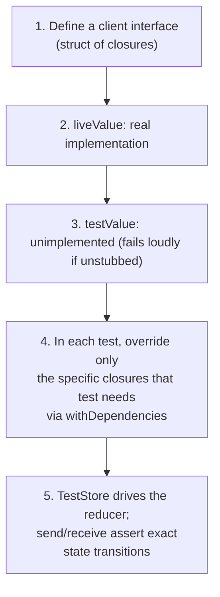

# Chapter 13 — Testing

This chapter is arguably the most important one in the entire book for
justifying TCA's existence in an interview setting. Every architectural
choice made in Chapters 5-12 — pure reducers, effects as values,
injectable dependencies — exists largely to make *this* chapter possible.

## 13.1 Why TCA testing is different from typical iOS testing

Traditional iOS testing usually means one of two things: slow, flaky UI
tests that drive the actual simulator, or narrow unit tests on isolated
helper functions that don't touch real app flow. TCA offers a third
option: **exhaustive, fast, deterministic tests of complete feature
behavior — state changes, effects, and all — without ever touching
UIKit/SwiftUI or the network.** This is possible because of one tool:
`TestStore`.

## 13.2 `TestStore` — the core idea

`TestStore` wraps a reducer the same way a real `Store` does, but adds
one crucial capability: **every assertion you make must account for every
single state change and every single action received, or the test
fails.** This is called **exhaustive testing**, and it is TCA's default.

```swift
import ComposableArchitecture
import Testing
@testable import CounterDemo

@MainActor
struct CounterFeatureTests {
    @Test
    func incrementAndDecrement() async {
        let store = TestStore(initialState: CounterFeature.State()) {
            CounterFeature()
        }

        await store.send(.incrementButtonTapped) {
            $0.count = 1
        }
        await store.send(.incrementButtonTapped) {
            $0.count = 2
        }
        await store.send(.decrementButtonTapped) {
            $0.count = 1
        }
    }
}
```

**Explaining every line:**

- `@MainActor` — TCA's `Store`/`TestStore` are main-actor-isolated (state
  mutation must happen on the main actor, matching how SwiftUI expects
  UI-facing state to be touched); marking the test type `@MainActor`
  satisfies this under Swift 6's strict concurrency checking.
- `struct CounterFeatureTests` with `@Test` — this example uses Apple's
  modern **Swift Testing** framework (`import Testing`, `@Test` functions);
  TCA works equally well with the older XCTest (`XCTestCase`,
  `func testX() async`) — you will see both styles in real codebases.
- `TestStore(initialState: CounterFeature.State()) { CounterFeature() }`
  — constructs a test-only Store with a starting state and the real
  reducer under test.
- `await store.send(.incrementButtonTapped) { $0.count = 1 }` — sends an
  action, exactly like a real Store. The trailing closure describes
  **exactly how you expect state to change** as a result. `$0` is the
  mutable state, starting as a copy of the state *before* this action.
  Internally, `TestStore` runs the actual reducer, then compares the
  *actual* resulting state to what you described by applying your
  closure to the state snapshot — if they don't match, the test fails
  and prints an exact diff of what differed.

### Why this specific mechanism catches more bugs than "assert after the fact"

If you only check final state after several actions (`assert(state.count == 2)`),
a bug that makes an *intermediate* state briefly wrong (but which
happens to cancel out later) would slip through undetected. Asserting the
state change after *every single* `send` catches that class of bug
immediately, at the exact action where it happens.

## 13.3 Testing effects — `receive`

When an action triggers an effect that later sends another action, the
test must also account for that action arriving, using `store.receive`.

```swift
@Test
func fetchFactSuccess() async {
    let store = TestStore(initialState: CounterFeature.State(count: 5)) {
        CounterFeature()
    } withDependencies: {
        $0.numberFactClient.fetch = { number in "\(number) is a great number." }
    }

    await store.send(.fetchFactButtonTapped) {
        $0.isLoadingFact = true
    }
    await store.receive(\.factResponse.success) {
        $0.isLoadingFact = false
        $0.fact = "5 is a great number."
    }
}
```

**Explaining every new piece:**

- `withDependencies: { $0.numberFactClient.fetch = { ... } }` — overrides
  the dependency for this test only, as covered in Chapter 12. Notice the
  fake returns a fixed, predictable string — no real network call
  happens.
- `await store.receive(\.factResponse.success) { ... }` — asserts that,
  as a result of the effect started by the previous `send`, the Store
  will receive an action matching `.factResponse(.success(_))`, and
  describes the resulting state change. `\.factResponse.success` is a
  **case path** reaching into the nested `Result` (Chapter 14 explains
  case paths fully) — this lets you match a specific case without writing
  out the exact associated value if you don't need to check it directly.
- If the effect never sends a matching action, or sends a *different*
  action than expected, `receive` fails the test with a clear message. If
  you `send` an action that starts an effect and never call `receive` for
  its resulting action, **the test fails at the end**, because exhaustive
  testing requires every action to be accounted for — this is
  deliberate, and it catches "I forgot this also triggers a side effect"
  bugs immediately.

## 13.4 Testing failures

```swift
@Test
func fetchFactFailure() async {
    struct SomeError: Error, Equatable {}

    let store = TestStore(initialState: CounterFeature.State()) {
        CounterFeature()
    } withDependencies: {
        $0.numberFactClient.fetch = { _ in throw SomeError() }
    }

    await store.send(.fetchFactButtonTapped) {
        $0.isLoadingFact = true
    }
    await store.receive(\.factResponse.failure) {
        $0.isLoadingFact = false
        $0.fact = "Couldn't load a fact. Please try again."
    }
}
```

This exercises the exact `.factResponse(.failure)` branch from Chapter
5's reducer, with no real network flakiness involved — the fake
dependency throws deterministically, every single time this test runs.

## 13.5 Controlling time: testing debounce, timers, and delays instantly

Recall Chapter 11's debounced search. Testing this *without* controllable
time would mean the test literally waiting 300 real milliseconds (or
longer, for longer debounce windows) — slow, and still somewhat flaky
under CI load. TCA's `continuousClock` dependency (Chapter 12, Section
12.5) solves this.

```swift
@Test
func searchDebounces() async {
    let clock = TestClock()
    let store = TestStore(initialState: SearchFeature.State()) {
        SearchFeature()
    } withDependencies: {
        $0.continuousClock = clock
        $0.searchClient.search = { query in ["\(query) result 1", "\(query) result 2"] }
    }

    await store.send(.binding(.set(\.query, "sw"))) {
        $0.query = "sw"
    }
    // Not enough time has passed yet — no effect should fire.
    await clock.advance(by: .milliseconds(200))

    await store.send(.binding(.set(\.query, "swift"))) {
        $0.query = "swift"
    }
    // Now advance past the full debounce window.
    await clock.advance(by: .milliseconds(300))

    await store.receive(\.searchResponse) {
        $0.results = ["swift result 1", "swift result 2"]
    }
}
```

- `TestClock()` — a controllable, fake clock. `.advance(by:)` instantly
  moves simulated time forward, without the test actually waiting in real
  time.
- Notice the test proves the debounce *restarted* — typing "sw" then
  "swift" within the 300ms window means only *one* search fires, for
  "swift," not two.

## 13.6 Testing navigation

Because navigation is State (Chapter 9), testing it is no different from
testing any other state change.

```swift
@Test
func pushAndPopDetail() async {
    let store = TestStore(initialState: AppFeature.State()) {
        AppFeature()
    }

    await store.send(.itemRowTapped(id: 42)) {
        $0.path.append(.detail(DetailFeature.State(itemID: 42)))
    }

    await store.send(.path(.popFrom(id: store.state.path.ids.first!)))
    { $0.path.removeLast() }
}
```

This test never touches `NavigationStack`, SwiftUI, or a simulator — it
proves the exact `State` transition that *drives* the real
`NavigationStack` (Chapter 9, Section 9.3), which is enough to trust the
navigation logic is correct.

## 13.7 Testing parent/child communication (delegate actions)

```swift
@Test
func savingAddItemDismissesSheetAndAppendsItem() async {
    let store = TestStore(initialState: InventoryFeature.State()) {
        InventoryFeature()
    }

    await store.send(.addButtonTapped) {
        $0.addItem = AddItemFeature.State()
    }
    store.state.addItem?.name = "Milk" // simulate the user having typed a name

    await store.send(.addItem(.presented(.saveButtonTapped)))

    await store.receive(\.addItem.presented.delegate.didSave) {
        $0.items.append(Item(name: "Milk"))
        $0.addItem = nil
    }
}
```

This confirms the whole chain from Chapter 10, Section 10.7: tapping Save
inside the child produces a `delegate(.didSave)` action, and the parent
correctly reacts by appending the item and dismissing the sheet — all
without ever rendering a real `View`.

## 13.8 Non-exhaustive testing — when and why

Sometimes a feature has many unrelated pieces of state, and a test only
cares about verifying one small part of the behavior. Writing out every
single field change for every `send`/`receive` can get noisy. TCA
supports **non-exhaustive testing** for exactly this situation.

```swift
@Test
func onlyCheckOneField() async {
    let store = TestStore(initialState: BigFeature.State()) {
        BigFeature()
    }
    store.exhaustivity = .off // or .off(showSkippedAssertions: true)

    await store.send(.someAction)
    await store.send(.checkThisOne) {
        $0.importantField = "expected value"
    }
}
```

`store.exhaustivity = .off` relaxes the requirement to account for *every*
state change and *every* received action — you only assert what you
explicitly write. Use this deliberately and sparingly: exhaustive testing
is the default for good reason (Section 13.2), and turning it off trades
away some bug-catching power for less noisy tests. A common convention:
use exhaustive tests for a feature's core logic, and non-exhaustive tests
for large integration-style tests that intentionally only care about one
outcome.

## 13.9 Mocking APIs — the pattern, end to end

Bringing Chapters 5, 11, and 12 together, here is the complete, standard
pattern for testing any feature that calls an API:



This pattern scales to any dependency: databases, location services,
push notifications, analytics — anything with a `liveValue` and a
`testValue` can be substituted per test with zero changes to reducer
code.

## 13.10 Common mistakes in testing

- **Not accounting for a `receive` and being surprised the test fails.**
  This is usually the test correctly catching a real bug (an effect you
  forgot about), not a false positive — investigate before disabling
  exhaustivity.
- **Turning off exhaustivity globally, by default, for every test.** This
  throws away most of TCA's testing value; reserve it for specific,
  justified cases.
- **Forgetting `await` before `store.send`/`store.receive`.** Both are
  `async` — actions are processed asynchronously to correctly interleave
  with real effect timing, even in tests.
- **Using real `Date()`/`UUID()`/network calls in a test** instead of
  overriding dependencies — leads to flaky, non-reproducible failures.
- **Writing assertions that just repeat what the reducer code already
  says**, without thinking about what could actually break. Good tests
  encode the *intended* behavior, so they fail if someone changes the
  reducer in a way that breaks that intent — not just changes it in any
  way at all.

## 13.11 Chapter Summary

- `TestStore` is TCA's dedicated testing tool: send actions, assert exact
  state changes, and receive effect-produced actions — all synchronously
  traceable and fast.
- Exhaustive testing (the default) requires every state change and every
  received action to be accounted for, catching bugs non-exhaustive tests
  would miss.
- `TestClock` lets you test debounced/throttled/delayed effects instantly,
  without waiting in real time.
- Navigation and parent/child communication are tested the same way as
  any other state change — because they *are* state changes.
- Non-exhaustive testing (`store.exhaustivity = .off`) is available for
  large or loosely-scoped tests, but should be used deliberately, not by
  default.

## 13.12 Check Your Understanding

1. What does the trailing closure passed to `store.send(...)` actually
   assert, precisely?
2. Why does a test fail if an effect sends an action that was never
   accounted for with `store.receive`?
3. How does `TestClock` let you test a 300ms debounce without the test
   taking 300ms (or longer) to run?
4. What is the tradeoff of setting `store.exhaustivity = .off`?
5. Explain why testing navigation in TCA does not require driving a real
   `NavigationStack`.

---

**Previous:** [Chapter 12 — Dependencies](12-Dependencies.md)
**Next:** [Chapter 14 — Advanced TCA](14-Advanced-TCA.md)
