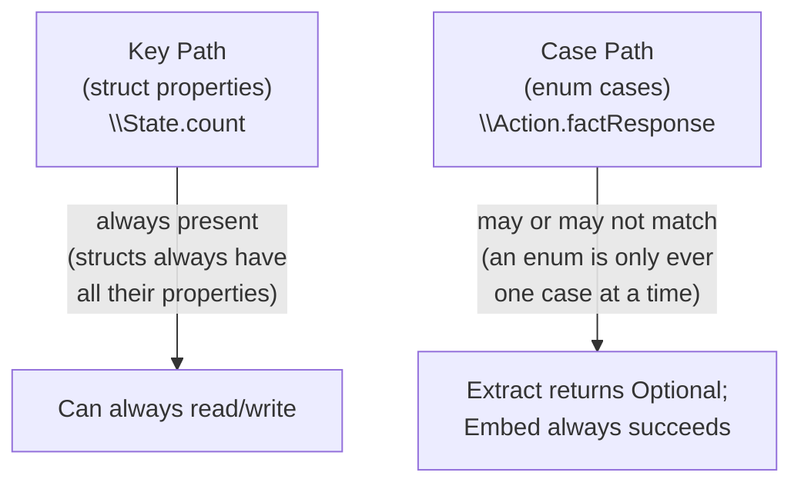
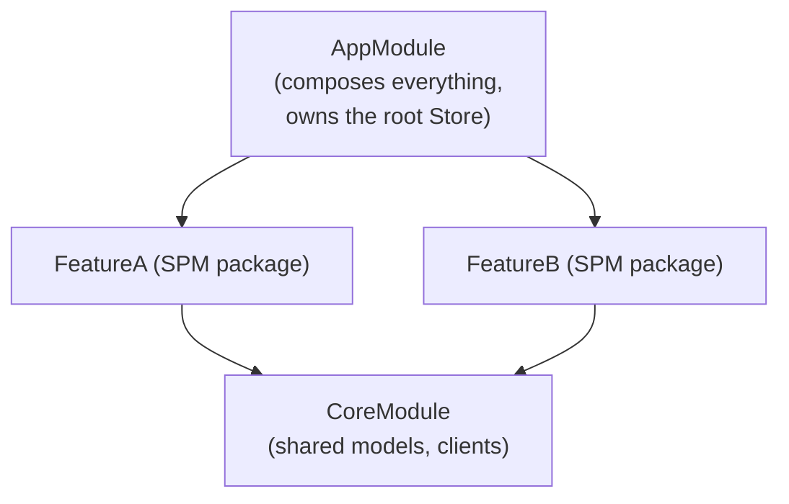

# Chapter 14 — Advanced TCA

You have now used every core piece of TCA. This chapter goes underneath
the syntax you've been using and explains the machinery that makes it
possible — Swift macros, case paths, the Observation framework — plus
advanced tools for bindings, shared state, and structuring large codebases.

## 14.1 What is a Swift macro, precisely?

A **macro** is code that runs *at compile time* and transforms your source
code into more source code, before the compiler proper builds it. Unlike
runtime metaprogramming (reflection, `NSObject` dynamism), macros produce
ordinary Swift code you could have written by hand — a macro is really
just "generate this boilerplate for me, automatically, checked by the
compiler."


You can see exactly what a macro generates in Xcode: right-click a macro
usage and choose **Expand Macro**.

## 14.2 `@Reducer`, fully explained

```swift
@Reducer
struct Feature {
    struct State { /* ... */ }
    enum Action { /* ... */ }
    var body: some ReducerOf<Self> { /* ... */ }
}
```

The `@Reducer` macro expands roughly into:

- Conformance of `Feature` to the `Reducer` protocol.
- A `typealias` and wiring so `ReducerOf<Feature>` resolves correctly.
- If `State` is marked `@ObservableState`, additional glue so
  `StoreOf<Feature>` correctly participates in Observation.
- If your `Action` has nested nested nested enums or you write
  `@Reducer enum Path { case detail(DetailFeature) }` (Chapter 9, Section
  9.3), it generates the combined `Path.State`/`Path.Action` types and
  the routing logic that would otherwise require substantial boilerplate
  written by hand (this was one of the biggest boilerplate reductions
  introduced by the 2023 macro rewrite mentioned in Chapter 3).

Without `@Reducer`, in pre-2023 TCA, you would write this conformance and
plumbing by hand for every single feature — the macro is what let
Point-Free remove a large fraction of TCA's historical ceremony.

## 14.3 `@ObservableState`, fully explained

```swift
@ObservableState
struct State: Equatable {
    var count = 0
    var fact: String?
}
```

This macro makes `State` participate in Swift's Observation framework
(the same one behind `@Observable` classes, iOS 17+), *while remaining a
`struct`* (Observation was originally designed for classes; TCA's macro
adapts it to work with value types, which is what `State` needs to be —
see Chapter 5, Section 5.1, for why `State` must be a `struct`).
Concretely, it wraps each stored property so that:

- **Reads** are tracked: when a View's `body` reads `store.count`, that
  specific access is recorded.
- **Writes** trigger targeted notifications: only for the *exact*
  property that changed, not the whole struct.

This is what makes Chapter 6, Section 6.4's fine-grained re-rendering
possible: a View reading only `store.count` never re-renders when
`store.fact` changes.

## 14.4 `@Dependency`, fully explained

Already covered mechanically in Chapter 12; the macro/property-wrapper
detail worth adding here: `@Dependency(\.key)` does its lookup **lazily,
at the point of use**, not at initialization time of the reducer struct.
This matters because `@Reducer` types (like `Feature()` in
`Store(initialState:) { Feature() }`) are typically created once, up
front, potentially *before* `withDependencies` overrides are applied at
the `Store` level — lazy lookup ensures the dependency resolution still
respects whatever overrides are active by the time the value is actually
read during action handling.

## 14.5 Case paths — key paths, but for enum cases

A **key path** (`\Type.property`) lets you refer to a `struct`'s property
as a value, without immediately reading it — useful for passing "which
property" around as data (e.g. `Scope(state: \.child, ...)`, Chapter 10).
Swift does not have a native equivalent for enum *cases*, because a case
may or may not be "present" in a given value, and may carry associated
data. TCA's `CasePaths` library (used pervasively through the `@Reducer`
and `@CasePathable` macros) fills this gap.

```swift
@CasePathable
enum Action {
    case incrementButtonTapped
    case factResponse(Result<String, EquatableError>)
}
```

With `@CasePathable`, you get a `\Action.Cases.factResponse` case path
(usually written just `\.factResponse` in context), which lets you:

- **Extract**, safely: given some `Action` value, does it match
  `.factResponse`, and if so, what's the associated `Result`?
- **Embed**: construct an `Action.factResponse(someResult)` value from
  just the payload.
- **Compose**, going deeper: `\.factResponse.success` reaches through
  *two* levels — the `Action.factResponse` case, and then the
  `Result.success` case inside it — exactly what Chapter 13's
  `store.receive(\.factResponse.success) { ... }` used.



This is the exact mechanism that powers `Scope(action: \.child)`,
`.ifLet(action: \.child)`, `.forEach(action: \.path)`, and
`store.receive(\.someAction.someNestedCase)` throughout the book — every
one of these is, underneath, a case path doing extraction or embedding.

## 14.6 `IdentifiedArray`, revisited

Briefly introduced in Chapter 8; worth stating precisely here:
`IdentifiedArrayOf<Element>` (from `swift-identified-collections`)
maintains both **order** (like an `Array`) and **O(1) average lookup by
ID** (like a `Dictionary`), by internally pairing an ordered list of IDs
with a dictionary from ID to element. This is why `state.todos[id: id]`
is efficient even for large lists, unlike `array.first(where: { $0.id == id })`,
which is O(n).

## 14.7 Bindings and `BindingReducer`, in depth

Chapter 8 used `BindableAction`/`BindingReducer` without fully explaining
the mechanism. Here it is:

```swift
enum Action: BindableAction {
    case binding(BindingAction<State>)
}

var body: some ReducerOf<Self> {
    BindingReducer()
    Reduce { state, action in /* ... */ }
}
```

- `BindingAction<State>` — a special, type-erased action representing
  "some key path of `State` was set to some new value," generated
  automatically whenever you write `$store.someField` in a View and
  SwiftUI's binding machinery assigns to it.
- `BindingReducer()` — a ready-made reducer that knows how to apply any
  `BindingAction` to `state` generically — you never have to hand-write
  "if the binding is for `.query`, set `state.query = newValue`" for
  every field; `BindingReducer()` does it for all of them at once.
- You can still intercept a *specific* field's binding for extra logic
  (Chapter 8's search debounce did this) with
  `case .binding(\.query): /* extra logic here */`, and it composes
  fine with `BindingReducer()` handling the actual assignment.

**When to use bindings vs. explicit actions:** bindings are a convenience
for simple, direct field edits (text fields, toggles, sliders) where the
"business meaning" of the action really is just "this field changed."
For anything with real business logic attached (validation, triggering
other state changes, side effects beyond a simple debounce), prefer an
explicit, named action (`case emailChanged(String)`) — it documents
intent far better than a generic binding, and is easier to trace in
`TestStore` assertions and code search.

## 14.8 `@Shared`, in depth

Chapter 10, Section 10.8 introduced `@Shared` for state visible to
unrelated features. Some further important details:

- **Persistence strategies:** `.inMemory("key")` (shared for the app's
  runtime only), `.appStorage("key")` (backed by `UserDefaults`, for
  small values), `.fileStorage(url)` (backed by a JSON file on disk, for
  larger structured data).
- **Testing shared state:** `TestStore` fully supports asserting changes
  to `@Shared` properties, the same as ordinary state — you do not lose
  testability by sharing state, which is a common (incorrect) worry.
- **Mutation from anywhere:** any feature holding a `@Shared` reference to
  the same key can mutate it, and every other holder sees the change
  immediately (backed by TCA's internal, thread-safe shared storage). This
  power comes with responsibility: because more than one reducer can
  write to shared state, be deliberate about which feature is considered
  the "owner" that performs writes, and which are read-mostly observers,
  to avoid confusing, hard-to-trace mutations from many places.

```swift
@Reducer
struct SomeFeature {
    @ObservableState
    struct State: Equatable {
        @Shared(.fileStorage(.documentsDirectory.appending(path: "settings.json")))
        var settings = AppSettings.default
    }
}
```

## 14.9 Performance, a first look (full chapter: Chapter 18)

Two habits, established early, prevent most TCA performance problems in
practice:

1. **Scope tightly.** Give child Views scoped stores (Chapter 5, Section
   5.4) rather than the whole app's Store, so Observation's fine-grained
   tracking (Section 14.3) can do its job — a View that only reads
   `store.count` should only ever be handed something that lets it read
   `count`, not the entire app's state tree.
2. **Keep `State` structs reasonably sized and flat where possible**, so
   copy-on-write mutation (Chapter 6, Section 6.3) stays cheap, and prefer
   `IdentifiedArrayOf` over plain arrays for any collection accessed by
   ID (Section 14.6).

## 14.10 Large applications and modularization — a first look (full chapter: Chapter 15)

As an app grows, a single Xcode target/module becomes slow to build and
hard to own across teams. The common TCA-friendly response: split
features into **separate Swift packages/modules**, each exposing one or a
few `@Reducer` types and their Views, with dependencies between modules
kept as narrow as possible (often just: a "Core"/"Models" module every
feature depends on, and feature modules that generally do *not* depend on
each other directly — communication happens via delegate actions or
`@Shared`, composed together only at a top-level "App" module). Chapter
15 walks through a complete folder/module layout.



## 14.11 Common mistakes at the advanced level

- **Fighting the macros by writing the pre-macro, manual boilerplate
  "just in case."** In modern TCA, let `@Reducer`/`@ObservableState`/
  `@CasePathable` do their job; manual equivalents are usually
  unnecessary and drift out of sync.
- **Using `@Shared` as a substitute for proper composition**, making
  every feature quietly depend on global state instead of explicit
  parent/child relationships — this erodes the traceability TCA is built
  for.
- **Binding directly to deeply-nested or computed fields** in ways that
  don't map cleanly to a settable key path — bindings need a real,
  settable property to work against.
- **Splitting modules along the wrong boundaries** (e.g. one module per
  file, instead of one module per genuinely independent feature),
  creating excessive cross-module boilerplate for little real benefit.

## 14.12 Chapter Summary

- Macros (`@Reducer`, `@ObservableState`, `@CasePathable`, and more)
  generate ordinary, compiler-checked boilerplate at compile time, which
  is why modern TCA needs far less hand-written ceremony than pre-2023
  TCA.
- Case paths are the enum equivalent of key paths, and they power every
  composition and testing tool that needs to "reach into" a specific
  action case.
- `IdentifiedArrayOf` combines ordered-array and by-ID-lookup performance
  characteristics.
- `BindingReducer` applies generic field-binding actions automatically;
  reach for explicit, named actions when real business logic is involved.
- `@Shared` supports in-memory, `UserDefaults`-backed, and file-backed
  persistence, and remains fully testable — but should be used
  deliberately, not as a substitute for clear ownership.
- Large apps typically modularize by feature, using Swift packages, with
  a shared "Core" module and narrow cross-feature dependencies.

## 14.13 Check Your Understanding

1. What does a Swift macro actually produce, and how can you inspect
   exactly what a given macro expands to in Xcode?
2. Why can't a plain Swift key path reach into a specific enum case the
   way `\Action.factResponse` does?
3. What performance characteristic does `IdentifiedArrayOf` have that a
   plain `Array` lacks, for by-ID operations?
4. When should you prefer an explicit, named action over a generic
   `BindingReducer`-handled binding?
5. Name two different persistence strategies available for `@Shared`, and
   describe a real scenario for each.

---

**Previous:** [Chapter 13 — Testing](13-Testing.md)
**Next:** [Chapter 15 — Real World Architecture](15-Real-World-Architecture.md)
