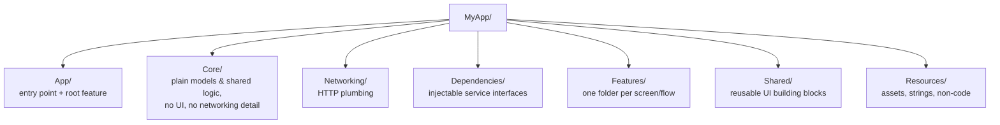
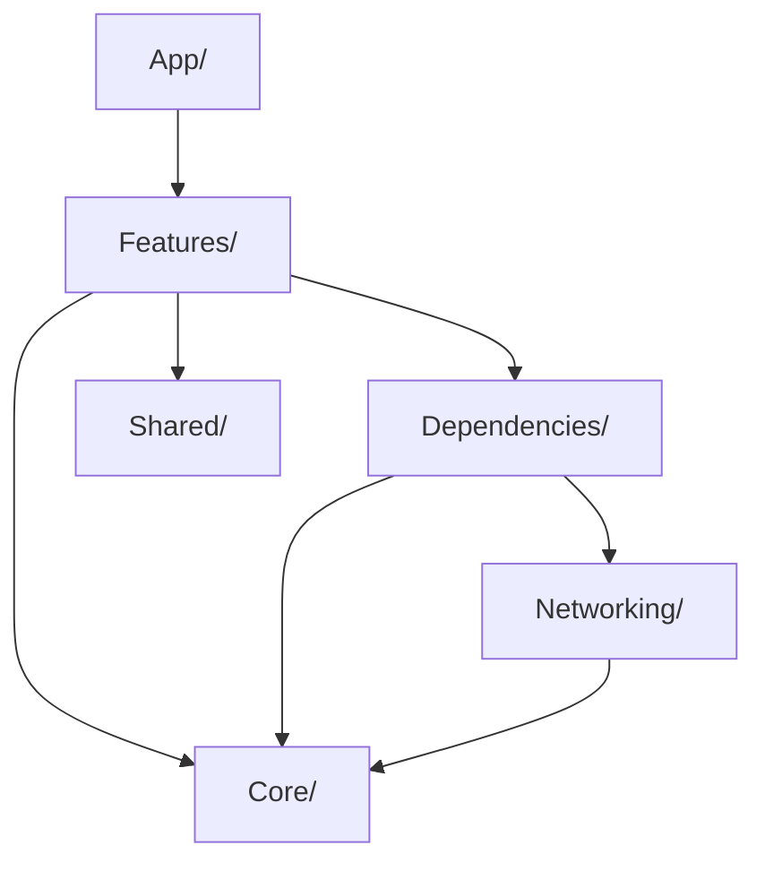
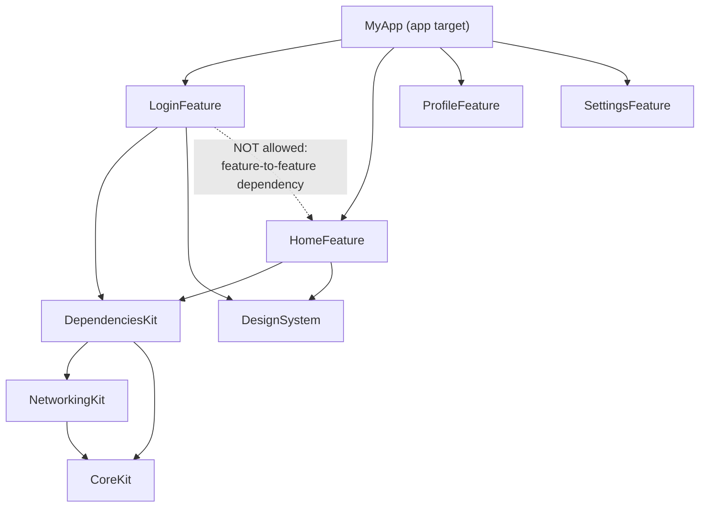

# Chapter 15 — Real World Architecture

Every chapter so far has built one feature at a time. This chapter zooms
out to a whole production app and shows exactly how a real, professional
TCA codebase is organized on disk, and why each folder exists.

## 15.1 The full folder structure

```
MyApp/
├── App/
│   ├── MyAppApp.swift
│   ├── AppFeature.swift
│   └── AppView.swift
├── Core/
│   ├── Models/
│   │   ├── User.swift
│   │   ├── Item.swift
│   │   └── AuthToken.swift
│   └── Extensions/
│       └── Date+Formatting.swift
├── Networking/
│   ├── APIClient.swift
│   ├── APIRequest.swift
│   └── APIError.swift
├── Dependencies/
│   ├── AuthClient.swift
│   ├── UserClient.swift
│   ├── AnalyticsClient.swift
│   └── PersistenceClient.swift
├── Features/
│   ├── Login/
│   │   ├── LoginFeature.swift
│   │   ├── LoginView.swift
│   │   └── LoginFeatureTests.swift
│   ├── Home/
│   │   ├── HomeFeature.swift
│   │   ├── HomeView.swift
│   │   └── HomeFeatureTests.swift
│   ├── Profile/
│   │   ├── ProfileFeature.swift
│   │   ├── ProfileView.swift
│   │   └── ProfileFeatureTests.swift
│   └── Settings/
│       ├── SettingsFeature.swift
│       ├── SettingsView.swift
│       └── SettingsFeatureTests.swift
├── Shared/
│   ├── DesignSystem/
│   │   ├── Colors.swift
│   │   └── Typography.swift
│   └── Components/
│       ├── LoadingView.swift
│       └── ErrorBanner.swift
└── Resources/
    ├── Assets.xcassets
    └── Localizable.xcstrings
```

## 15.2 Why each folder exists



### `App/`

**Purpose:** the single entry point, and the top-level `AppFeature` that
composes every other feature together (Chapter 10). This is where the
one and only root `Store` is created (Chapter 7, Section 7.6), and where
app-wide concerns live — top-level navigation state (`StackState`, tab
selection, Chapter 9), and reacting to app lifecycle events (becoming
active, receiving a push notification, handling a deep link URL).

**Rule of thumb:** if a piece of logic only makes sense "at the level of
the whole app," it belongs here — not duplicated into individual
features.

### `Core/`

**Purpose:** plain, framework-agnostic data types and logic shared by
many features — the closest thing to Clean Architecture's "Entities"
layer (Chapter 2, Section 2.8). A `User` struct, an `Item` struct, date
formatting helpers. Crucially, **`Core` should not import SwiftUI, and
should not know about specific features.** Every feature can depend on
`Core`; `Core` never depends on a feature.

### `Networking/`

**Purpose:** the low-level HTTP plumbing — building `URLRequest`s,
decoding responses, mapping HTTP errors to typed `APIError` values. This
is deliberately *separate* from `Dependencies/` — `Networking` provides
low-level, reusable machinery; `Dependencies/` provides the
feature-facing, injectable, closure-based interfaces (like `AuthClient`)
that are built *on top of* `Networking`, and are the things reducers
actually declare with `@Dependency`.

```swift
// Networking/APIClient.swift — low-level, reusable
struct APIClient {
    var send: (APIRequest) async throws -> Data
}

// Dependencies/AuthClient.swift — feature-facing, built on top of APIClient
struct AuthClient {
    var login: (String, String) async throws -> AuthToken
}
extension AuthClient: DependencyKey {
    static let liveValue = AuthClient(
        login: { email, password in
            @Dependency(\.apiClient) var apiClient
            let data = try await apiClient.send(.login(email: email, password: password))
            return try JSONDecoder().decode(AuthToken.self, from: data)
        }
    )
}
```

### `Dependencies/`

**Purpose:** every injectable service interface and its
`liveValue`/`previewValue`/`testValue` implementations (Chapter 12), one
file per dependency. Grouping these together, separate from the features
that use them, makes it trivial to see, at a glance, every external
system the app talks to — useful for onboarding, security review, and
understanding blast radius when a backend API changes.

### `Features/`

**Purpose:** the feature-based organization from Chapter 2, Section 2.10,
fully realized. Every screen or flow gets its own folder containing its
`@Reducer` type, its `View`, and its tests, together. This is deliberately
**not** split into `ViewModels/`, `Views/`, `Tests/` top-level folders —
that grouping-by-type approach was shown in Chapter 2 to scale worse than
grouping by feature.

**Rule of thumb:** if you delete a `Features/SomeFeature/` folder
entirely, the app should still compile (aside from wherever
`SomeFeature` is composed into its parent) — that's the sign a feature's
boundaries are drawn correctly.

### `Shared/`

**Purpose:** reusable *UI* building blocks — design tokens (colors,
typography) and small, dumb, reusable Views (`LoadingView`, `ErrorBanner`)
used by several features. Unlike `Core/`, this folder *does* import
SwiftUI — the distinction is: `Core` is shared *data/logic*, `Shared` is
shared *presentation*.

### `Resources/`

**Purpose:** non-code assets — images, colors defined in an asset
catalog, and localized strings. Ordinary Xcode project organization,
included here for completeness since a "full production folder
structure" chapter should not leave it out.

## 15.3 Dependency direction between folders

This is the single most important rule in this chapter, and a common
architecture interview question: **dependencies should only point in one
direction.**



Notice: `Core/` and `Networking/` never point back up toward
`Features/`. This mirrors Clean Architecture's Dependency Rule from
Chapter 2, Section 2.8 — the "inner," more fundamental layers never know
about the "outer," more specific ones. Practically, this means: a
`Networking/APIClient.swift` change never requires touching feature
code unless the interface itself changed, and you can develop/test
`Core/` and `Networking/` entirely independently of any specific screen.

## 15.4 Scaling to Swift Package Manager modules

For genuinely large apps (dozens of engineers, many features), the folder
structure above often graduates into **separate Swift packages** — the
same logical boundaries, but now enforced by the compiler (a module
literally cannot import another module it doesn't declare a dependency
on), and with real build-time benefits (Swift Package Manager can build
and cache unrelated modules in parallel, and changing one feature module
does not force recompiling every other feature module).

```
Packages/
├── CoreKit/            (Swift Package: Core/ contents)
├── NetworkingKit/       (Swift Package: Networking/ contents)
├── DependenciesKit/     (Swift Package: Dependencies/ contents)
├── LoginFeature/        (Swift Package: one Features/ folder)
├── HomeFeature/
├── ProfileFeature/
├── SettingsFeature/
└── DesignSystem/        (Swift Package: Shared/ contents)
MyApp/                   (thin app target: App/ contents, depends on
                           every package above, composes AppFeature)
```



Notice the explicitly forbidden edge: `LoginFeature` should not directly
depend on `HomeFeature` (or vice versa). If `LoginFeature` needs to tell
the app "I'm done, go show Home," that's exactly what delegate actions
(Chapter 10, Section 10.7) are for — the *app target* composes both
features and wires that delegate action to a transition, so neither
feature module needs to know the other exists.

## 15.5 Common mistakes in real-world structure

- **Feature folders/modules depending directly on each other.** Breaks
  the ability to build, test, or even delete features independently;
  route communication through delegate actions or `@Shared` instead
  (Chapter 10).
- **Putting SwiftUI imports in `Core/`.** Once `Core` needs UIKit/SwiftUI,
  it silently becomes untestable outside of a UI test target, and its
  logic can no longer be reused by, say, a widget extension or a watchOS
  companion app.
- **A `Utilities/` or `Helpers/` folder that becomes a dumping ground.**
  If it doesn't clearly belong in `Core`, `Networking`, `Shared`, or a
  specific feature, that's usually a sign the code needs a clearer home,
  not a catch-all folder.
- **Mixing low-level networking code directly into `Dependencies/`**
  clients, instead of building on a shared `Networking/APIClient`. Leads
  to duplicated request-building/error-handling logic across every
  dependency file.

## 15.6 Chapter Summary

- A production TCA app organizes code into: `App` (entry point,
  composition root), `Core` (plain shared models/logic), `Networking`
  (HTTP plumbing), `Dependencies` (injectable service interfaces),
  `Features` (one folder per screen/flow, grouped by feature not by
  type), `Shared` (reusable UI), and `Resources` (assets).
- Dependencies between these areas must point in one direction only:
  outer layers (`Features`, `App`) depend on inner layers (`Core`,
  `Networking`), never the reverse.
- Features should not depend on each other directly; communicate via
  delegate actions or `@Shared`, composed together only at the app level.
- Large apps typically graduate this folder structure into separate
  Swift Package Manager modules, gaining compiler-enforced boundaries and
  faster, more parallel builds.

## 15.7 Check Your Understanding

1. What is the difference in purpose between `Networking/` and
   `Dependencies/`?
2. Why should `Core/` never import SwiftUI?
3. What test can you apply to check whether a feature's folder
   boundaries are drawn correctly?
4. Why is a direct `LoginFeature → HomeFeature` module dependency
   considered a mistake, and what should you use instead?
5. What concrete build-system benefit do you get from splitting features
   into separate Swift packages, beyond just folder organization?

---

**Previous:** [Chapter 14 — Advanced TCA](14-Advanced-TCA.md)
**Next:** [Chapter 16 — TCA + Swift Concurrency](16-TCA-and-Swift-Concurrency.md)
