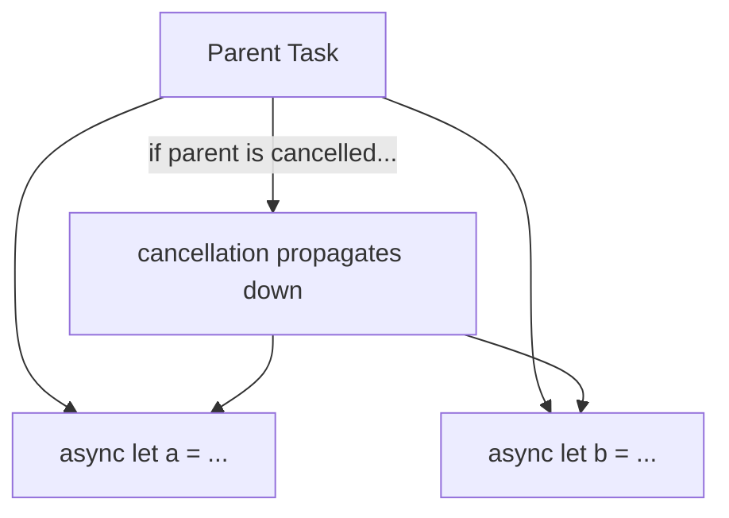

# Chapter 16 — TCA + Swift Concurrency

Effects (Chapter 11) are built directly on Swift's structured concurrency
system. This chapter explains that underlying system properly, from
first principles, and then shows exactly how TCA uses each piece. If you
already know Swift Concurrency well, skim Sections 16.1-16.5 and focus on
16.6 onward, where the TCA-specific integration details live.

## 16.1 `async`/`await`, in plain English

A function marked `async` can **suspend** — pause its execution, let
other work happen, and resume later — instead of blocking the thread it's
running on. `await` is where a suspension point *might* occur.

```swift
func fetchUser() async throws -> User {
    let (data, _) = try await URLSession.shared.data(from: userURL)
    return try JSONDecoder().decode(User.self, from: data)
}
```

While waiting for `URLSession` to get data back from the network, the
thread that called `fetchUser` is freed up to do other work — nothing is
blocked, spinning, or wasting CPU while waiting.

## 16.2 `Task` — starting async work

An `async` function can only be called from inside another `async`
context. `Task { ... }` is how you *start* a new, independent unit of
async work from synchronous code (like a button's `action` closure, in
plain SwiftUI without TCA).

```swift
Button("Refresh") {
    Task {
        await viewModel.refresh()
    }
}
```

TCA's `.run { send in ... }` (Chapter 11, Section 11.4) is, underneath,
exactly this: the `Store` wraps your closure in a `Task` for you, and
gives you `send` to communicate results back.

## 16.3 Structured concurrency — why it's called "structured"

**Structured concurrency** means: a `Task`'s lifetime is tied to the
scope that created it — if the parent task is cancelled, child tasks
(`async let`, `TaskGroup` children) are automatically cancelled too, and
a function cannot "return" until all the concurrent work it started has
finished or been cancelled. This is a deliberate contrast to older,
"unstructured" concurrency (raw `DispatchQueue.async` calls, completion
handlers) where a background operation could easily outlive the code that
started it, with no automatic way to cancel or wait for it.



## 16.4 `Actor` and `MainActor`

An **actor** is a reference type that automatically protects its mutable
state from being accessed by two threads at the same time (data races) —
the compiler enforces that you can only touch an actor's state via
`await`, one caller at a time. `MainActor` is a special, built-in actor
representing "the main thread" — the one UIKit/SwiftUI require UI updates
to happen on.

```swift
@MainActor
final class Store<State, Action> { /* ... */ }
```

TCA's `Store` (and by extension, `State` mutation through it) is
`@MainActor`-isolated. This is a deliberate design choice: it guarantees
state mutations and SwiftUI observation always happen on the main thread,
matching what SwiftUI requires, and it eliminates an entire class of
"updated UI from a background thread" crashes by making it a compile-time
error instead of a runtime crash.

## 16.5 `Sendable` — the concurrency safety contract

A type is `Sendable` if it is safe to pass across concurrency boundaries
(e.g., from a background `Task` into a `send` call that will run on the
main actor) — meaning it either cannot be mutated after creation (a
`struct` of `Sendable` value types, or an immutable `class`), or it
protects its mutable state itself (an `actor`). Swift 6's strict
concurrency mode enforces this at compile time: **if you try to pass a
non-`Sendable` type across a concurrency boundary, your code will not
compile.**

```swift
enum Action: Sendable {  // Actions typically need to be Sendable
    case factResponse(Result<String, EquatableError>)
}
```

**Why this matters for TCA specifically:** `Action` values are created in
one context (often inside a `.run` effect's background work) and sent
into the Store, which runs on `@MainActor` — crossing an actor boundary.
Under Swift 6, `Action` (and everything it contains) generally must be
`Sendable` for this to compile. This is a real, practical reason TCA
encourages keeping action payloads as simple, immutable value types
(Chapter 5, Section 5.2's common mistakes) — complex reference types with
mutable internals are exactly what `Sendable` checking is designed to
catch and reject.

## 16.6 How `.run` effects use all of this together

```swift
return .run { send in
    let user = try await userClient.fetch(id)
    await send(.userResponse(.success(user)))
}
```

- The closure passed to `.run` is itself executed inside a `Task`
  (Section 16.2), so it can freely `await`.
- `userClient.fetch(id)` — an injected dependency (Chapter 12) whose
  `liveValue` typically performs real `async` network I/O.
- `await send(...)` — `send` hops back onto `@MainActor` (Section 16.4)
  to safely deliver the action into the Store, and the `Action` value
  being sent must be `Sendable` (Section 16.5) to legally cross that
  boundary.
- If the effect is cancelled (Chapter 11, Section 11.8), Swift's
  structured concurrency cancellation propagates into this `Task`
  automatically — any further `await`s inside it (like a subsequent
  network call) will throw `CancellationError` at their next suspension
  point, stopping the work promptly.

## 16.7 `AsyncSequence` and TCA

An `AsyncSequence` is like a `Sequence`, but each element may need to be
*awaited* — perfect for representing a stream of events over time
(location updates, notifications, WebSocket messages).

```swift
return .run { send in
    for await notification in NotificationCenter.default.notifications(named: UIApplication.didBecomeActiveNotification) {
        await send(.appDidBecomeActive)
    }
}
.cancellable(id: CancelID.appActiveObserver)
```

`for await ... in ...` iterates the sequence, suspending between
elements. Chapter 11, Section 11.5 used exactly this pattern for location
updates — it works identically for any `AsyncSequence`-conforming source.

## 16.8 `TaskGroup` for dynamic parallel work

Chapter 11, Section 11.6 used `async let` for a *fixed* number of
parallel operations. When the number of parallel operations is only
known at runtime (e.g., fetching details for however many IDs are in a
list), use `withThrowingTaskGroup`:

```swift
return .run { send in
    let details = try await withThrowingTaskGroup(of: ItemDetail.self) { group in
        for id in itemIDs {
            group.addTask { try await itemClient.fetchDetail(id) }
        }
        var results: [ItemDetail] = []
        for try await detail in group {
            results.append(detail)
        }
        return results
    }
    await send(.detailsResponse(.success(details)))
}
```

- `withThrowingTaskGroup(of:)` — creates a scope where you can add any
  number of child tasks.
- `group.addTask { ... }` — starts one child task per item, all running
  concurrently.
- `for try await detail in group` — collects results as they complete
  (not necessarily in the original order — sort afterward if order
  matters).
- If the group scope exits (including via cancellation or a thrown
  error), any still-running child tasks are automatically cancelled —
  structured concurrency's guarantee from Section 16.3, in action.

## 16.9 Networking with modern concurrency, end to end

Putting this chapter's pieces together, here is a complete, realistic
`liveValue` for a networking dependency:

```swift
extension ItemClient: DependencyKey {
    static let liveValue = ItemClient(
        fetchAll: {
            let (data, response) = try await URLSession.shared.data(from: .itemsEndpoint)
            guard let http = response as? HTTPURLResponse, http.statusCode == 200 else {
                throw APIError.badResponse
            }
            return try JSONDecoder().decode([Item].self, from: data)
        },
        fetchDetails: { ids in
            try await withThrowingTaskGroup(of: ItemDetail.self) { group in
                for id in ids { group.addTask { try await Self.fetchOne(id) } }
                var results: [ItemDetail] = []
                for try await detail in group { results.append(detail) }
                return results
            }
        }
    )

    private static func fetchOne(_ id: Item.ID) async throws -> ItemDetail {
        let (data, _) = try await URLSession.shared.data(from: .itemDetailEndpoint(id))
        return try JSONDecoder().decode(ItemDetail.self, from: data)
    }
}
```

Every technique in this chapter appears here: `async throws` functions,
`await`, structured `TaskGroup` for parallel per-ID fetches, and (per
Chapter 12) this whole thing is swappable for a `testValue` in tests with
zero changes to any reducer that calls `fetchAll`/`fetchDetails`.

## 16.10 Common mistakes

- **Ignoring `Task.isCancelled`/`try Task.checkCancellation()` in long,
  multi-step effects**, causing wasted work to continue after
  cancellation was requested but before the next natural suspension
  point.
- **Marking `Action` or `State` types with non-`Sendable` reference-type
  properties**, forcing you to sprinkle `@unchecked Sendable` around
  instead of fixing the actual design (prefer plain value types).
  `@unchecked Sendable` should be a rare, deliberate escape hatch, not a
  default response to a compiler error.
- **Calling `MainActor`-isolated APIs from inside a `TaskGroup` child
  task without proper isolation**, causing compiler errors or, if
  suppressed carelessly, real data races.
- **Manually managing `DispatchQueue`s inside a `liveValue`
  implementation**, instead of using async/await throughout — mixing the
  two models unnecessarily increases complexity and the chance of subtle
  bugs.

## 16.11 Chapter Summary

- Swift Concurrency's core building blocks — `async`/`await`, `Task`,
  structured concurrency's automatic cancellation propagation, `Actor`/
  `MainActor`, and `Sendable` — are not separate from TCA; they are the
  literal implementation substrate for `.run` effects.
- `Store` (and state mutation through it) is `@MainActor`-isolated,
  matching SwiftUI's requirements and eliminating background-thread UI
  update bugs at compile time.
- `Action` types generally must be `Sendable` under Swift 6's strict
  concurrency checking, which is a strong, compiler-enforced argument for
  keeping actions as simple, immutable value types.
- `AsyncSequence` and `TaskGroup` extend naturally into `.run` effects for
  streaming and dynamic-parallel-work scenarios, respectively.
- Cancelling a TCA effect (Chapter 11) works by cancelling its underlying
  `Task`, which structured concurrency propagates automatically to any
  child tasks.

## 16.12 Check Your Understanding

1. What does "structured" mean in "structured concurrency," and how does
   it differ from a raw `DispatchQueue.async` call?
2. Why is TCA's `Store` marked `@MainActor`, and what class of bug does
   this prevent at compile time rather than at runtime?
3. Why must `Action` types generally be `Sendable` under Swift 6?
4. When would you use `async let` versus `TaskGroup` for parallel work
   inside an effect?
5. What happens to a `TaskGroup`'s still-running child tasks if the
   group's surrounding effect is cancelled?

---

**Previous:** [Chapter 15 — Real World Architecture](15-Real-World-Architecture.md)
**Next:** [Chapter 17 — TCA vs Other Architectures](17-TCA-vs-Other-Architectures.md)
