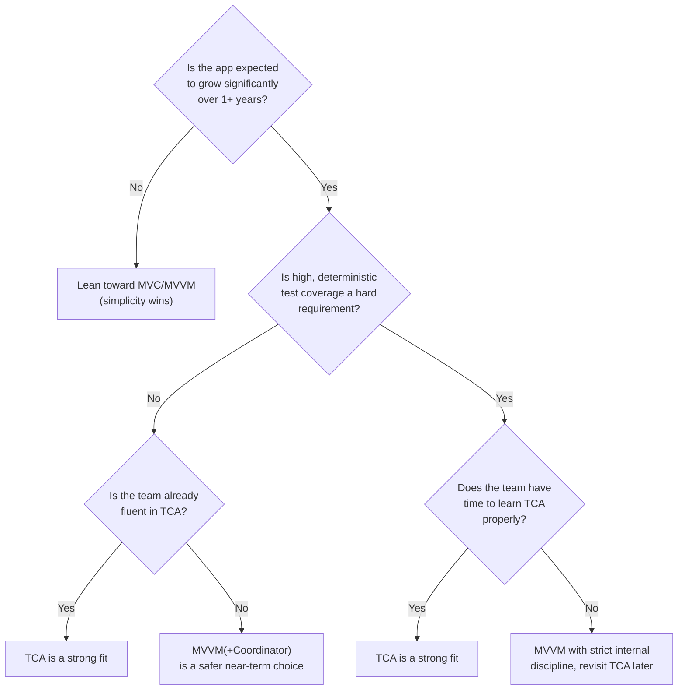

# Chapter 17 — TCA vs Other Architectures

You now know TCA deeply enough to compare it honestly. This chapter is
built specifically for interview preparation — comparison questions
("when would you choose X over TCA?") are extremely common at the senior
and architect level, and a good answer requires real trade-off
reasoning, not just "TCA is better."

## 17.1 The full comparison table

| Dimension | MVC | MVVM | MVVM+C | VIPER | Redux (JS) | Clean Architecture | MVI | Elm | TCA |
|---|---|---|---|---|---|---|---|---|---|
| Complexity | Low | Low-Medium | Medium | High | Medium | High | Medium | Medium | Medium-High |
| Learning curve | Low | Low-Medium | Medium | High | Medium | High | Medium | Medium | Medium-High |
| Boilerplate | Low | Low-Medium | Medium | High | Medium-High | High | Medium | Low (language-native) | Medium (macros reduce it a lot) |
| Testing | Poor | Good | Good | Very good | Very good | Very good | Very good | Very good | Excellent |
| Scalability | Poor | Medium | Good | Very good | Good | Very good | Good | Good | Very good |
| Navigation story | Ad hoc | Not built-in | Built-in (Coordinator) | Built-in (Router) | Not built-in | Not defined | Not built-in | N/A (web) | Built-in (StackState/PresentationState) |
| State management | Weak, scattered | Scattered `@Published` | Scattered `@Published` | Scattered across layers | Single store | Layer-dependent | Single state per screen | Single model | Single State tree per feature |
| Concurrency story | Manual | Manual/Combine | Manual/Combine | Manual | Middleware-dependent | Layer-dependent | Manual | N/A (web) | First-class (Effects + Swift Concurrency) |
| Performance | Good (simple) | Good | Good | Good | Good (JS-specific concerns) | Good | Good | Good | Very good (fine-grained Observation) |
| Best for | Prototypes, tiny apps | Most SwiftUI apps | Mid-size apps needing structured nav | Large, heavily-tested enterprise apps | Web/React apps | Large, multi-platform apps | Android-influenced teams | Elm web apps | Apps prioritizing testability & traceability at scale |
| Enterprise usage | Rare today | Common | Common | Common (large legacy) | N/A (iOS) | Common (as a philosophy, not a full pattern) | Uncommon on iOS | N/A (iOS) | Growing |
| Small app fit | Excellent | Excellent | Good | Poor (overkill) | N/A | Poor (overkill) | Good | N/A | Fair (some ceremony even for small features) |
| Large app fit | Poor | Fair-Good | Good | Excellent | Good | Excellent | Good | Good | Excellent |
| Maintainability | Poor at scale | Good | Good | Very good | Very good | Very good | Good | Very good | Very good |
| Readability | Good (small), poor (large) | Good | Good | Fair (many files) | Good | Fair (many layers) | Good | Good | Good, once the pattern is learned |
| Developer experience (DX) | Simple, familiar | Simple, SwiftUI-native | Slightly more ceremony | Heavy ceremony | Requires discipline | Heavy ceremony | Moderate | Simple (in Elm) | Strong tooling (TestStore, macros), steeper start |

## 17.2 What is MVI, briefly (since it appears in the table)

**MVI (Model-View-Intent)**, popular on Android, is conceptually very
close to TCA/Redux/Elm: a unidirectional loop where a `View` emits
`Intent`s (equivalent to Actions), a reducer-like function computes a new
`Model` (equivalent to State), and the `View` renders that `Model`. If
you have Android experience with MVI, most of TCA's core loop (Chapter 4)
will feel immediately familiar — the main differences are Swift-specific
mechanics (macros, case paths, structured concurrency) rather than
conceptual ones.

## 17.3 Head-to-head: TCA vs MVVM (the most common real comparison)

This is the single most likely "compare architectures" question you will
get in an interview, since MVVM is the most common alternative on real
iOS teams today.

| | MVVM | TCA |
|---|---|---|
| State shape | Scattered `@Published` properties | One `State` struct, single source of truth |
| Business logic location | ViewModel methods | Reducer `body` |
| Side effects | Called directly in ViewModel (any style: Combine, async/await, completion handlers — inconsistent across a team) | `Effect` values, uniform `.run`, consistently cancellable |
| Testing async flows | Manual `await`, `XCTestExpectation`, or Combine test helpers; timing can be fragile | `TestStore` + `TestClock`, deterministic and fast |
| Navigation | Not built-in; usually a hand-rolled Coordinator | Built-in (`StackState`, `PresentationState`) |
| Composition of small features into large ones | Ad hoc, no standard convention | `Scope`, `.ifLet`, `.forEach` — a standard, well-defined convention |
| Boilerplate for a simple screen | Very little | Some (macros reduce it, but there is real ceremony: State, Action, reducer, at minimum) |
| Team consistency | Depends entirely on team discipline | Enforced by the pattern itself — hard to write an MVVM-style shortcut inside a reducer without it standing out |
| Onboarding speed | Fast — most iOS engineers already know MVVM | Slower — TCA-specific vocabulary and tools must be learned |

**The honest verdict:** MVVM is simpler to start with and has a shallower
learning curve; TCA pays off more as an app's state complexity, team
size, and testing requirements grow. Neither is "wrong" — they solve
overlapping but not identical problems (Chapter 1 through Chapter 4 built
up exactly this insight).

## 17.4 When to use TCA

- The app has **complex, interrelated state** across many screens (a
  shopping app with cart, checkout, and account state that all interact).
- **High test coverage is a hard requirement** (fintech, healthcare,
  regulated industries) and you need confidence that business logic is
  fully, deterministically tested.
- The team is **large enough that consistency matters more than
  individual velocity** — TCA's strictness prevents "everyone solves the
  same problem their own way."
- The app has **complex navigation flows** (deep linking, multiple entry
  points, conditional flows) that benefit from being modeled as testable
  state.
- You expect the app to **grow substantially over multiple years**, and
  want architecture that scales with that growth rather than degrading.

## 17.5 When NOT to use TCA

- A **small, short-lived app** (a hackathon project, an internal tool
  used by five people, a proof of concept) — the ceremony of State/
  Action/Reducer for every screen is not worth it.
- A team that is **new to Swift or SwiftUI entirely** — layering TCA's
  vocabulary on top of learning the platform itself can overwhelm new
  engineers; plain SwiftUI + light MVVM is often a gentler start.
- A project with a **hard, near-term deadline** and no existing TCA
  experience on the team — the learning curve is a real, non-trivial cost
  that can outweigh its benefits in a tight timeline.
- An app that is **fundamentally simple and unlikely to grow** (a
  single-purpose utility, a display-only companion app) — the
  architecture should match the problem's actual complexity (Chapter 1,
  Section 1.2).

## 17.6 Real-world examples (general patterns, not confidential specifics)

- Companies building **finance, trading, or other high-stakes apps**
  often cite TCA's testability guarantees as the deciding factor over
  MVVM.
- **Media and content apps** with deep, branching navigation (article →
  related articles → author profile → more articles) benefit from TCA's
  state-driven navigation over hand-rolled Coordinators.
- **Small startups moving fast** with a handful of screens more commonly
  reach for plain MVVM or even a light MVC-derived pattern, adopting TCA
  later if/when the app and team grow substantially.
- Teams **already invested in VIPER** for a large legacy app sometimes
  migrate feature-by-feature to TCA when rewriting screens, since both
  patterns share a similar philosophy (strict separation of concerns,
  strong testability) but TCA has lower long-term boilerplate thanks to
  macros.

## 17.7 A decision framework you can use out loud in an interview

## 17.8 Common mistakes when comparing architectures (in interviews and in practice)

- **Claiming one architecture is universally "best."** Every pattern in
  this book was invented to solve specific problems its predecessors had
  — the right answer is always "it depends on the app, the team, and the
  constraints" (Chapter 1, Section 1.2's core lesson).
- **Comparing TCA to a "textbook" version of MVVM** rather than how MVVM
  is actually used in practice (often already including a Coordinator, a
  service layer, and dependency injection) — a fair comparison should
  compare mature, real-world implementations of both.
- **Ignoring team and organizational factors** (existing skills,
  deadlines, hiring pool) and comparing architectures on pure technical
  merit alone — real engineering decisions weigh both.
- **Assuming more testable always means better for a specific project.**
  Testability has a real cost (Section 17.1's boilerplate row) that is
  not worth paying for every project.

## 17.9 Chapter Summary

- TCA trades a steeper learning curve and more upfront ceremony for
  stronger guarantees: single source of truth, exhaustive testability,
  built-in navigation, and consistent side-effect handling.
- MVVM remains the pragmatic default for many SwiftUI apps, especially
  smaller ones or teams without existing TCA experience.
- VIPER and Clean Architecture share TCA's philosophy of strict
  separation and testability, at an even higher boilerplate cost and
  without TCA's SwiftUI-native ergonomics.
- The right choice depends on app complexity, expected growth, testing
  requirements, and team familiarity — not on which architecture is
  abstractly "best."

## 17.10 Check Your Understanding

1. Give the single strongest technical argument for choosing TCA over
   MVVM, and the single strongest argument for choosing MVVM over TCA.
2. Why is it more useful to compare TCA against a *realistic*,
   fully-built-out MVVM implementation than a "textbook" MVVM example?
3. Name two real-world categories of apps where TCA's guarantees are
   especially valuable, and explain why.
4. Name two real-world categories of apps where adopting TCA would
   likely not be worth its cost, and explain why.
5. How is MVI conceptually similar to TCA, and what kind of engineer
   would likely find TCA's core loop immediately familiar because of it?

---

**Previous:** [Chapter 16 — TCA + Swift Concurrency](16-TCA-and-Swift-Concurrency.md)
**Next:** [Chapter 18 — Performance](18-Performance.md)
