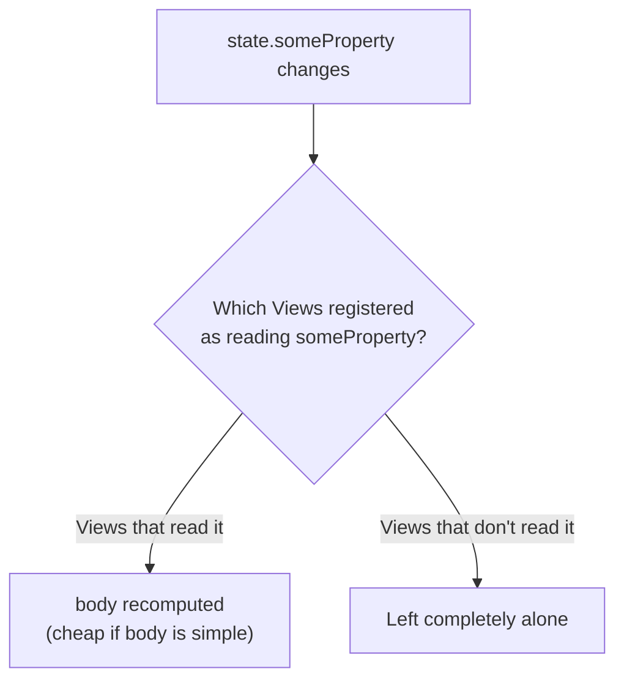
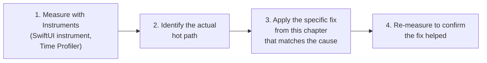

# Chapter 18 — Performance

TCA has a reputation, from its earlier Combine-based years, for being
"heavier" than plain SwiftUI. Modern TCA (Observation-based) closes most
of that gap. This chapter explains exactly where performance costs come
from in a TCA app, and how to avoid the common pitfalls.

## 18.1 Where rendering cost actually comes from

SwiftUI re-renders a View's `body` when the data it reads changes.
Chapter 6, Section 6.4 already explained the mechanism; here is the
performance consequence, stated directly:



Because `@ObservableState` tracks reads at the *property* level (not the
whole `State` struct), the main lever you have for performance is: **make
sure each View only reads the specific properties it actually needs**,
so the "Views that read it" set stays as small as possible for any given
change.

## 18.2 Scoping tightly

```swift
// Less ideal: child view holds the whole parent store,
// reads through to a nested property.
struct BadgeView: View {
    let store: StoreOf<AppFeature>
    var body: some View {
        Text("\(store.cart.itemCount)")
    }
}

// Better: child view is scoped to exactly what it needs.
struct BadgeView: View {
    let store: StoreOf<CartFeature>
    var body: some View {
        Text("\(store.itemCount)")
    }
}
```

Both versions *will* only re-render `BadgeView` when `itemCount`
specifically changes, thanks to Observation's property-level tracking —
but the scoped version is still preferred because it keeps the View's
dependencies explicit and small, makes the View reusable outside
`AppFeature`, and avoids accidentally reading a broader property later
without noticing (e.g. someone adds `Text("\(store.user.name)")` to
`BadgeView` "just this once," and now it silently depends on the whole
app's state shape). Scoping (Chapter 5, Section 5.4; Chapter 10) is a
correctness and architecture tool first, and a performance safety net
second.

## 18.3 `Equatable` and why it matters here too

`@ObservableState`'s change tracking still benefits from `State` being
cheap to compare and cheap to copy. Value types with excessive nested
reference types, or extremely large flat structs, can make even
"unrelated" copy-on-write operations (Chapter 6, Section 6.3) more
expensive than necessary.

**Practical guidance:**

- Prefer nested, feature-scoped `State` structs (Chapter 5, Section 5.1)
  over one enormous flat struct — smaller structs are cheaper to copy
  when only one branch of a large state tree changes.
- Use `IdentifiedArrayOf` (Chapter 14, Section 14.6) for any sizeable
  collection accessed by ID, to avoid O(n) linear scans becoming a
  bottleneck as a list grows.

## 18.4 Avoiding unnecessary state updates from reducers

A subtle but real cost: writing to a state property with the *same*
value it already had still triggers change notification machinery. This
is rarely a bottleneck in practice, but it matters in hot paths (e.g., a
reducer processing rapid, high-frequency events like scroll offset or
live typing).

```swift
case let .scrollOffsetChanged(offset):
    guard state.scrollOffset != offset else { return .none } // skip redundant writes
    state.scrollOffset = offset
    return .none
```

This guard is a cheap, explicit way to avoid redundant work when a
producer of actions might emit the same value repeatedly.

## 18.5 Effects and performance

- **Debounce/throttle** (Chapter 11, Section 11.9) are not just
  correctness tools — they directly reduce unnecessary network and CPU
  work for high-frequency triggers like typing or scrolling.
- **Cancel effects you no longer need** (Chapter 11, Section 11.8),
  especially long-running subscriptions (location, notifications) —
  leaving them running after a feature is no longer visible wastes
  battery and CPU, and can cause actions to arrive for state that no
  longer meaningfully needs them.
- **Avoid excessive `.merge` fan-out** for actions that don't actually
  need multiple concurrent effects — each concurrent effect has real
  overhead (a `Task`, potential system resource usage like a socket).

## 18.6 Memory: Store lifecycle and retain cycles

Because `Store` is a class, and closures (like `.run { send in ... }`)
can capture `self` or other reference types, it is possible to
accidentally create retain cycles that keep a `Store` (and its whole
State tree, and any presented child features) alive longer than
intended.

```swift
// Watch for accidental strong references to long-lived objects
// inside long-running effects, especially ones tied to delegate
// callback-style APIs (e.g. CLLocationManagerDelegate adapters).
```

In practice, most TCA code avoids this class of bug naturally because
dependencies are typically small, `Sendable` structs of closures
(Chapter 12) rather than long-lived delegate objects — but it is worth
knowing this is where memory-related bugs in a TCA app most often
originate, if they occur.

## 18.7 Measuring, not guessing

Before optimizing anything in this chapter, **measure**. Xcode's
Instruments app, specifically the **SwiftUI** and **Time Profiler**
instruments, will show you exactly which Views are re-rendering and how
often, and where CPU time is actually going. A View you *assume* is
re-rendering too often may not be a real bottleneck at all — real
performance work should always start from a measured problem, not a
hypothesis.



## 18.8 Common performance mistakes

- **Handing every child View the entire app's `Store`** instead of
  scoping, out of convenience — works correctly, but erodes the clarity
  and reusability benefits scoping provides (Section 18.2).
- **Optimizing before measuring** — "this feels slow" is not the same as
  "Instruments shows this is where time is going."
- **Leaving long-running effects (timers, subscriptions) uncancelled**
  after a feature is no longer in use.
- **Keeping enormous, flat `State` structs** instead of nesting by
  feature, making every copy-on-write mutation touch more data than
  necessary.
- **Forgetting `Equatable`/appropriate equality**, which can make
  SwiftUI's and TCA's own diffing machinery do more comparison work than
  needed, especially for large collections.

## 18.9 Chapter Summary

- Modern TCA's `@ObservableState` tracks property-level reads, so
  re-renders are already fine-grained by default — the main lever
  remaining is keeping each View's actual dependencies small via scoping.
- `Equatable`, `IdentifiedArrayOf`, and nested (rather than flat) State
  structs all reduce the cost of routine copy-on-write mutations.
- Guard against redundant state writes in high-frequency reducers.
- Cancel effects proactively; debounce/throttle high-frequency triggers.
- Always measure with Instruments before optimizing — most "performance
  problems" in a TCA app are either scoping issues or uncancelled
  effects, both fixable with the techniques in this chapter.

## 18.10 Check Your Understanding

1. Why does scoping a View's Store tightly still matter for performance
   even though `@ObservableState` already tracks reads at the property
   level?
2. Give a concrete example of a high-frequency reducer scenario where
   guarding against redundant writes would help.
3. Name two effect-related habits that directly reduce unnecessary CPU
   and battery usage.
4. Where do memory/retain-cycle bugs most commonly originate in a TCA
   app, and why are they relatively rare in practice?
5. What is the correct first step before applying any performance fix
   from this chapter?

---

**Previous:** [Chapter 17 — TCA vs Other Architectures](17-TCA-vs-Other-Architectures.md)
**Next:** [Chapter 19 — Common Mistakes](19-Common-Mistakes.md)
