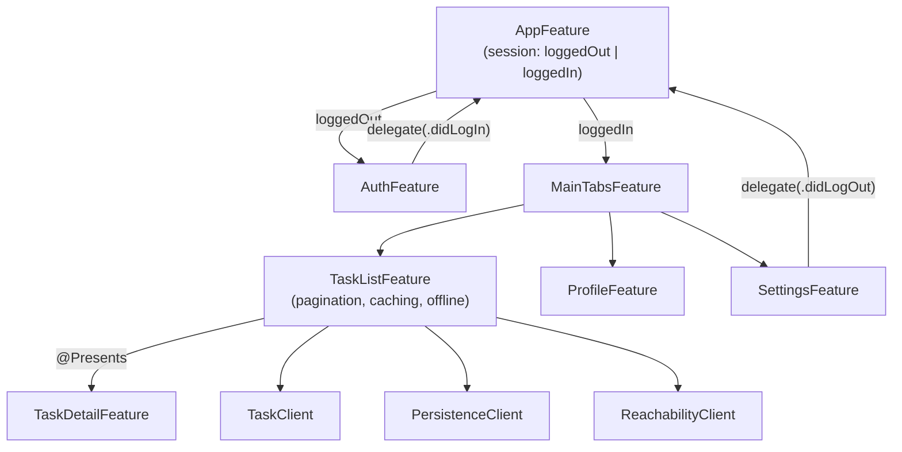

# Chapter 21 — Build a Production App

This capstone chapter builds **TaskFlow**, a realistic task-management
app, using every tool from this book: authentication, paginated API
fetching, caching, offline mode, profile, settings, full navigation, DI,
tests, error handling, and loading states. Concepts already explained
line-by-line in earlier chapters are referenced rather than re-explained;
this chapter focuses on how everything integrates.

## 21.1 Folder structure

```
TaskFlow/
├── App/
│   ├── TaskFlowApp.swift
│   └── AppFeature.swift
├── Core/
│   └── Models/
│       ├── User.swift
│       ├── Task.swift
│       └── AuthToken.swift
├── Networking/
│   ├── APIClient.swift
│   └── APIError.swift
├── Dependencies/
│   ├── AuthClient.swift
│   ├── TaskClient.swift
│   ├── PersistenceClient.swift
│   └── ReachabilityClient.swift
├── Features/
│   ├── Auth/
│   │   ├── AuthFeature.swift
│   │   └── AuthView.swift
│   ├── TaskList/
│   │   ├── TaskListFeature.swift
│   │   ├── TaskListView.swift
│   │   └── TaskListFeatureTests.swift
│   ├── TaskDetail/
│   │   └── TaskDetailFeature.swift
│   ├── Profile/
│   │   └── ProfileFeature.swift
│   └── Settings/
│       └── SettingsFeature.swift
└── Shared/
    └── Components/
        ├── LoadingView.swift
        └── OfflineBanner.swift
```

This mirrors Chapter 15 exactly — if any folder's purpose is unclear,
that chapter is the reference.

## 21.2 Core models

```swift
// Core/Models/Task.swift
struct Task: Equatable, Identifiable, Codable {
    let id: UUID
    var title: String
    var isDone: Bool
    var updatedAt: Date
}

// Core/Models/User.swift
struct User: Equatable, Codable {
    let id: UUID
    var name: String
    var email: String
}
```

Plain, `Codable` (for persistence and API decoding), `Equatable` (for
`State` and `TestStore`), no framework imports — pure `Core`, per Chapter
15, Section 15.2.

## 21.3 Authentication

```swift
// Dependencies/AuthClient.swift
struct AuthClient {
    var login: (_ email: String, _ password: String) async throws -> AuthToken
    var currentToken: () -> AuthToken?
    var logout: () async throws -> Void
}

extension AuthClient: DependencyKey {
    static let liveValue = AuthClient(
        login: { email, password in
            @Dependency(\.apiClient) var apiClient
            let data = try await apiClient.send(.login(email: email, password: password))
            return try JSONDecoder().decode(AuthToken.self, from: data)
        },
        currentToken: { KeychainStore.shared.token },
        logout: { KeychainStore.shared.token = nil }
    )
    static let testValue = AuthClient(
        login: unimplemented("AuthClient.login"),
        currentToken: unimplemented("AuthClient.currentToken", placeholder: nil),
        logout: unimplemented("AuthClient.logout")
    )
}
```

```swift
// Features/Auth/AuthFeature.swift
@Reducer
struct AuthFeature {
    @ObservableState
    struct State: Equatable {
        var email = ""
        var password = ""
        var isLoading = false
        var errorMessage: String?
        var isFormValid: Bool { email.contains("@") && password.count >= 8 }
    }
    enum Action: BindableAction {
        case binding(BindingAction<State>)
        case loginButtonTapped
        case loginResponse(Result<AuthToken, EquatableError>)
        case delegate(Delegate)
        @CasePathable
        enum Delegate: Equatable { case didLogIn(AuthToken) }
    }
    @Dependency(\.authClient) var authClient

    var body: some ReducerOf<Self> {
        BindingReducer()
        Reduce { state, action in
            switch action {
            case .binding:
                state.errorMessage = nil
                return .none
            case .loginButtonTapped:
                guard state.isFormValid else { return .none }
                state.isLoading = true
                let email = state.email, password = state.password
                return .run { send in
                    await send(.loginResponse(
                        Result { try await authClient.login(email, password) }.mapError(EquatableError.init)
                    ))
                }
            case let .loginResponse(.success(token)):
                state.isLoading = false
                return .send(.delegate(.didLogIn(token)))
            case let .loginResponse(.failure(error)):
                state.isLoading = false
                state.errorMessage = error.localizedDescription
                return .none
            case .delegate:
                return .none
            }
        }
    }
}
```

This is Chapter 8's Login example, extended with a `delegate(.didLogIn)`
action (Chapter 10, Section 10.7) so `AppFeature` — not `AuthFeature`
itself — decides what happens after a successful login, keeping
`AuthFeature` fully decoupled and reusable.

## 21.4 The root `AppFeature` — auth gate + tabs

```swift
@Reducer
struct AppFeature {
    @ObservableState
    struct State: Equatable {
        enum Session: Equatable {
            case loggedOut(AuthFeature.State)
            case loggedIn(MainTabsFeature.State)
        }
        var session: Session = .loggedOut(.init())
    }
    enum Action {
        case auth(AuthFeature.Action)
        case mainTabs(MainTabsFeature.Action)
    }
    var body: some ReducerOf<Self> {
        Reduce { state, action in
            switch action {
            case .auth(.delegate(.didLogIn)):
                state.session = .loggedIn(.init())
                return .none
            case .mainTabs(.settings(.delegate(.didLogOut))):
                state.session = .loggedOut(.init())
                return .none
            default:
                return .none
            }
        }
        .ifCaseLet(\.session.loggedOut, action: \.auth) { AuthFeature() }
        .ifCaseLet(\.session.loggedIn, action: \.mainTabs) { MainTabsFeature() }
    }
}
```

**What's new here:** `.ifCaseLet` (the enum-state equivalent of
`.ifLet`) composes a child reducer only when `state.session` is currently
that specific case — this is how TCA models "one of two entirely
different root screens," switched by a top-level state machine, exactly
the "state machine enum instead of a loose boolean" best practice from
Chapter 19, Mistake #2, applied at the whole-app level (`isLoggedIn: Bool`
would be the tempting-but-wrong alternative).

## 21.5 Task list — pagination, caching, and offline, together

```swift
// Dependencies/TaskClient.swift
struct TaskClient {
    var fetchPage: (_ page: Int) async throws -> [Task]
}

// Dependencies/PersistenceClient.swift
struct PersistenceClient {
    var loadCachedTasks: () -> [Task]
    var saveCachedTasks: ([Task]) -> Void
}

// Dependencies/ReachabilityClient.swift
struct ReachabilityClient {
    var isOnline: () -> Bool
}
```

```swift
@Reducer
struct TaskListFeature {
    @ObservableState
    struct State: Equatable {
        var tasks: IdentifiedArrayOf<Task> = []
        var pageStatus: LoadingState<Never> = .idle
        var currentPage = 1
        var hasMorePages = true
        var isOffline = false
        @Presents var taskDetail: TaskDetailFeature.State?
    }
    enum Action {
        case onAppear
        case loadMoreIfNeeded(currentItem: Task?)
        case pageResponse(Result<[Task], EquatableError>)
        case taskRowTapped(id: Task.ID)
        case taskDetail(PresentationAction<TaskDetailFeature.Action>)
    }
    @Dependency(\.taskClient) var taskClient
    @Dependency(\.persistenceClient) var persistenceClient
    @Dependency(\.reachabilityClient) var reachabilityClient
    private enum CancelID { case page }

    var body: some ReducerOf<Self> {
        Reduce { state, action in
            switch action {
            case .onAppear:
                state.isOffline = !reachabilityClient.isOnline()
                guard state.tasks.isEmpty else { return .none }
                if state.isOffline {
                    // Offline: show cached data immediately, skip network.
                    state.tasks = IdentifiedArrayOf(uniqueElements: persistenceClient.loadCachedTasks())
                    return .none
                }
                return fetchPage(1, into: &state)

            case let .loadMoreIfNeeded(currentItem):
                guard state.hasMorePages, !state.isOffline,
                      let currentItem, state.tasks.last?.id == currentItem.id
                else { return .none }
                return fetchPage(state.currentPage + 1, into: &state)

            case let .pageResponse(.success(newTasks)):
                state.pageStatus = .idle
                state.hasMorePages = !newTasks.isEmpty
                state.tasks.append(contentsOf: newTasks)
                state.currentPage += 1
                persistenceClient.saveCachedTasks(Array(state.tasks)) // cache-after-fetch
                return .none

            case .pageResponse(.failure):
                state.pageStatus = .failed("Couldn't load tasks.")
                if state.tasks.isEmpty {
                    // Network failed and we have nothing yet — fall back to cache.
                    state.tasks = IdentifiedArrayOf(uniqueElements: persistenceClient.loadCachedTasks())
                }
                return .none

            case let .taskRowTapped(id):
                guard let task = state.tasks[id: id] else { return .none }
                state.taskDetail = TaskDetailFeature.State(task: task)
                return .none

            case .taskDetail:
                return .none
            }
        }
        .ifLet(\.$taskDetail, action: \.taskDetail) {
            TaskDetailFeature()
        }
    }

    private func fetchPage(_ page: Int, into state: inout State) -> Effect<Action> {
        state.pageStatus = .loading
        return .run { send in
            await send(.pageResponse(
                Result { try await taskClient.fetchPage(page) }.mapError(EquatableError.init)
            ))
        }
        .cancellable(id: CancelID.page)
    }
}
```

**Explaining the new, production-specific pieces:**

- **Pagination:** `.loadMoreIfNeeded(currentItem:)` is sent from the View
  as the list scrolls (Section 21.6); it only fetches the next page when
  the *last* visible row matches the *last* loaded task, a standard
  "infinite scroll" trigger, guarded by `hasMorePages` and `!isOffline`.
- **Caching:** every successful page fetch writes the accumulated task
  list to `persistenceClient.saveCachedTasks`, so the most recent known
  state survives app relaunches.
- **Offline mode:** `onAppear` checks `reachabilityClient.isOnline()`
  first; if offline, it skips the network entirely and loads cached data
  directly. If a fetch fails *and* there's no data yet (e.g. connectivity
  dropped mid-session), it falls back to cache as well — the user always
  sees the best available data rather than a bare error screen.
- **`fetchPage(_:into:)` as a private helper:** factoring out the
  repeated "set loading, run effect, cancellable" logic keeps `onAppear`
  and `loadMoreIfNeeded` consistent and DRY (don't repeat yourself),
  while remaining ordinary, directly testable reducer code.

## 21.6 Wiring pagination to the View

```swift
struct TaskListView: View {
    @Bindable var store: StoreOf<TaskListFeature>

    var body: some View {
        List {
            if store.isOffline {
                OfflineBanner()
            }
            ForEach(store.tasks) { task in
                Button { store.send(.taskRowTapped(id: task.id)) } label: {
                    Text(task.title)
                }
                .onAppear { store.send(.loadMoreIfNeeded(currentItem: task)) }
            }
            if case .loading = store.pageStatus {
                LoadingView()
            }
        }
        .task { store.send(.onAppear) }
        .sheet(item: $store.scope(state: \.taskDetail, action: \.taskDetail)) { detailStore in
            TaskDetailView(store: detailStore)
        }
    }
}
```

`.onAppear { store.send(.loadMoreIfNeeded(currentItem: task)) }` on each
row is the standard SwiftUI trick for infinite scroll: as new rows
scroll into view, this fires, and the reducer's guard clause
(`state.tasks.last?.id == currentItem.id`) ensures it only actually
triggers a fetch when the *very last* row appears — not on every row.

## 21.7 Error handling and loading states, consistently

Every async operation in TaskFlow follows the same pattern established
across Chapters 8, 11, and 12: a `LoadingState<Value>` (or a purpose-fit
variant like `pageStatus: LoadingState<Never>` here, since the "loaded"
payload is really just the growing `tasks` array, not a separate value),
a `Result`-wrapped response action, explicit failure handling that
updates user-visible state, and a fallback path (here, cached data)
rather than a dead end. This consistency — the same shape, reducer after
reducer — is exactly the payoff Chapter 3 promised: once you've built
this pattern once, every future screen reuses it directly.

## 21.8 Testing the production task list

```swift
@MainActor
struct TaskListFeatureTests {
    @Test
    func loadsFirstPageOnAppear() async {
        let store = TestStore(initialState: TaskListFeature.State()) {
            TaskListFeature()
        } withDependencies: {
            $0.reachabilityClient.isOnline = { true }
            $0.taskClient.fetchPage = { page in
                page == 1 ? [Task(id: UUID(0), title: "Buy milk", isDone: false, updatedAt: .now)] : []
            }
            $0.persistenceClient.saveCachedTasks = { _ in }
        }

        await store.send(.onAppear) {
            $0.isOffline = false
            $0.pageStatus = .loading
        }
        await store.receive(\.pageResponse.success) {
            $0.pageStatus = .idle
            $0.tasks = [Task(id: UUID(0), title: "Buy milk", isDone: false, updatedAt: .now)]
            $0.currentPage = 2
        }
    }

    @Test
    func fallsBackToCacheWhenOffline() async {
        let cached = [Task(id: UUID(1), title: "Cached task", isDone: false, updatedAt: .now)]
        let store = TestStore(initialState: TaskListFeature.State()) {
            TaskListFeature()
        } withDependencies: {
            $0.reachabilityClient.isOnline = { false }
            $0.persistenceClient.loadCachedTasks = { cached }
        }

        await store.send(.onAppear) {
            $0.isOffline = true
            $0.tasks = IdentifiedArrayOf(uniqueElements: cached)
        }
    }
}
```

Both the pagination happy path and the offline fallback are fully,
deterministically tested, with no real network, no real disk I/O, and no
waiting — exactly the payoff Chapter 13 built up to.

## 21.9 Profile and Settings

```swift
@Reducer
struct SettingsFeature {
    @ObservableState
    struct State: Equatable {
        var user: User?
    }
    enum Action {
        case logoutButtonTapped
        case delegate(Delegate)
        @CasePathable
        enum Delegate: Equatable { case didLogOut }
    }
    @Dependency(\.authClient) var authClient

    var body: some ReducerOf<Self> {
        Reduce { state, action in
            switch action {
            case .logoutButtonTapped:
                return .run { send in
                    try? await authClient.logout()
                    await send(.delegate(.didLogOut))
                }
            case .delegate:
                return .none
            }
        }
    }
}
```

`SettingsFeature` reports `.delegate(.didLogOut)` upward exactly the same
way `AuthFeature` reported `.didLogIn` — `AppFeature`'s reducer (Section
21.4) listens for both, keeping the entire authentication state machine
in one clear, well-tested place.

## 21.10 The full picture



## 21.11 Chapter Summary

TaskFlow demonstrates every major tool from this book working together:
a top-level auth gate modeled as a state machine enum (not a loose
boolean), delegate actions coordinating between independent features,
pagination and caching layered onto the same effect pattern used
throughout the book, an offline fallback that keeps the app useful
without connectivity, presented detail screens via `@Presents`, and full
`TestStore` coverage of both the happy path and the offline path — all
organized in the exact production folder structure from Chapter 15.

## 21.12 Check Your Understanding

1. Why does `AppFeature.State.Session` use an enum with associated
   `AuthFeature.State`/`MainTabsFeature.State` instead of a boolean
   `isLoggedIn` flag plus separate state properties?
2. Walk through what happens, step by step, when `TaskListFeature`
   detects it is offline on `onAppear`.
3. Why does `.loadMoreIfNeeded` guard on `state.tasks.last?.id == currentItem.id`
   instead of firing for every row's `onAppear`?
4. Why do `AuthFeature` and `SettingsFeature` both use delegate actions
   rather than directly mutating `AppFeature.State.session` themselves?
5. In the offline-fallback test (Section 21.8), why doesn't the test need
   to override `taskClient.fetchPage` at all?

---

**Previous:** [Chapter 20 — Interview Questions](20-Interview-Questions.md)
**Next:** [Exercises](22-Exercises.md)
